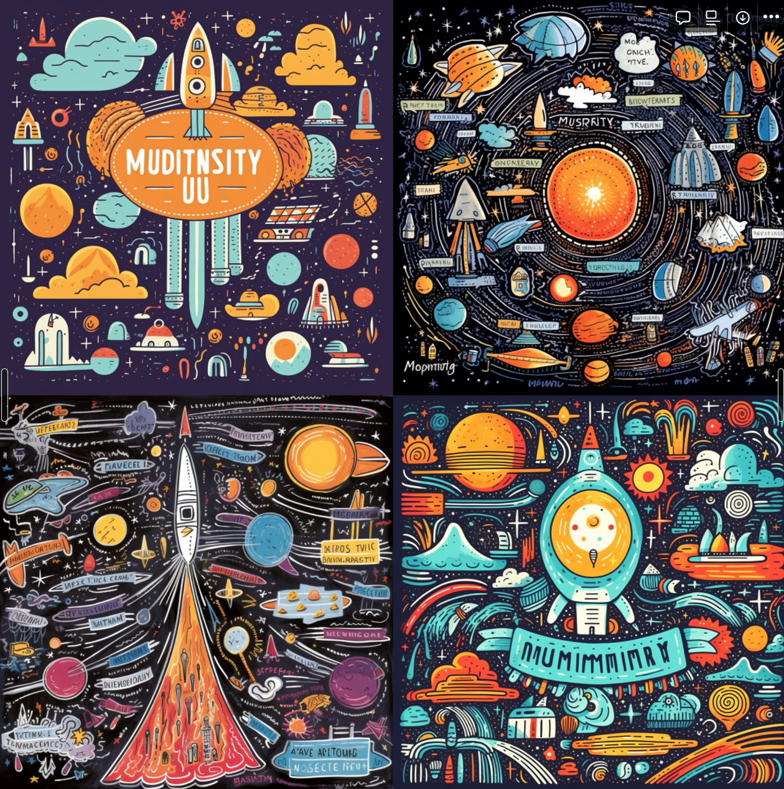
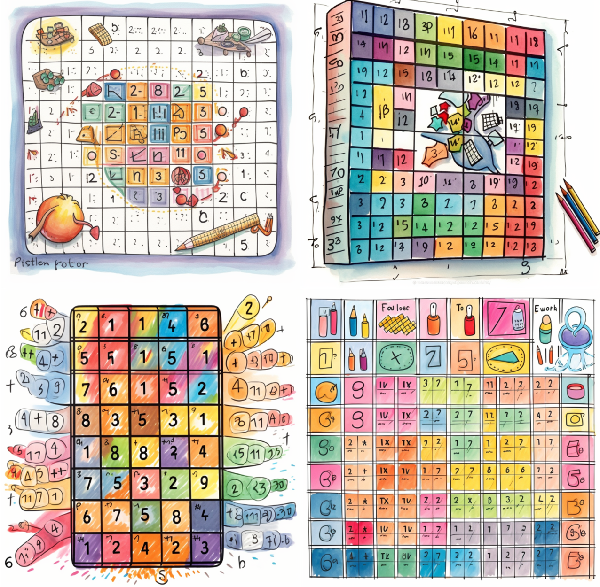
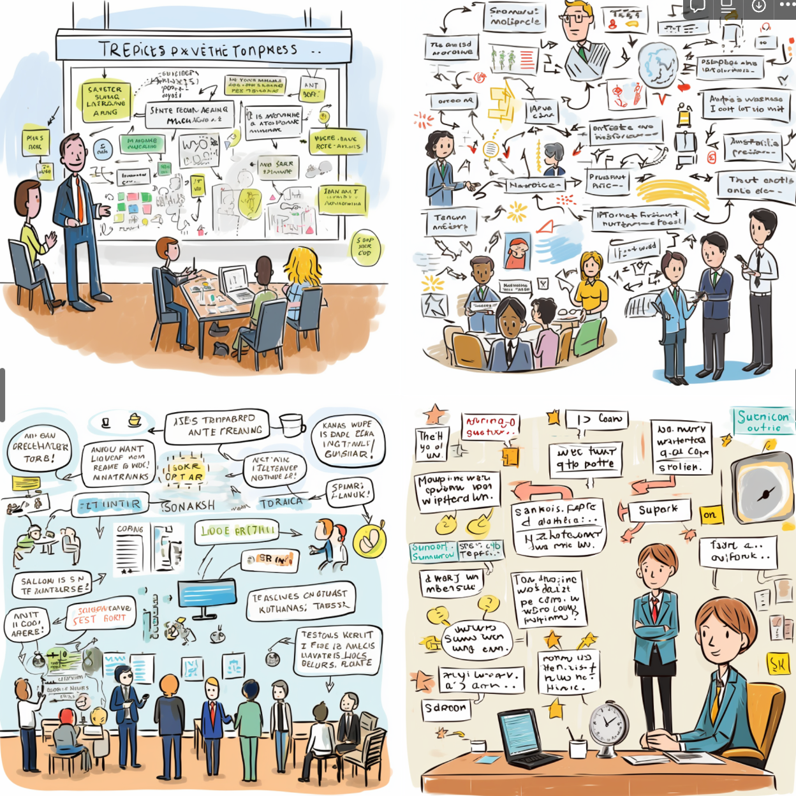
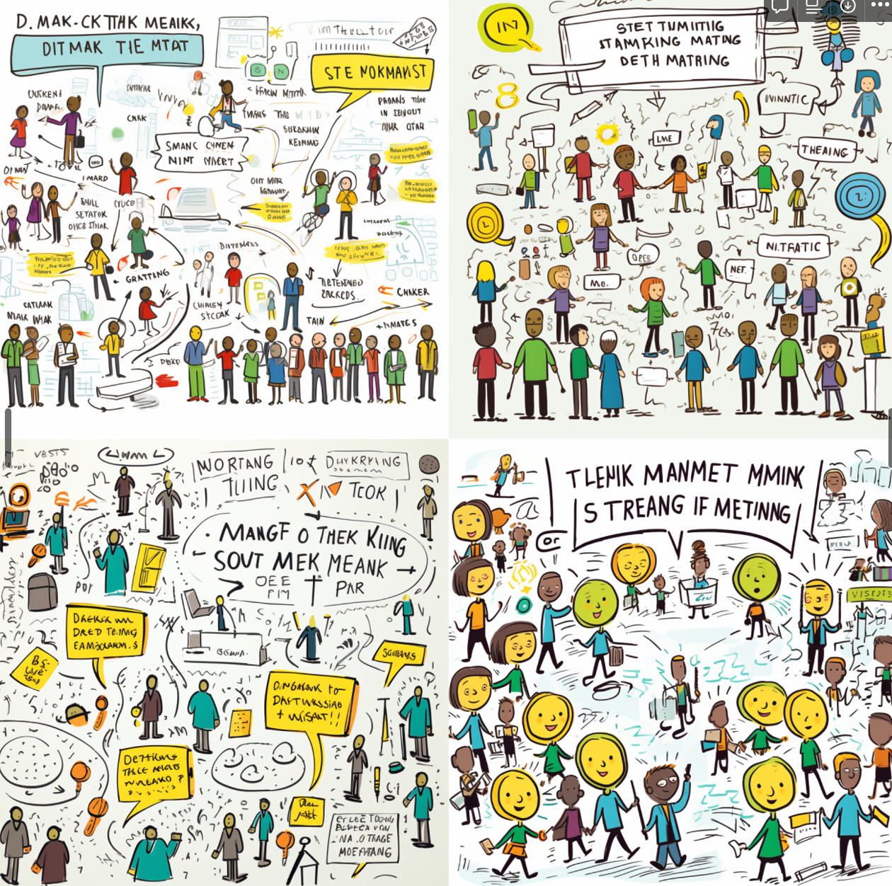
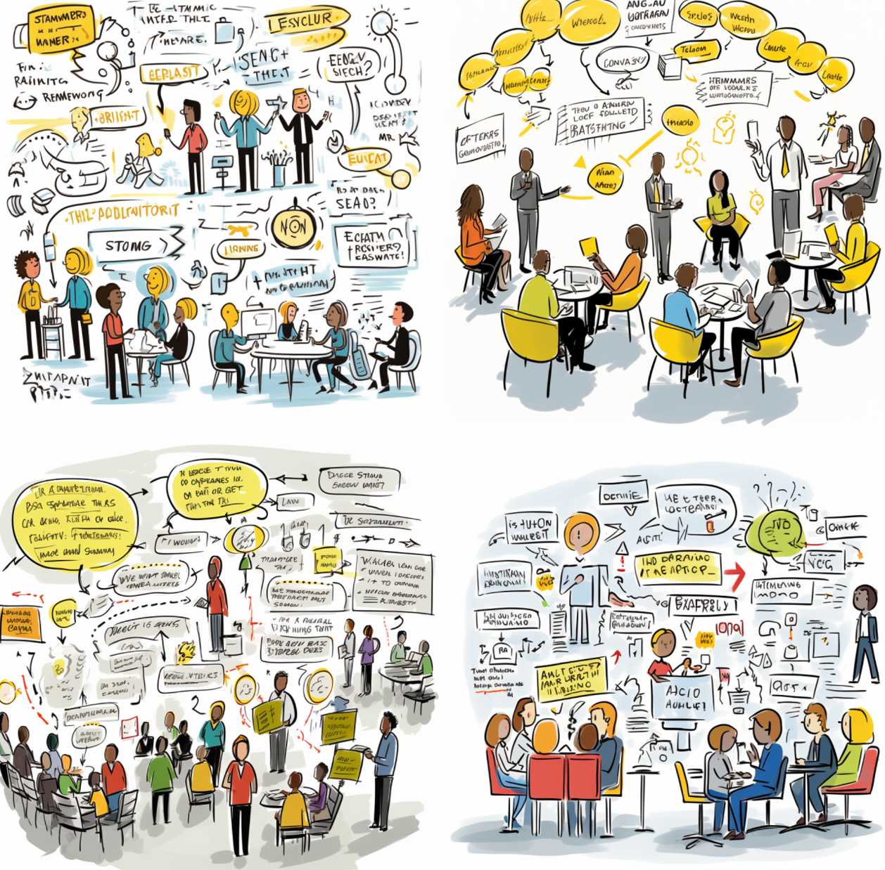
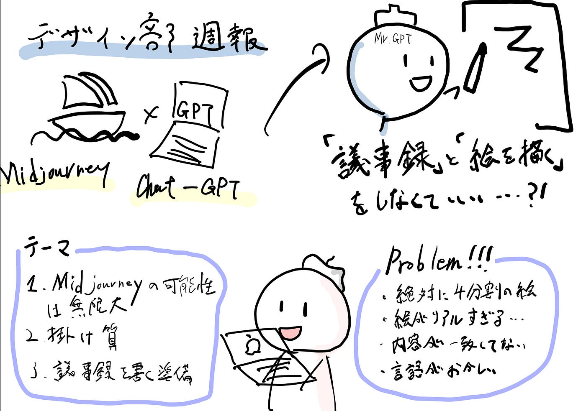

### デザイン部 週報

こんにちは！4年の小澤です。

今回の自分のテーマは、「Midjourneyでグラレコを作る」です。
もしこれができたら、自分の超絶苦手な「議事録」と「絵」の要素がつまりに詰まってるグラレコを、AIに任せることができる！という淡い期待を抱いて、挑戦しようと思いました。

まずは、お試しで

「Midjouneyの可能性は無限大」というコンセプトの、グラレコのprompt をChat-GPTに作成してもらいました。

Create a graphic recording that captures the concept of ‘Midjourney’s limitless possibilities’. Begin by drawing a vast universe in the background, representing the endless opportunities. Place the word ‘Midjourney’ at the center as if it’s a bright star or galaxy. Around ‘Midjourney’, illustrate various elements like rockets, planets, and shooting stars to signify exploration and innovation. Incorporate people on spaceships or using futuristic gadgets, showcasing the idea of embarking on adventures and realizing dreams through Midjourney. Use vibrant colors and interconnected lines to show the interwoven nature of possibilities and the dynamic paths one can take with Midjourney

上記のpromptだと、文字情報がかなり少なく、ほぼ「ただの絵」になることがわかりました。

それもそれで面白かったので、次はなんとなく（好奇心で）、掛け算をテーマにしたグラレコだったら、どんなものになるのか、試してみました。

Create a graphic recording that visually represents the multiplication table. Start by drawing a large grid in the center of the canvas, with numbers 1 to 10 across the top and down the left side. Within each cell of the grid, write the product of the corresponding row and column numbers. Around the grid, add elements that represent multiplication — such as groups of apples, stars, or geometric shapes, each grouped in multiples to visually represent the concept of multiplication. Use arrows or lines to connect these groups to corresponding cells in the table. Add a bold title at the top ‘Multiplication Table’ and include explanatory notes or tips on how multiplication works, using engaging fonts and colors

それっぽい、それっぽいけど、「内容はめちゃめちゃ適当」でした。

ただ実際のグラレコの使い方とは異なるので、次はより実践的な内容で行うことにしました。

テーマは、「議事録を書く準備」で、[https://goworkship.com/magazine/minutes-format/](https://goworkship.com/magazine/minutes-format/)

上記のサイトの4項目を引用させて頂きました。

準備1. 会議の目的と参加者を確認する
会議は何かしらの目的があって開かれます。当たり前ですが、目的を知らずに会議に参加してもまともな議事録は書けません。**会議の目的**を理解した上で、どのポイントに注意して議事録を作成すれば良いかあらかじめ考えておきましょう。

また、会議の参加者の確認も必須です。参加者を確認しておくことで、その会議のキーマン（主要人物）を判断でき、また会議におけるそれぞれの人の役割を確認できます。参加者の役割を理解することで、会議を俯瞰的に見ることができます。

議事録には会議の目的と参加者は必ず記入するものなので、これらはあらかじめ議事録に記入しておいても良いでしょう。

準備2. 専門用語を学んでおく
会議に参加しても、会議で飛び交う用語が理解できなければ議事録を書くことは難しいです。よく使われる用語は業界によってやや差がありますが、**一般的なビジネス用語集には一通り目を通しておきましょう。**ビジネス用語を学んでおくことは、議事録の作成以外にも様々な場面で役立ちます

準備3. メモを取る
会議での発言や決定事項を記録するのに**メモは必須**です。また、メモは自分の思考を整理するためにも役立ちます。
ただし、会議の内容を全てメモすることはほぼ不可能なので、要点とキーワードだけまとめてメモするように心がけましょう。細かい雑多な情報については、後述するボイスレコーダーなどに任せて問題ありません。
なお、メモは基本的に自分しか見ないものなので、丁寧に書く必要はありません。スピードの方が大事です。

準備4. ボイスレコーダーで録音する
ボイスレコーダーで録音することで、会議の中で聞き漏らした内容を後から確認することができます。ボイスレコーダーの中には「ノイズキャンセリング機能」や、人間の会話のみを強調し聞きやすくする「ボイスアップ機能」など、会議の音声を録音するのにベストな機能がついているものもあります。
また、会議前には電池残量の確認を忘れずに行いましょう。

なお、スマートフォンの機能を使って録音することもできますが、あまりおすすめは出来ません。スマートフォンは録音専用機ではないため、音をひろう能力があまり高くありません。また、会議中にスマートフォンを利用することを良しとしない会社も多いです。

prompt

**Design a captivating logo that artistically combines the elements of geography with the signature glasses and scarf of Taichi Furuhashi, reflecting his contributions to geographic information science (GIS) and mapping. Start with an illustration of the Earth, depicted as a globe with vibrant colors and geographic contours. Make sure the globe is semi-transparent, symbolizing the openness and accessibility of geographic data. Within this globe, create an abstract portrayal of Taichi Furuhashi’s glasses. The frames should resemble latitude and longitude lines, while the lenses are made up of intricate networks of lines and nodes, representing GIS data layers. Around the globe, design a scarf that looks like it’s embracing or flowing around the Earth. The scarf should be depicted with patterns similar to topographic maps and should be in rich, earthy colors. Incorporate wind lines to give the scarf a sense of motion, symbolizing the dynamic nature of the open mapping community. Place the name ‘Taichi Furuhashi’ below the globe in a modern font, with a tagline such as ‘Mapping the World with Openness and Innovation**

Certainly! Based on the information provided, here’s a prompt that could be used to instruct an image-generating AI to create a graphic recording (グラレコ) of the preparation steps for taking meeting minutes:

“Create a graphic recording that visually summarizes the preparation steps for taking effective meeting minutes, including the following key points:

1. Identifying the meeting’s purpose and participants, highlighting the importance of understanding the main objectives and recognizing the key individuals and their roles.

1. Learning specialized terminology commonly used in the meetings to ensure clear understanding and accurate minute-taking.

1. Taking notes efficiently, focusing on main points and keywords, while understanding that it’s impossible to write down everything.

1. Using a voice recorder to capture the meeting’s audio, ensuring battery is checked beforehand, and noting that smartphones are not recommended due to their inferior recording capabilities.

1. Taking photos of the whiteboard for visual records, remembering to ask for permission if necessary.

Please incorporate visual elements such as icons, arrows, and brief text annotations to make the content easy to understand and engaging.”

This prompt encourages the AI to create a visually appealing and informative graphic recording, integrating both textual and visual elements to convey the preparation steps effectively.

やはり絵の割合た多く、文字情報が伝わりづらいのと、絵が凄いリアルだったので、少しキャラクターを簡素にしてもらいました。

Create a graphic recording that clearly and simply illustrates the key steps for preparing to take meeting minutes:

1. Central Idea: Place a large, open notebook in the center of the image to represent the task of minute-taking.

1. Step 1 — Purpose and Participants: Draw a question mark and several simple stick-figure heads around the notebook, connecting them with dotted lines. Add a large ‘Why’ and ‘Who’ next to this area.

1. Step 2 — Learn Jargon: Illustrate a book with basic lines on one side of the notebook and write ‘Jargon’ in large letters above it.

1. Step 3 — Take Notes: On the other side of the notebook, depict a pen writing on a notepad. Label this area with a large ‘Notes’.

1. Step 4 — Record: Place a simple voice recorder icon at the bottom of the image, connecting it to the notebook with a dotted line. Add a large ‘Record’ label next to it.

1. Step 5 — Capture Visuals: Draw a camera on the top of the image, aiming at a small whiteboard. Write ‘Capture’ in large letters next to it.

Ensure that all the elements are connected and the text is large and easy to read, creating a cohesive and visually appealing graphic recording.

やっぱりなんだか変です、、笑

その後も色々promptを変えて作成してて、やっと気づいたのが、
「これ何語」ということです。

こちら、どういった現象なのか調べているのですが、未だ理由がわかってません、、。こちら、引き続き原因を探っていきたいと思います。

Midjourneyハッカソン待ってます！！

