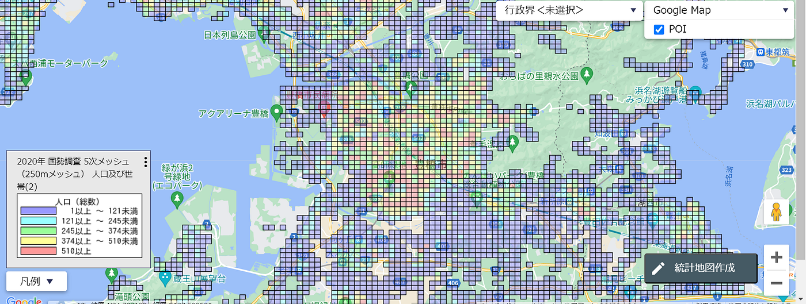
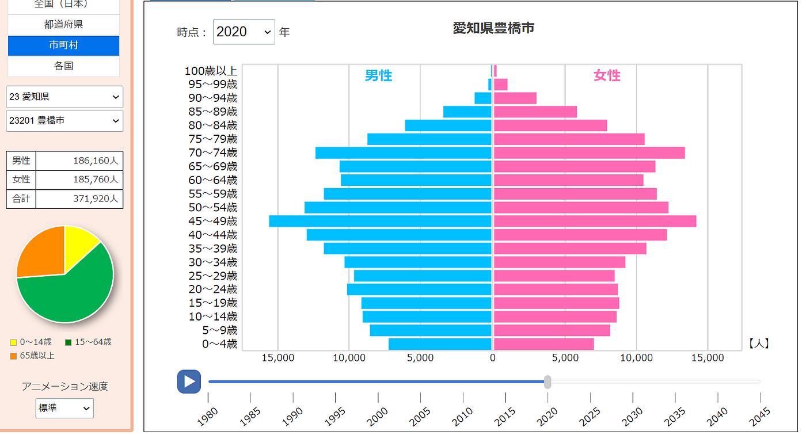
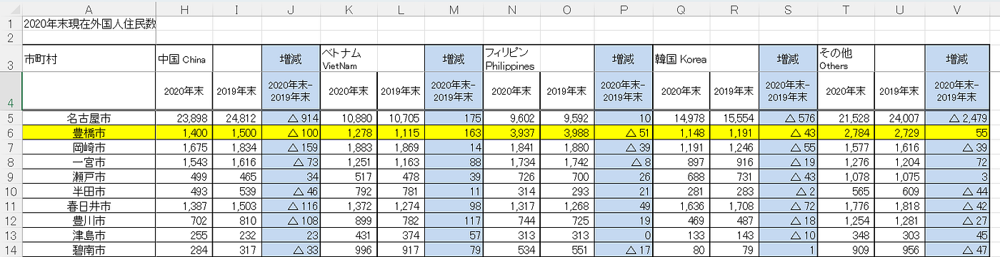
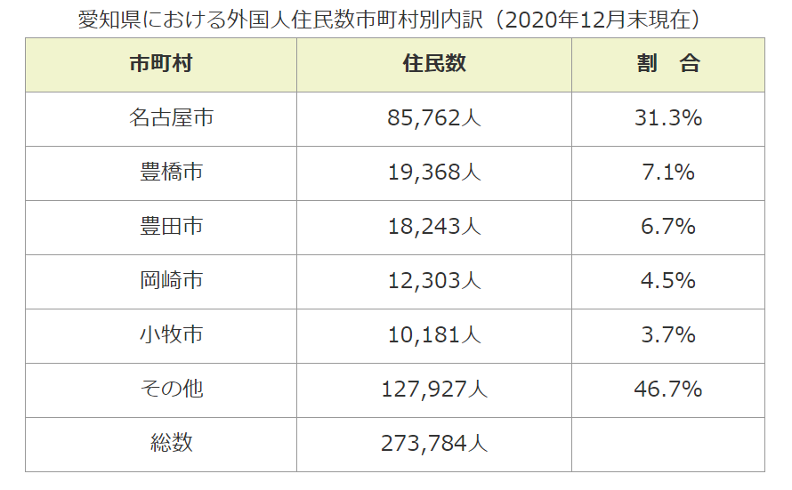
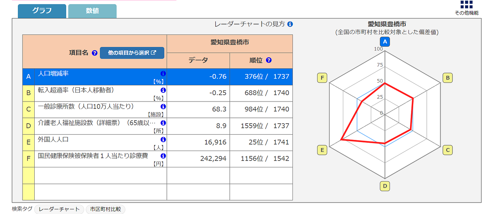
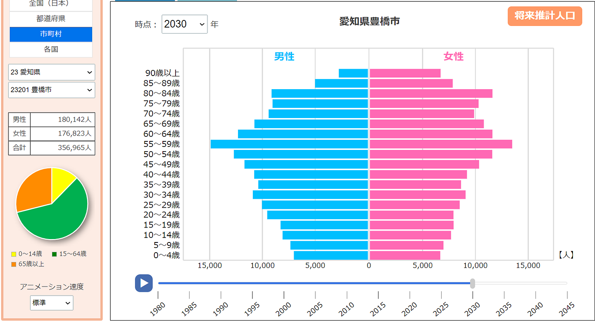
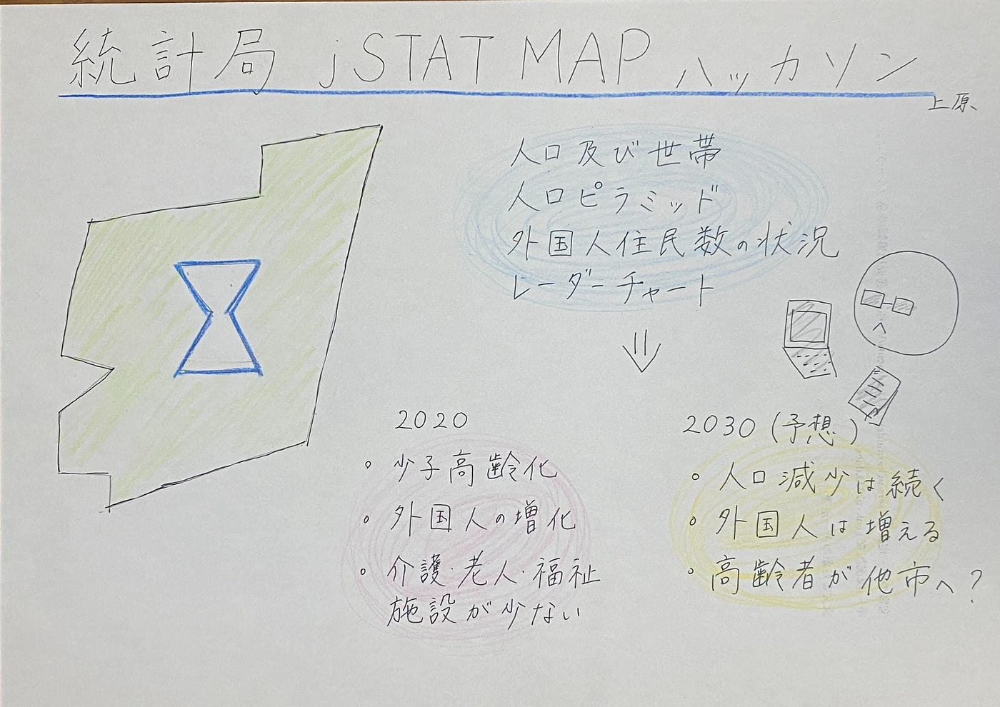

### 愛知県豊橋市の地域分析と未来予測

こんにちは。3年の上原です。

10月は[統計局 jSTAT MAP ハッカソン](https://github.com/furuhashilab/README/issues/35#issuecomment-1786361571)を実施しました。[jSTAT MAP](https://jstatmap.e-stat.go.jp/) と [統計ダッシュボード](https://dashboard.e-stat.go.jp/)等の統計データを用いて地域分析と2030年の未来予測を行いました。

私が分析した地域は「愛知県豊橋市」です。単純な理由ですが、18年間生まれ育った地であるため、この地域を選びました。

使用したデータは以下の通りです。
・[jSTAT MAP 人口及び世帯（国勢調査2020に基づく）](https://jstatmap.e-stat.go.jp/map.html)
・[統計ダッシュボード 人口ピラミッド 2020](https://dashboard.e-stat.go.jp/pyramidGraph?screenCode=00570&regionCode=00000&pyramidAreaType=2) 
・[統計ダッシュボード 人口ピラミッド 2030](https://dashboard.e-stat.go.jp/pyramidGraph?screenCode=00570&regionCode=00000&pyramidAreaType=2)
・[外国人住民数の状況 市町村別・国籍別一覧表（2020年12月末現在）](https://www.pref.aichi.jp/uploaded/attachment/387671.pdf)
・[愛知県内の市町村における外国人住民数の状況（2020年12月末現在）](https://www.pref.aichi.jp/soshiki/tabunka/gaikokuzinjuminsu-2020-12.html)
・[統計ダッシュボード レーダーチャート](https://dashboard.e-stat.go.jp/radarChart?screenCode=00560&regionCode=13000)

> 人口及び世帯

jSTAT MAPを用いて、[豊橋市の人口及び世帯](https://jstatmap.e-stat.go.jp/map.html)について、５次メッシュ（250mタイル）で地図に反映させました。ここから、市の中心部ほど人口が密集していることが分かりました。また、学校がある地域は局所的に集中していることも見えてきました。

> 人口ピラミッド

[2020年の豊橋市の人口ピラミッド](https://dashboard.e-stat.go.jp/pyramidGraph?screenCode=00570&regionCode=00000&pyramidAreaType=2)について、統計ダッシュボードを用いて分析しました。40代後半＆70代前半（団塊の世代・団塊ジュニア）の人口が多く、20代以下の世代の人口が減少傾向にあるという「つぼ型＝少子高齢化」のピラミッドであることが分かりました。

> 外国人住民数の状況

愛知県や豊橋市が公表している統計データを用いて、外国人住民数についても分析しました。これを見ると、国によって多少の増減はあるものの全体としては増加していることが分かります。

また、[愛知県内の市区町村で人口に対する外国人住民数の割合](https://www.pref.aichi.jp/soshiki/tabunka/gaikokuzinjuminsu-2020-12.html)を比較してみると、以下のようになります。豊橋市は愛知県で2番目に割合が高いです。

> レーダーチャート

最後に、統計ダッシュボードの機能の1つであるレーダーチャートを用いて分析しました。自分で項目をカスタマイズできたので以下のように設定しました。これまでの分析で、外国人が多そうであること、少子高齢化であることが分析できたので関連できるような項目を選びました。
A. 人口増減率
B. 輸入超過率（日本人移動者）
C. 一般診療所数（人口10万人あたり）
D. 介護老人福祉施設数
E. 外国人人口
F. 国民健康保険被保険者1人当たり診療費

以下のように[豊橋市のレーダーチャート](https://dashboard.e-stat.go.jp/radarChart?screenCode=00560&regionCode=13000)が完成しました。

全体としての人口や日本人人口は減っているが外国人人口が多いこと、全国と比較してみて介護老人福祉施設が少ないことが見て取れました。

> 2030年の予測

以上の分析結果から、考察できることをまとめていきます。

①人口減少は続いていく
人口ピラミッドを見ると、10年後に親となる世代が減っているので新しく生まれる人数も減少すると考えられる。また、レーダーチャートの輸入超過率はマイナスであり、且つ、今後高齢者が増えると思われるのに介護老人福祉施設が少ないので、高齢者が他市へ移り住んでしまうのではないか。

②外国人人口は増加する
日本人の人口が減る一方で、外国人の人数は増えていくと考えられる。2019、2020年はコロナによって海外渡航が規制されていたにも関わらず増えているということは、規制がなくなった今、さらに流入していると考えられるからだ。総人口に対する外国人住民数の割合も増していくだろう。

参考までに、[統計ダッシュボードに載っていた2030年の人口ピラミッド](https://dashboard.e-stat.go.jp/pyramidGraph?screenCode=00570&regionCode=00000&pyramidAreaType=2)は以下の通りです。

地元の地域分析をしてみて、自分の知っている地域だったからこそ基礎知識があったため、データの取捨選択はしやすかったです。統計データを用いると、根拠をもとに定量化できるので、データを組み合わせて新しい視点を形成できるなと感じました。特にjSTAT MAPはかなり細かくフィルターをかけて地図上に反映できるので分かりやすい材料になると思いました。

ハッカソン発表スライドは[こちら](https://docs.google.com/presentation/d/1cCKXGewwionVazKMSacczrvJxM65eNleNJPggB4TmZQ/edit?usp=sharing)です。

> グラレコ

