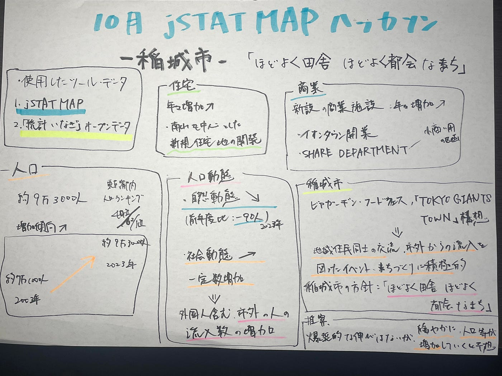

### 10月 統計局 jSTAT MAP ハッカソン-稲城市-

こんにちは！

4年の吉田です。

今回のハッカソンは

- [統計ダッシュボード](https://dashboard.e-stat.go.jp/)

- [jSTAT MAP](https://jstatmap.e-stat.go.jp/)

- その他 [e-STAT](https://www.e-stat.go.jp/) が提供しているデータ/API

- 地方自治体/民間組織が公開しているオープンデータ各種

これらを利用して任意(自分の興味のある)の自治体を地域分析(最低３つの視点)し、2030年の状況を未来予測する、というものでした。

私は、数ある市町村から**東京都稲城市**を選びました！

理由は、

①. 自分が住んでいる地域であるため

②. 都市開発が進んできており、どのくらい市として成長しているのか、地域分析をする中で、将来どのような状況となるのかを知りたかったためです。

今回私は、[jSTAT MAP](https://jstatmap.e-stat.go.jp/)と稲城市が公開しているオープンデータ「[統計いなぎ」オープンデータ](https://www.city.inagi.tokyo.jp/shisei/gyosei/opendata/opendata_catalogpage/index.html)を利用して、地域分析を行いました。

> _**分析結果_**

今回のハッカソンで自身が居住している地域に対する現状の理解が非常に深まりました。

このような、自分が関わっている地域やものごとを「知る」ということの必要性を改めて感じました。

> _**新機能リクエスト_**

[新機能リクエスト · Issue #5 · furuhashilab/howto4jstatmap
地図ダウンロード機能の追加 国土地理院のレイヤーにした場合のみ、表示画面上の地図をダウンロードできるようにしてほしいgithub.com](https://github.com/furuhashilab/howto4jstatmap/issues/5#issue-1980315882)

> _**グラレコ_**

