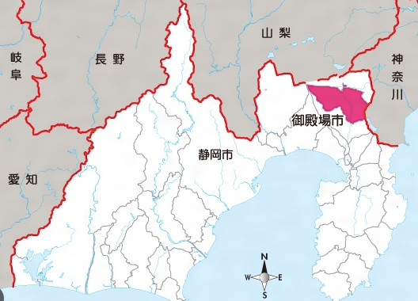
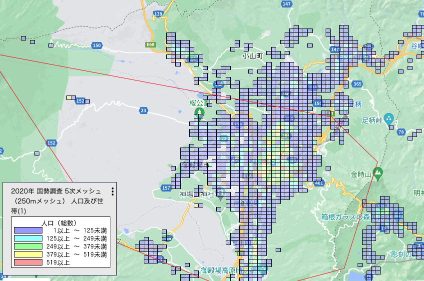
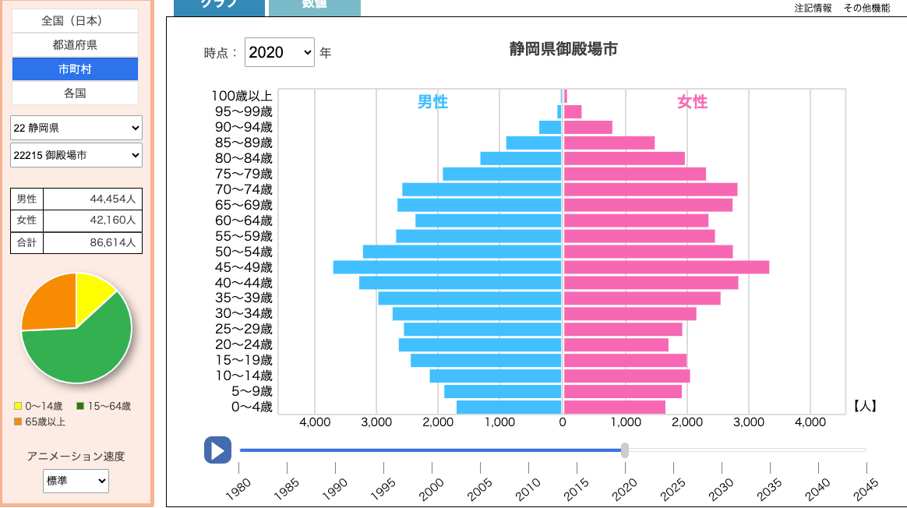
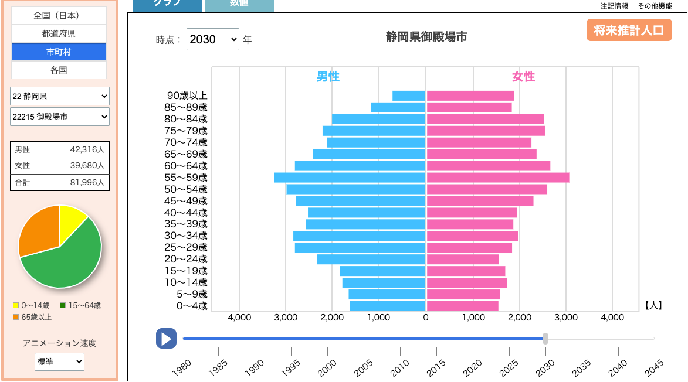
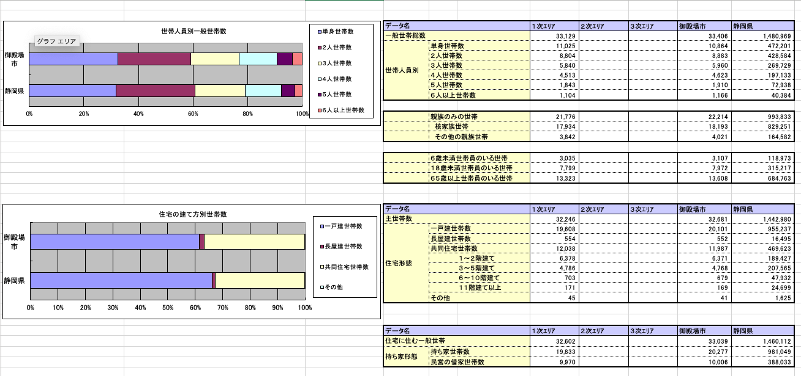
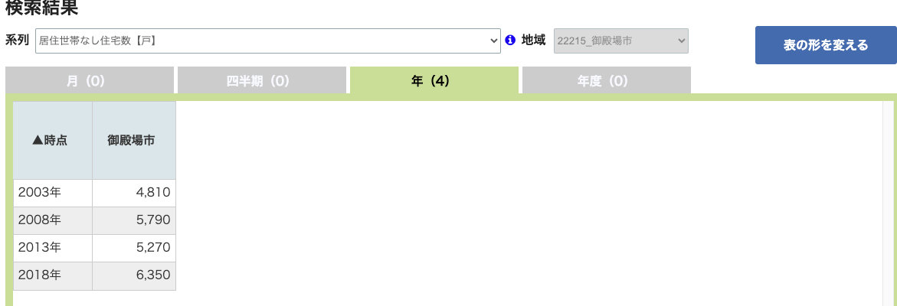
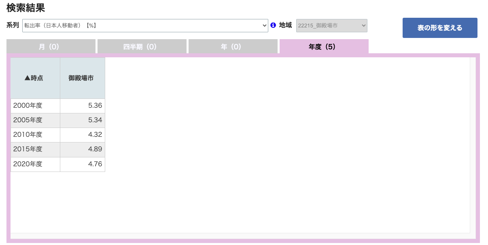
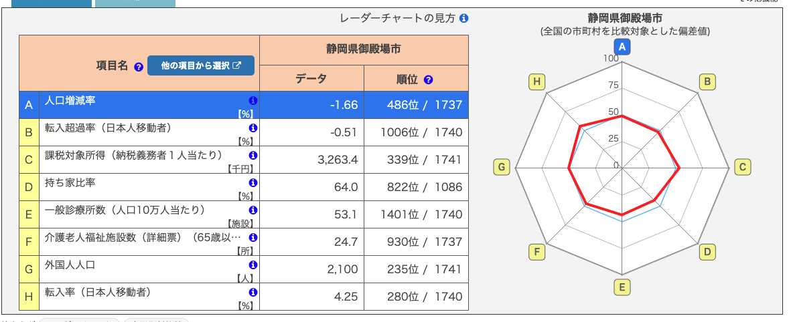
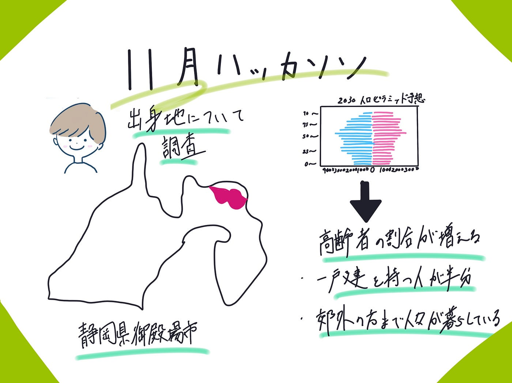

### 10月ハッカソン 御殿場市

今回私静岡県御殿場市について調べました。

理由は単純に自分の出身地であるという点とアウトレット以外魅力がないと言われる御殿場を定量的に知りたかったからです。

**5次メッシュ**

赤い枠の中ざっくりとした御殿場市の範囲です。この画像から御殿場線駅周辺、つまり中心地以外の郊外にも散らばって人が住んでいることがわかります。

**人口ピラミッド**2020

人口は高齢化しており、65歳以上の割合が大きいことが、ピラミッドの上部が広がっていることからわかる。

0–14歳（黄色）、15–64歳（緑色）、65歳以上（オレンジ色）の割合を示す円グラフも表示されており、65歳以上の割合が他の年代に比べて顕著に大きいのもわかる。

人口は総数で86,614人であり、男女の比率はほぼ同等ですが、男性の方が若干多い。（男性44,454人、女性42,160人。

**人口ピラミッド2030**

2030年の予測では、人口が減少して81,996人になると予測されています。

高齢化はさらに進んでおり、特に90歳以上の女性の割合が増加していることが見て取れます。

若年層（特に0–4歳）の人口はさらに減少しています。

65歳以上の割合がさらに大きくなっており、これは社会にとって高齢化に関連する問題が増えることを意味している可能性があります。

男女の総人口はさらに接近しており、男性が42,316人、女性が39,680人となっています。

これらのグラフから、該当する地域または国が直面している人口の変化と高齢化の進行についての情報を得ることができます。特に、高齢者のサポートに関する社会福祉政策や、労働力不足、医療費の増加などの課題に焦点を当てる必要があるでしょう。また、若年層の人口減少は、長期的には労働市場に影響を及ぼし、経済成長にも影響を与える可能性があります。

こちらは世帯数と住宅の建て方別の世帯数を示したグラフと表です。みてわかるように御殿場市では半分以上の人が１戸建の家を保有しています。

こちらは住居世帯なしの住宅数です

2003年から2018年までしかデータはありませんが年々数が増えていることがわかります。

こちらは御殿場からの日本人転出率です。年々減ってはいますが4.76パーセントと多くあります。

最後にレーダーチャートです。

全国と比較して日本人の移動者である転入超過率、一般診療所数がきわて低いのがわかります

2030 年の予想

2030年は御殿場では空き家問題が徐々に始まってくると考える。

・一戸建て所有率が高いため。

・2030ねんの人口ピラミッド予想で80さい以上の割合が高くなるため。

・御殿場郊外の方まで住宅の分布が見える（周り田んぼだらけ）

そのため空き家ビジネスを行うと成功するのではと考える。例えばラインボットのように簡単に自分の家の価値診断、販売が御殿場でできるようになれば便利で儲かるのではないか？

