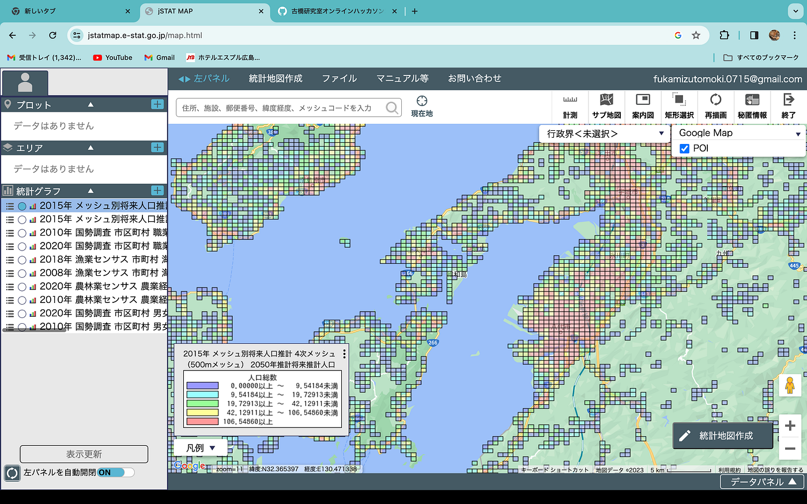

### 10月ハッカソン

今月のハッカソンでは、[J -STAT](https://jstatmap.e-stat.go.jp/trialstart.html)を利用して任意の地域を分析し、2030年の未来予測を行いました。

今回は、自分が生まれ育った熊本県上天草市を対象にしました。

自分がそこに住んでいたのはおよそ10年前なのですが、当時から少子高齢化が進行していました。

今回は上天草市の人口と、主要産業である農業や漁業に関するデータのうち、2010年頃と2020年頃の物を集めて比較し、10年間での変化を観察しました。

その結果、**2030年の熊本県上天草市は、限界集落と化し、農業、漁業の規模も更に縮小していく**と予測されます。

グラレコ
