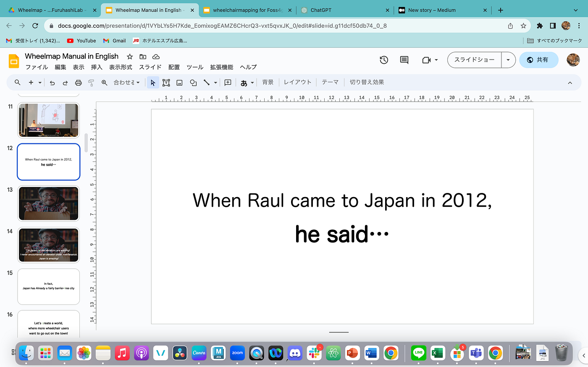
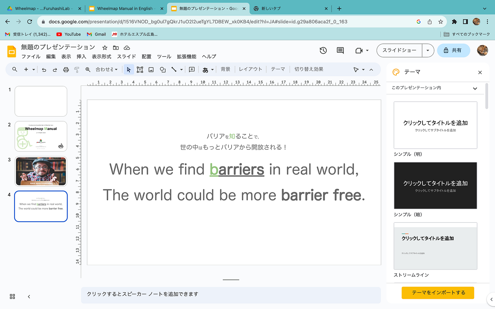
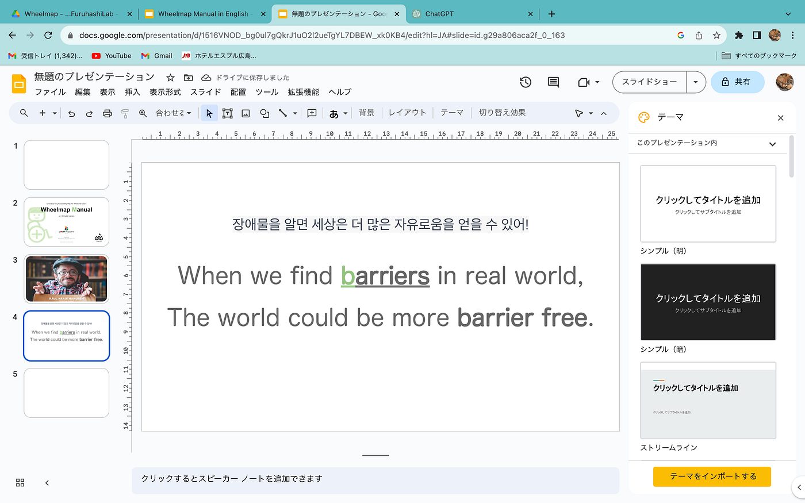
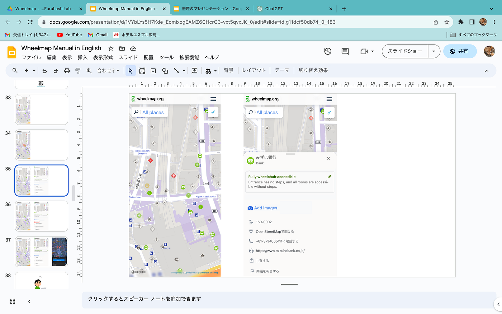

### デザ動画週報

お疲れ様です。深水です。

デザ部も動画部も関係ないのですが、今度韓国で[wheelmap](https://wheelmap.org/alexion)について発表するので、その資料制作の進捗について書きます。

基本的には先生から頂いた英語版のスライドを使うのですが、10分しかないので、ラウルさんの日本のエピソード等は省こうと思います。

あとは、一部日本語を韓国語に変えました。

また、操作画面の説明を行うスライドを、携帯やPCの言語設定を英語にして作り直そうと考えています。

今のところは**[こんな感じ**](https://docs.google.com/presentation/d/1516VNOD_bg0ul7gQkrJ1uO2l2ueTgYL7DBEW_xk0KB4/edit?usp=sharing)です。

操作説明をスライドで行うか、説明動画を作るかで迷っています。

グラレコ
