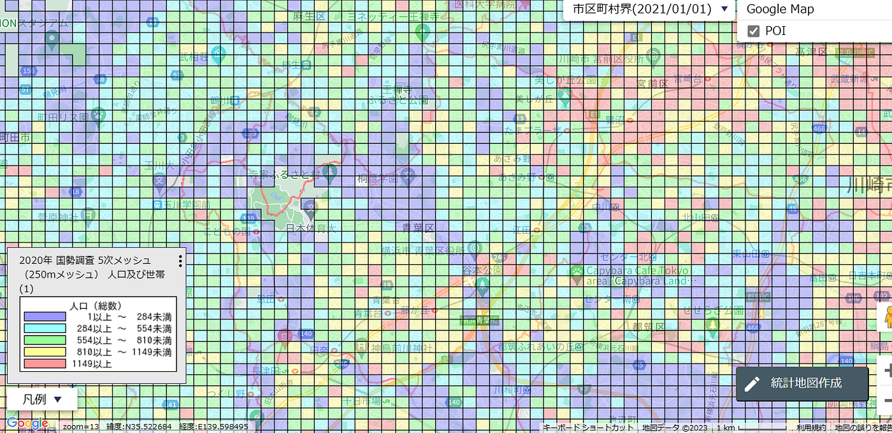
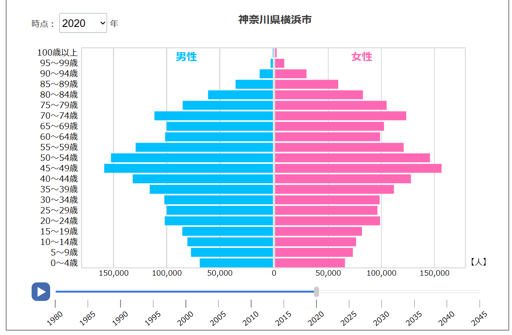
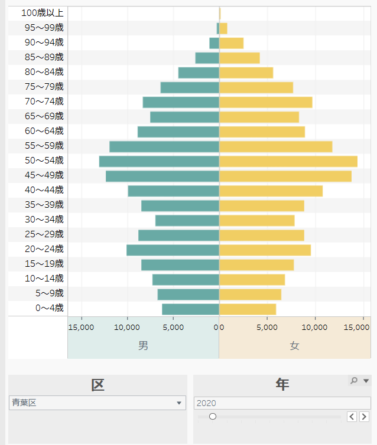
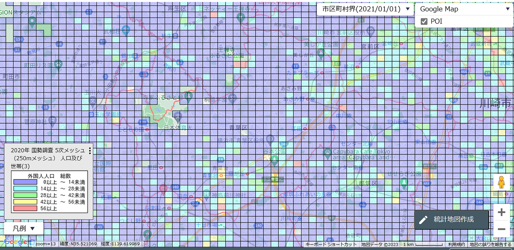
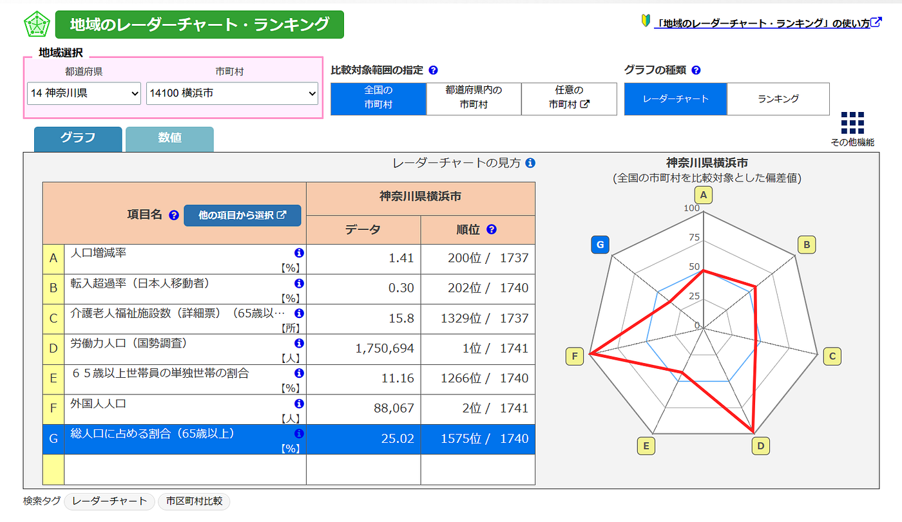
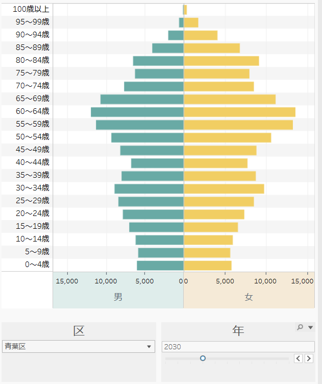

### 10月ハッカソン 横浜市青葉区

こんにちは、3年石井です。

10月のハッカソンは、総務省統計局が公開している統計ウェブGIS [jSTAT MAP](https://jstatmap.e-stat.go.jp/) と [統計ダッシュボード](https://dashboard.e-stat.go.jp/) を用いて任意の自治体を地域分析し、2030年の状況を未来予測するというものでした。

今回私は「横浜市青葉区」を分析しました。選んだ理由としては、20年間住んでいる地域であることと、ずっと住み続けているからこそわかる変化（外国人が増えたことや、小学校のクラス数が減っていることなど）に関して調べたいと思ったからです。

> 技術仕様

- [jSTAT MAP](https://jstatmap.e-stat.go.jp/)

- [統計ダッシュボード](https://dashboard.e-stat.go.jp/)

・[なるほどあおば](https://www.city.yokohama.lg.jp/aoba/kusei/tokei/od.html#op1)

・[横浜市オープンデータポータル](https://data.city.yokohama.lg.jp/)

> 総人口

[jSTAT MAP](https://jstatmap.e-stat.go.jp/)を使用して、横浜市青葉区の総人口を5次メッシュで地図に反映させました。その結果、主要路線である東急田園都市線沿いに人口が集中していることが分かりました。また、川の周辺や公園の近くは人口が少なめだということも見出せました。

> 人口ピラミッド

2020年の横浜市青葉区の人口ピラミッドに関して、青葉区が公開している統計データ「[なるほどあおば](https://www.city.yokohama.lg.jp/aoba/kusei/tokei/od.html#op1)」を利用しました。比較するため、横浜市の人口ピラミッドも[統計ダッシュボード](https://dashboard.e-stat.go.jp/)を使用して分析しました。

分析の結果、横浜市も青葉区もどちらもつぼ型であり、少子高齢化が進んでいることが分かりました。横浜市と比較して青葉区は50~54歳が中心となっていました。

> 外国人人口

外国人人口もやはり線路沿いが多いことが分かりました。特に青葉台、長津田周辺に集まっていることが見出せます。

> レーダーチャート

「横浜市青葉区」ではないですが、せっかくなのでレーダーチャートの機能を使いたいと思い、横浜市のレーダーチャートを作ってみました。

> 2030年の横浜市青葉区

横浜市青葉区は人口ピラミッドを見てもわかるように、これからさらに少子高齢化が進むと考えられます。

自分自身が一番知っていると思っていた土地でも、地域分析を行うことで見えていなかったところが見えた気がしました。

[発表スライド](https://docs.google.com/presentation/d/16y-B2yuLXXQ8J8m7owM2lwxDYLqEMow7kD0XsPEbinM/edit?usp=sharing)
