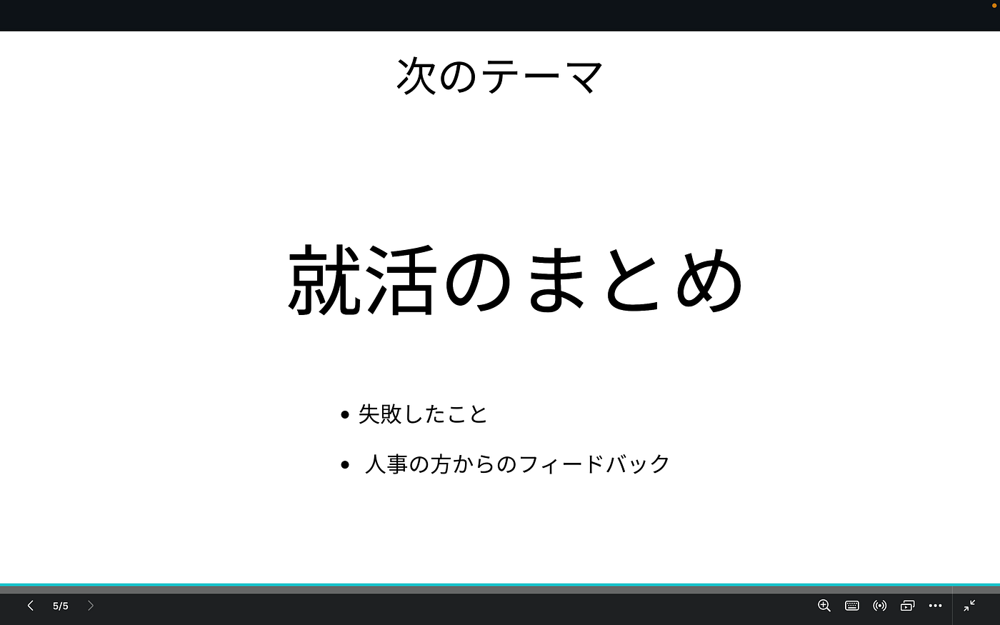

### ゼミ論 中間発表

お疲れ様です。3年の深水です。

自分のゼミ論は、IT業界に就職するためにポートフォリオを作成し、その効果などを検証することでした。

しかし、いくつか短期のインターンを経験して、志望する職種が変わりました。

そこで、それに合わせてゼミ論のテーマを少し抽象化して、自分の就活を通じた反省などをまとめようと思います。

最終発表までに就活が終わっていなかった場合には、これからの戦略なども含めてまとめるつもりです。

> _**中間発表_**

中間発表としては、今の段階で感じたポートフォリオを作成することのデメリットについて述べます。

1. クオリティ次第でマイナス要素になり得る

1. クオリティを上げるのに時間と労力を必要とする

1. 志望職種が変わった場合、役に立たなくなる可能性がある

以上の点が挙げられると思います。

今回は以上です。

