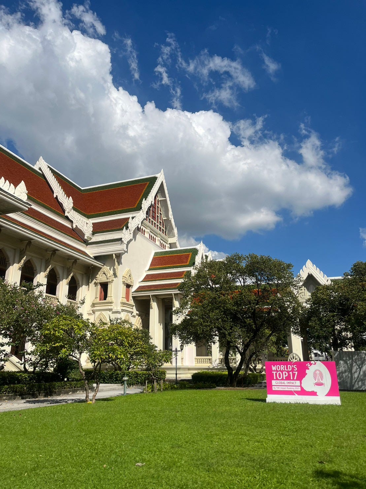
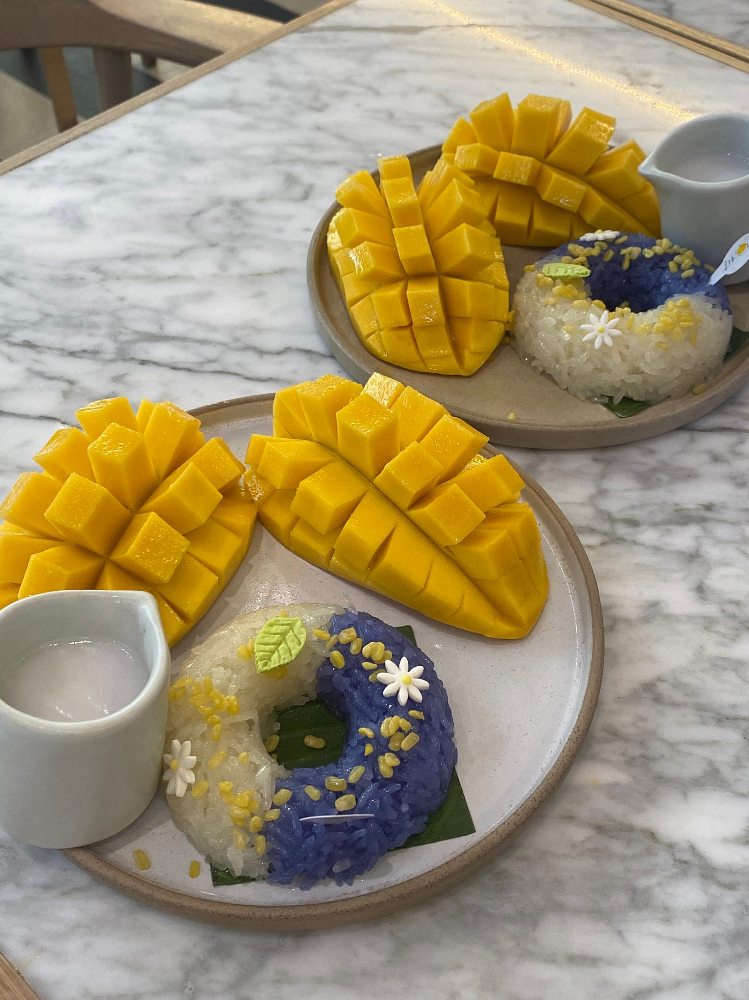
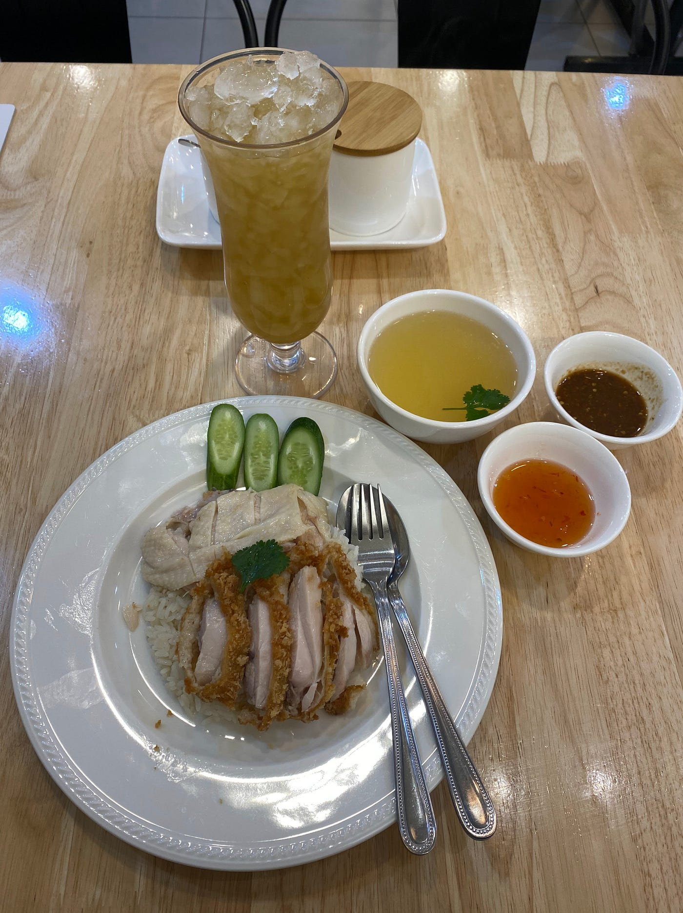
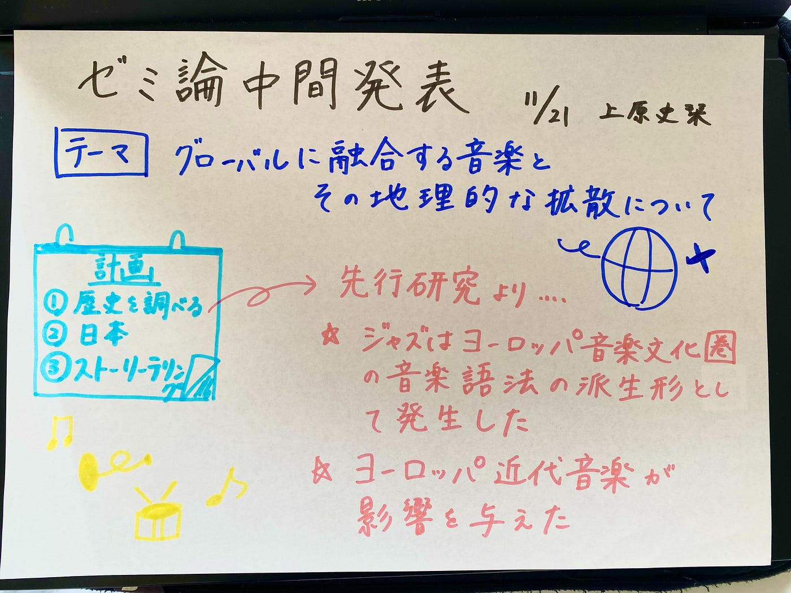

### ゼミ論中間発表

こんにちは！3年の上原です。
先週から[FOSS4G Thailand](https://www.bing.com/ck/a?!&&p=4d1cc4c835bbfebeJmltdHM9MTcwMDQzODQwMCZpZ3VpZD0xZDA5YWViZi02ODMwLTY1MTktM2FiYy1iZWI4NjllMjY0NjkmaW5zaWQ9NTE4OA&ptn=3&ver=2&hsh=3&fclid=1d09aebf-6830-6519-3abc-beb869e26469&psq=Foos4G+thailand&u=a1aHR0cHM6Ly8yMDIzLmZvc3M0Zy5pbi50aC8&ntb=1) &[ SotM Asia](https://www.bing.com/ck/a?!&&p=3fc274ff0a1408eaJmltdHM9MTcwMDQzODQwMCZpZ3VpZD0xZDA5YWViZi02ODMwLTY1MTktM2FiYy1iZWI4NjllMjY0NjkmaW5zaWQ9NTE4Mg&ptn=3&ver=2&hsh=3&fclid=1d09aebf-6830-6519-3abc-beb869e26469&psq=sotm+asia&u=a1aHR0cHM6Ly9zdGF0ZW9mdGhlbWFwLmFzaWEv&ntb=1)参加のためにタイにいます。毎日いろいろなところを巡っており、新鮮でとても楽しいです。

> 中間報告

さて、ゼミ論中間報告をいたします。私のテーマは「グローバルに融合する音楽とその地理的な拡散について」です。GitHubは[こちら](https://github.com/furuhashilab/2023gsc_ShioriUehara)です。

研究の計画は以下のように立てています。今は最初のステップが終わっている段階です。

1. Jazzの歴史を調べる

1. 日本に持ち込まれた背景を調べる（1人に注目して聞き書き）

1. ストーリーテリングを作成する（[Mapbox Storytelling](https://www.mapbox.com/solutions/interactive-storytelling)を使用予定）

研究成果の詳細については、[こちらのスライド](https://docs.google.com/presentation/d/1-ZWCC7daW9tkTjCytlGAn1eTM8Gv9sQTMIYdACg52_E/edit?usp=sharing)からご覧いただけます。

> 今後の展望

今後は研究計画の2,3段階目に取り掛かる予定です。まずは、誰が日本に持ち込んだのか1人に絞って、構想発表の際にアドバイスをいただいた「聞き書き」という方法で記述したいと思っています。

> グラレコ

