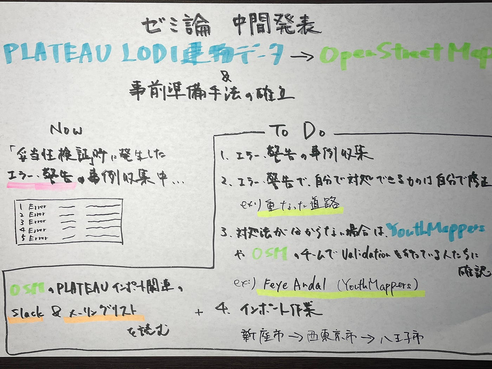

### furu卒論 中間発表

#### PLATEAU LOD1建物データをOSMにインポートする作業及び事前準備手法の確立

今年度の卒論は、ゼミ論の延長としてPLATEAU LOD1建物データのインポート及び事前準備手法の確立をテーマに取り組んでいきます。

ゼミ論では、新座市における妥当性検証まで完了しています。

今後は妥当性検証で発生したエラーや警告の事例収集および対処法の確立、その後新座市へPLATEAUデータをインポートという流れになります。

年内にはエラー・警告の事例収集とその対処法の確立を完了させることを目標に動いていこうと考えています。

[GitHub - furuhashilab/2023gsc_WataruYoshida
Contribute to furuhashilab/2023gsc_WataruYoshida development by creating an account on GitHub.github.com](https://github.com/furuhashilab/2023gsc_WataruYoshida)

> _**Google Slide_**

> _**グラレコ_**

