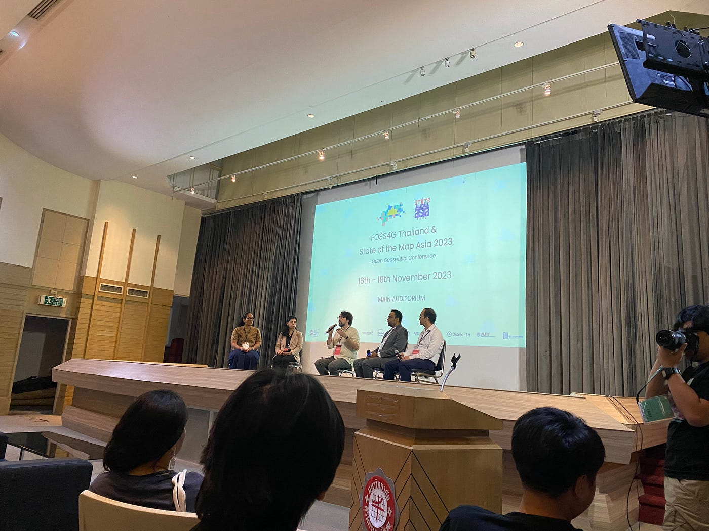
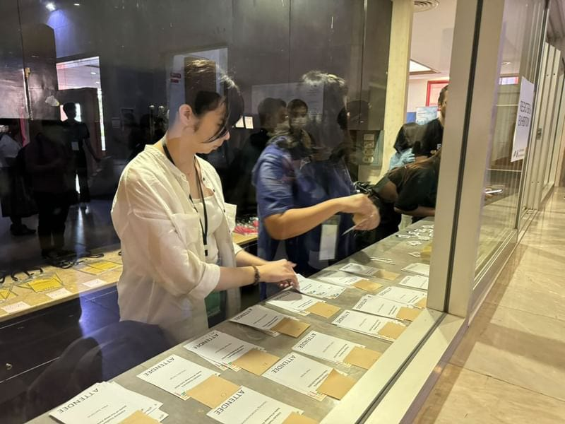
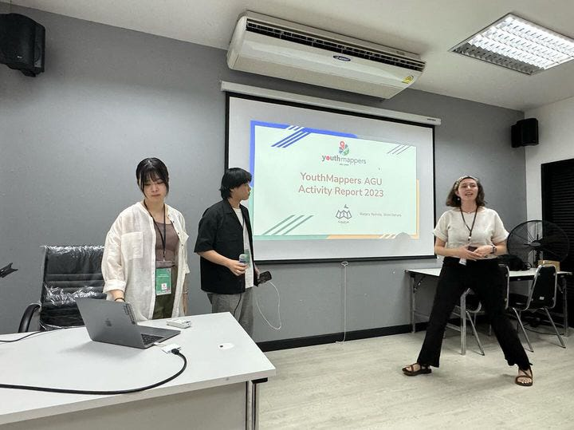
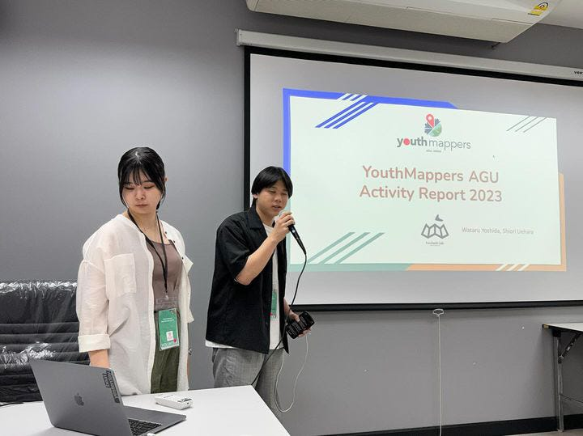
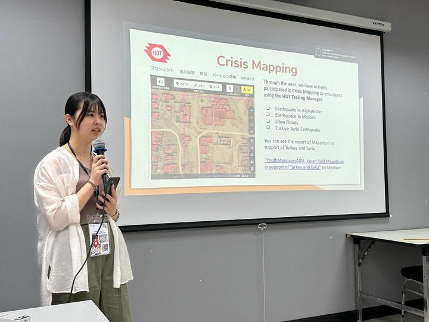
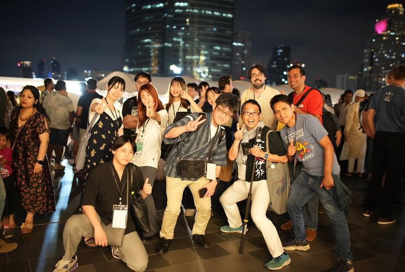

### FOSS4G Thailand, SotM Asia 2023に参加しました！

国際会議参加レポート by Shiori Uehara

2023年11月16日～18日の3日間に渡ってタイの[シーナカリンウィロート大学（ Srinakharinwirot University：以下SWU）](https://www.openstreetmap.org/edit#map=18/13.74018/100.53412)で開催された、[FOSS4G Thailand](https://2023.foss4g.in.th/)と[SotM Asia 2023](https://stateofthemap.asia/)に参加しました。今回は同時開催ということで幅広い話を聞くことができました。

初めての国際会議参加ということでかなり緊張しました。私は、運営ボランティアとして3日間参加し、最終日には[YouthMapparsAGU](https://www.bing.com/ck/a?!&&p=d62e198bdf413c7aJmltdHM9MTcwMDk1NjgwMCZpZ3VpZD0xZDA5YWViZi02ODMwLTY1MTktM2FiYy1iZWI4NjllMjY0NjkmaW5zaWQ9NTE5NA&ptn=3&ver=2&hsh=3&fclid=1d09aebf-6830-6519-3abc-beb869e26469&psq=youthmappersagu&u=a1aHR0cHM6Ly9mdXJ1aGFzaGlsYWIuZ2l0aHViLmlvL3lvdXRobWFwcGVyczRhZ3Uv&ntb=1)についての発表も行いました。

#### **運営ボランティアとして**

ボランティアは、Registration, Information, Moderatorなど6種類の仕事に分かれて3日間通して会場の運営をする役割でした。私は主にRegistrationとして参加者のチェックをして名札を渡す作業を行いました。優しい方々ばかりだったので、1日目の午前中は楽しく仕事ができていました。

しかし！ボランティアの人手不足により、急遽Moderatorを頼まれてしまいました。台本もなく、準備時間も充分にとれず、さらに13:00~17:00という長時間シフトにより、せっかくなくなってきていた緊張が戻ってきました。結果として、なんとか遂行することはできましたが3日間の中で最も不安だった時間でした。いざという時の対応力や度胸は養われたような気がします(-_-;)

#### **発表者として**

最終日のLTで、YouthMappersAGUの2023年の活動について、吉田航さんと共に報告しました。準備通りに発表はできたものの、自分の英語力やOSMなど地理空間情報系の専門知識について課題が見つかった発表となったと感じています。

発表スライド

#### **まとめ**

初参加ということで、不安や緊張を感じながら臨んだ国際会議でしたが、想像していたよりもずっとフレンドリーで楽しく参加できました。同年代の友達もたくさんできたし、ディナーも素晴らしかったし、何より各分野のエキスパートの話を生で聞けたことはとても良い経験でした。せっかく繋がった縁を大切に、活動の幅を広げていきたいと思います。

#### **Strava**

[11/16 - 史栞 上's 1.1 mi walk
史栞 上 completed 1.1 mi on Nov 16, 2023.www.strava.com](https://www.strava.com/activities/10226705988?share_sig=0E4C2FCA1701045785&utm_medium=social&utm_source=ios_share)

[11/17 - 史栞 上's 1.0 mi walk
史栞 上 completed 1.0 mi on Nov 17, 2023.www.strava.com](https://www.strava.com/activities/10231722340?share_sig=522C91271701045816&utm_medium=social&utm_source=ios_share)

[11/18 - 史栞 上's 0.9 mi walk
史栞 上 completed 0.9 mi on Nov 18, 2023.www.strava.com](https://www.strava.com/activities/10237111105?share_sig=396276A81701045830&utm_medium=social&utm_source=ios_share)

ポイントは毎日微妙に違うルートを歩き、だんだんと最適化していった点です！笑
