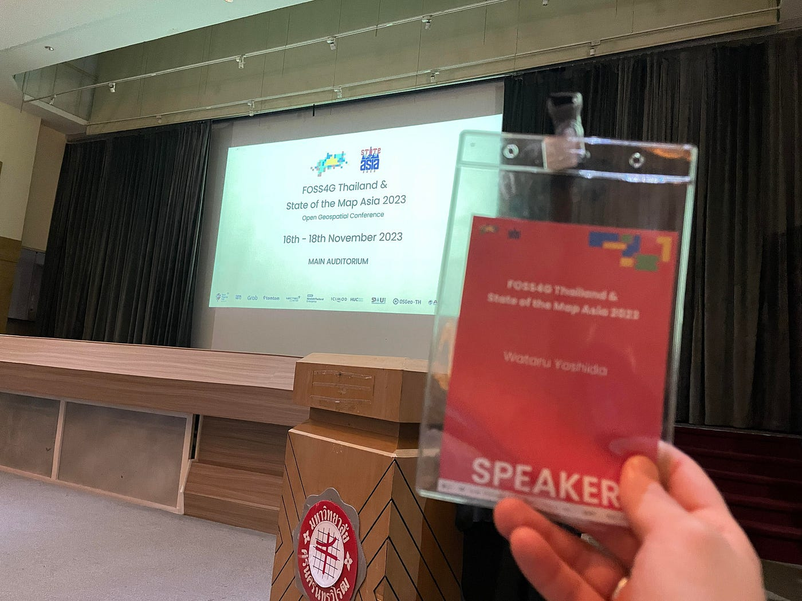
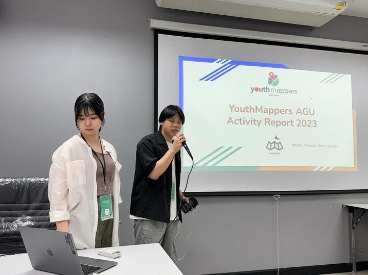
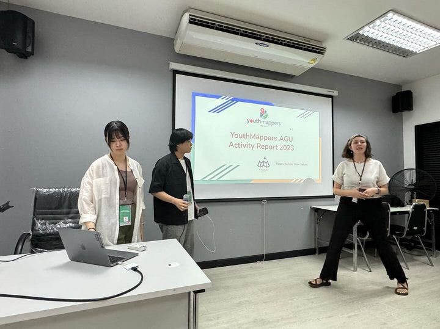
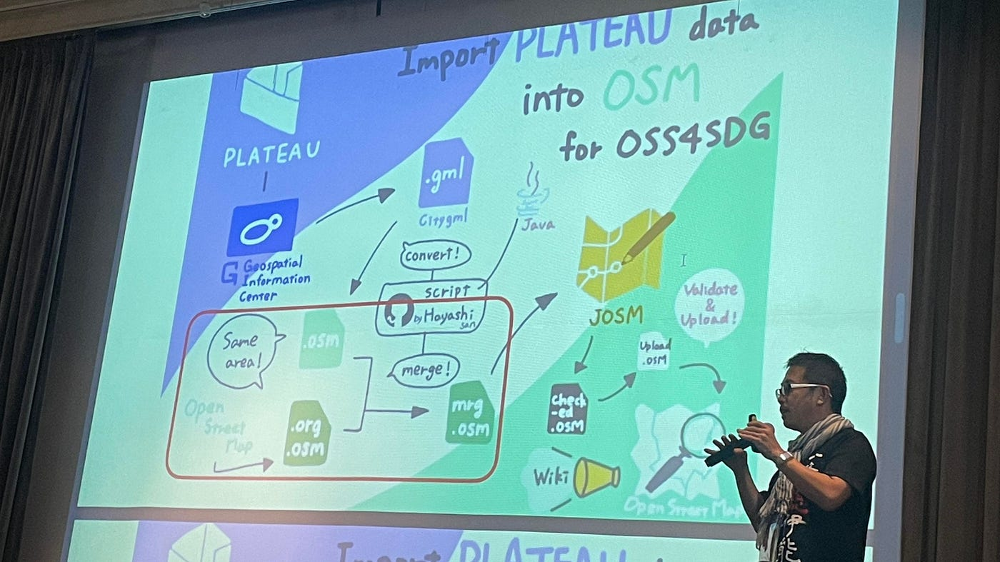
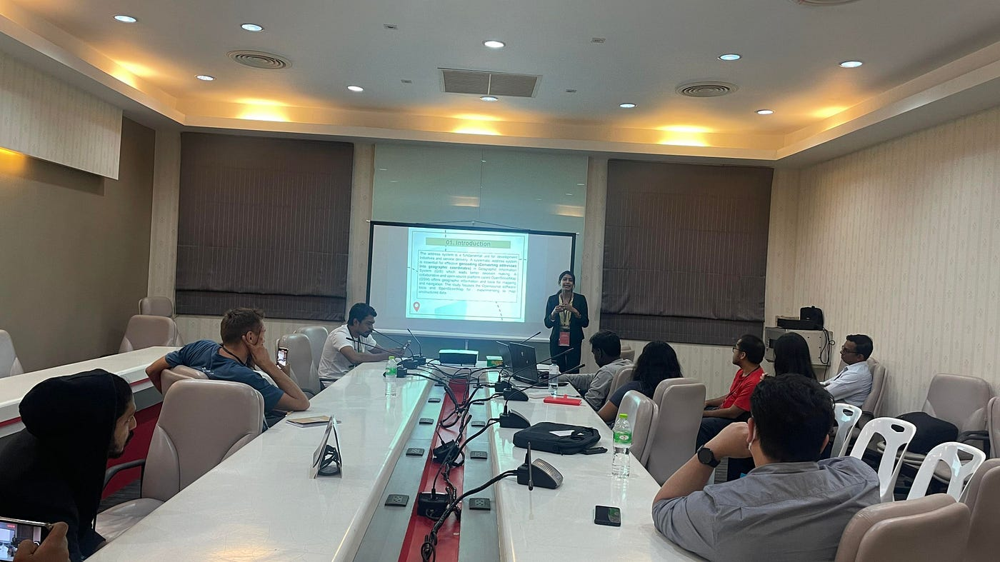
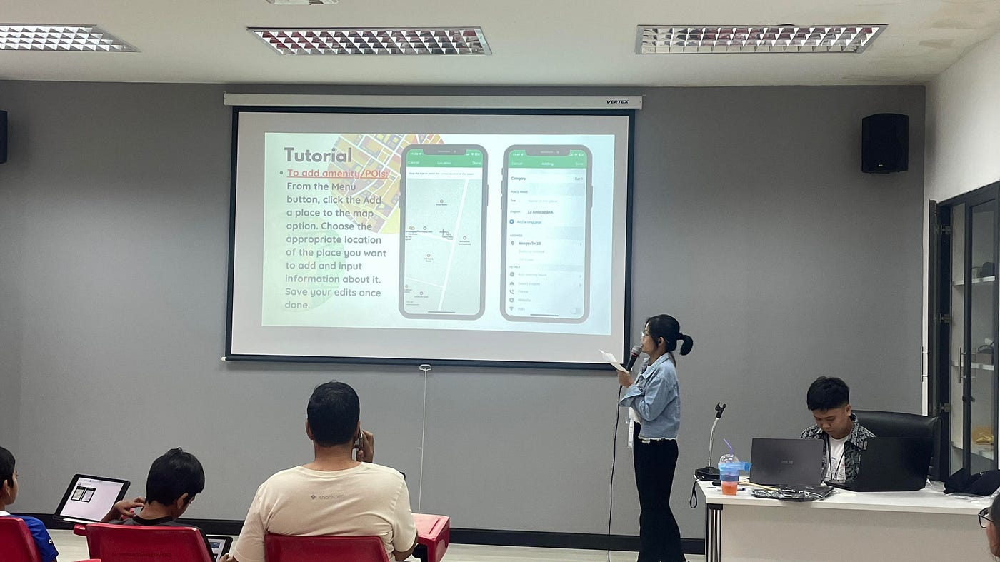
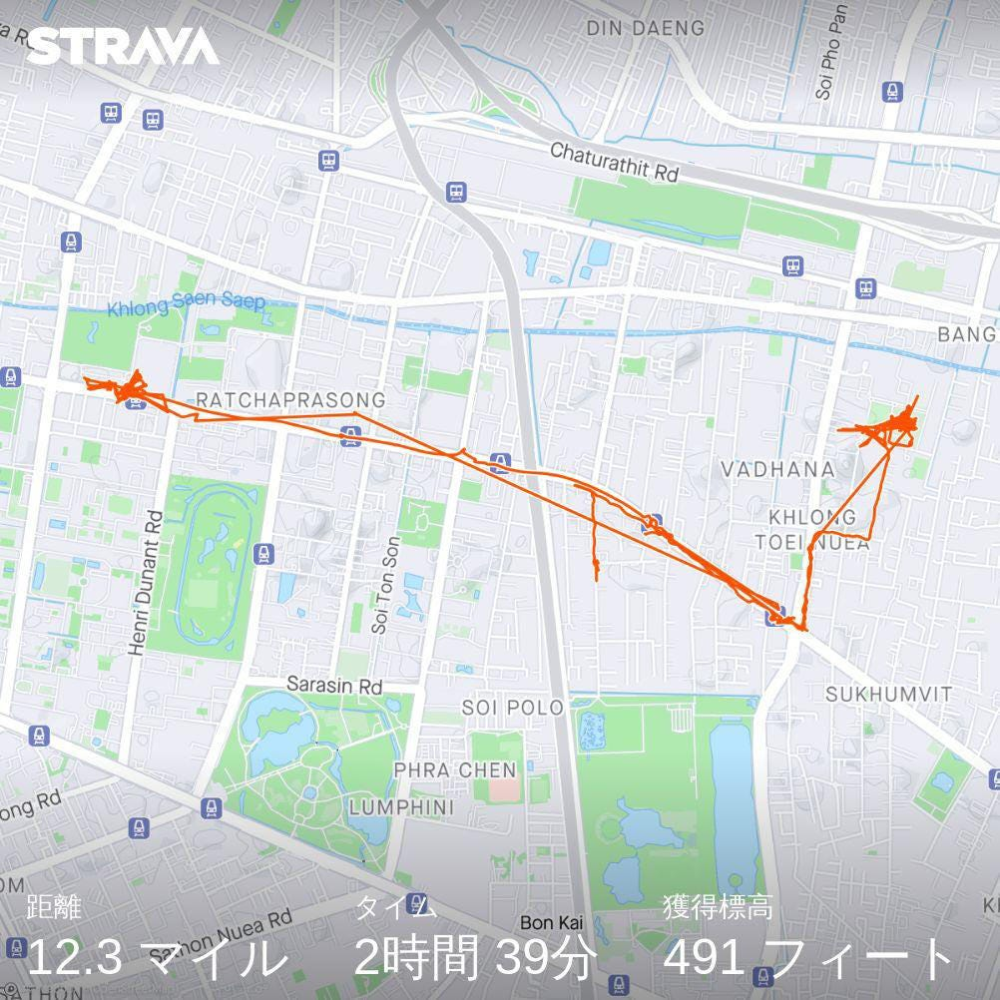
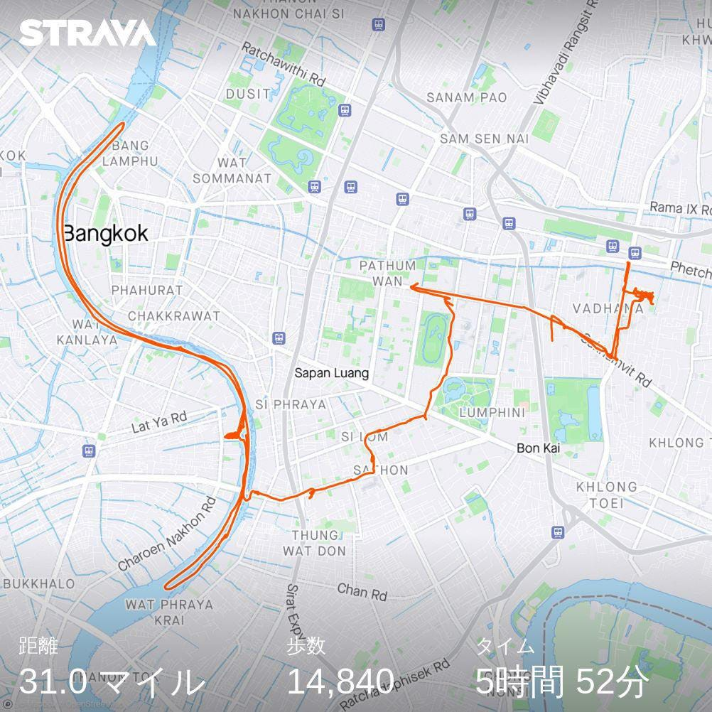

### SOTM Asia 2023/FOSS4G Thailand参加レポート

こんにちは！4年の吉田です！

2023/11/16~11/18の3日間にタイのバンコクにて開催された[SOTM Asia 2023/FOSS4G Thailand](https://2023.foss4g.in.th/)に、YouthMappersAGUとして参加・登壇してきました！

[Home | FOSS4G Thailand 2023
FOSS4G Thailand & State of the Maps Asia 2023 Open Geospatial Conference Conference…2023.foss4g.in.th](https://2023.foss4g.in.th/)

大規模なオフラインの国際会議は初めてで、一人で海外に行くことも初であったため不安もありましたが、振り返ると非常に充実した3日間でした！

会場には、世界中のマッパー、ユースマッパー、HOTのチーム、開催場所であった[Srinakharinwirot University](https://www.swu.ac.th/)のボランティアの学生など様々な方がいらっしゃり、多くの方と交流できたことが非常に良かったです。

> _**発表_**

今回、我々は「YouthMappersAGU Activity Report 2023」として、5分間のLT枠で登壇しました。

主な発表内容としては、

・2023年に行ったクライシスマッピング活動の紹介

・自然災害だけでなく**政治的な混乱**の中でどのような対応をしていくのか

・日本のYouthMappersの団体数・活動数をどのように増やしていくのか

について話しました。

英語力・語彙力をもっと身につけねばと感じたとともに、自分たちが現在やっていることが今後どのように世の中に役立っていくのか・活用されていくのかをもっと理解する必要があると感じた発表でした。

> _**ボランティア_**

今回私はPhotographer/videographerのボランティアに参加しました。

断片的ではありますが、いろいろな方のお話が聞けたり、部屋ごとの雰囲気が異なっていたりと、非常に良い経験となりました。

また、この国際会議での一番の収穫は人との交流でした。

今までオンライン上でしかやり取りをしていなかった人とも直接会えたりもしたり、新たなつながりがたくさんできました。

とても貴重な経験となりました！！

> _**ストラバ_**

