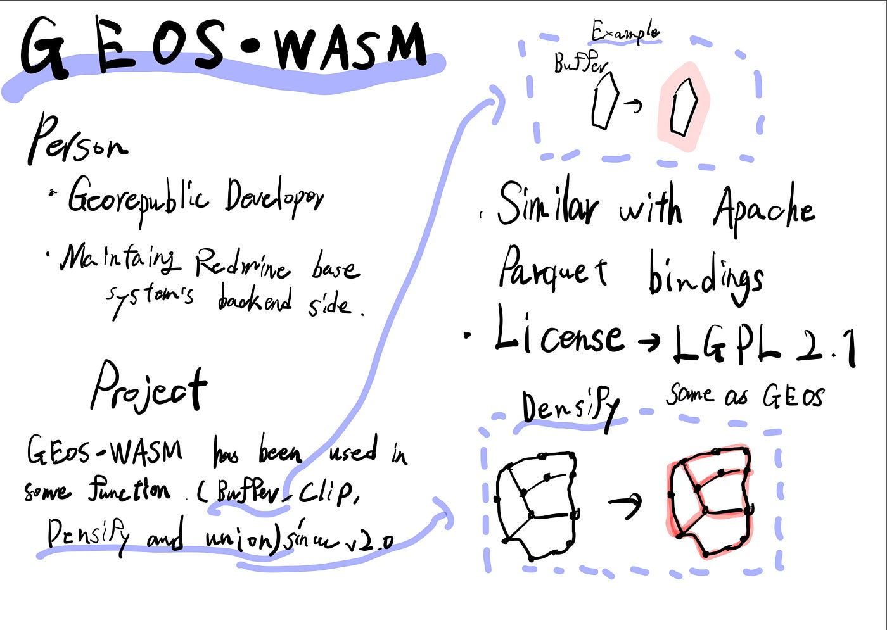
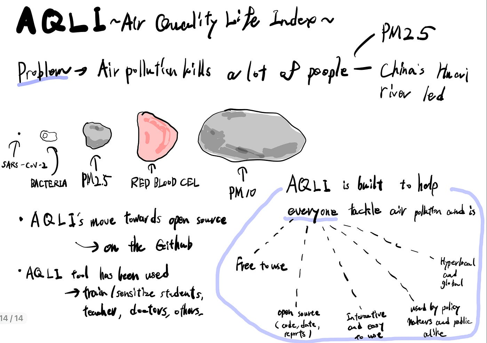
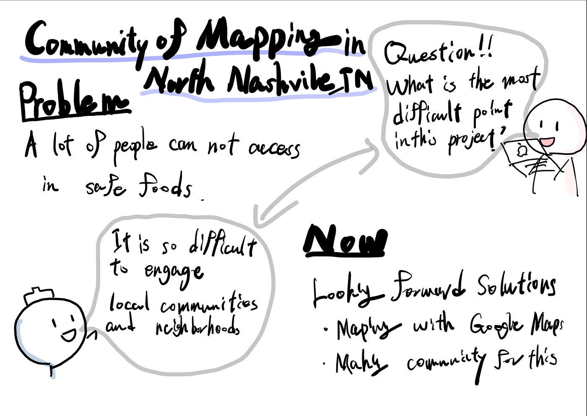
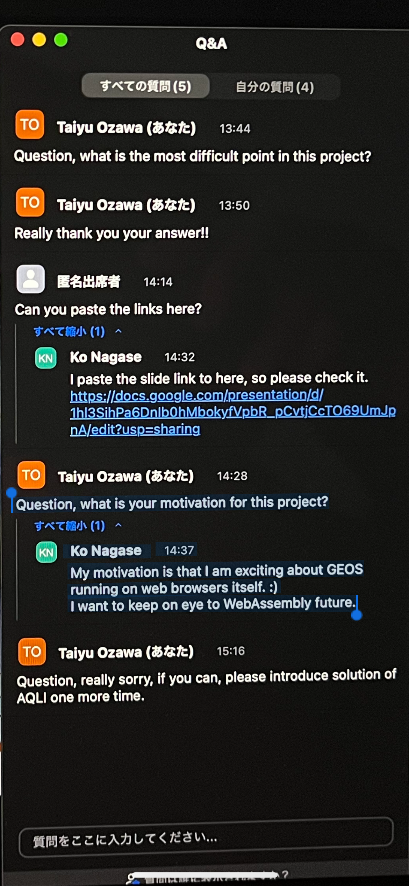

### **FOSS4G ASIA 2023 報告**

こんにちは！4年の小澤です。

11月28日〜12月2日のFOSS4G ASIA 2023に、オンラインにて参加をしたので、その報告をさせて頂きます！

まずは、GEOS-WASMを開発している、georepublic developerの方の発表でした。地理情報システムの開発を行なっているという認識であってますかね、、？英語は難しいです。

発表内容に関しては、GEOS-WASMという内容で、GEOSという地理空間情報を処理するための、オープンソースのライブラリをさらにバージョンアップさせたものとのことでした。

もの凄い複雑な内容だったので、モチベーションはなんですか？と聞いたら、一度は無視されたものの、チャットで以下のように返してくれました。

「My motivation is that I am exciting about GEOS running on web browsers itself. :) I want to keep on eye to WebAssembly future.」

それ自体にワクワクするんだよ！って、なんか漫画みたいで凄いカッコいいなと思いました。

出典：[https://club.informatix.co.jp/?p=1284](https://club.informatix.co.jp/?p=1284)

次は、インド人の方の発表で、大気汚染に関して取り組んでいた内容でした。インドではPM2.5が大問題となっており、AQLIとは、そうした問題を解決するツールで、教師や医者などが使用するとのことでした。

また、インドの汚染問題はは中国の川を経由してやってくることも大きな問題で、その点に関しても大きな課題感を抱いていました。

正直、インド英語むず過ぎました、、笑

最後に、アメリカのnorth nashvilleという地域の食の安全性とその対策についての発表でした。プレゼンターは、その地域での安全な食糧に辿り着ける可能性が低いことを問題として考えており、その解決策を模索しているとのことでした。

現状、地域でコミュニティを作り、Googleマップを活用した安全な食に関するマッピングを行なっているとのことでした。

日本にいると全く気にしない「食の安全」についてだったので、「この取り組みの中で、どういったことが1番大変か」という質問をしたところ、

「コミュニティの活性化（engage）が最も難しい」とのことでした。やはり「コミュニティ事業」は人の感情部分がとても密接に関わってくるので本当に大変そうだと感じました。

もっと英語力鍛えないと、せっかくの面白そうな部分を理解できずで悔しいなと思いました、、。英語の勉強も頑張ります！！

質問した時のスクショを一応貼り付けておきます

