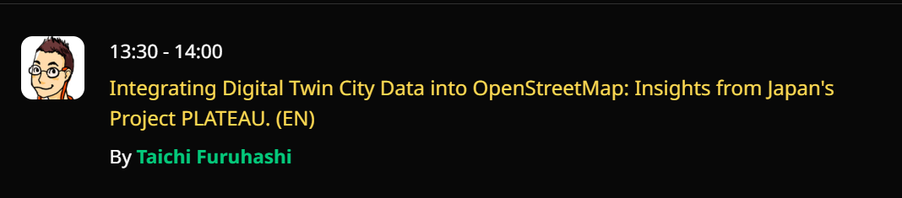
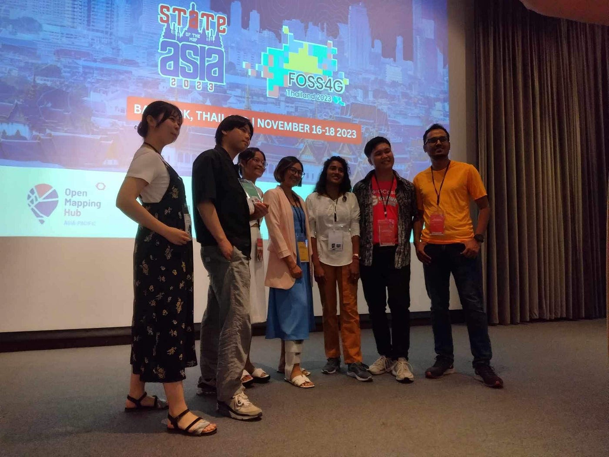
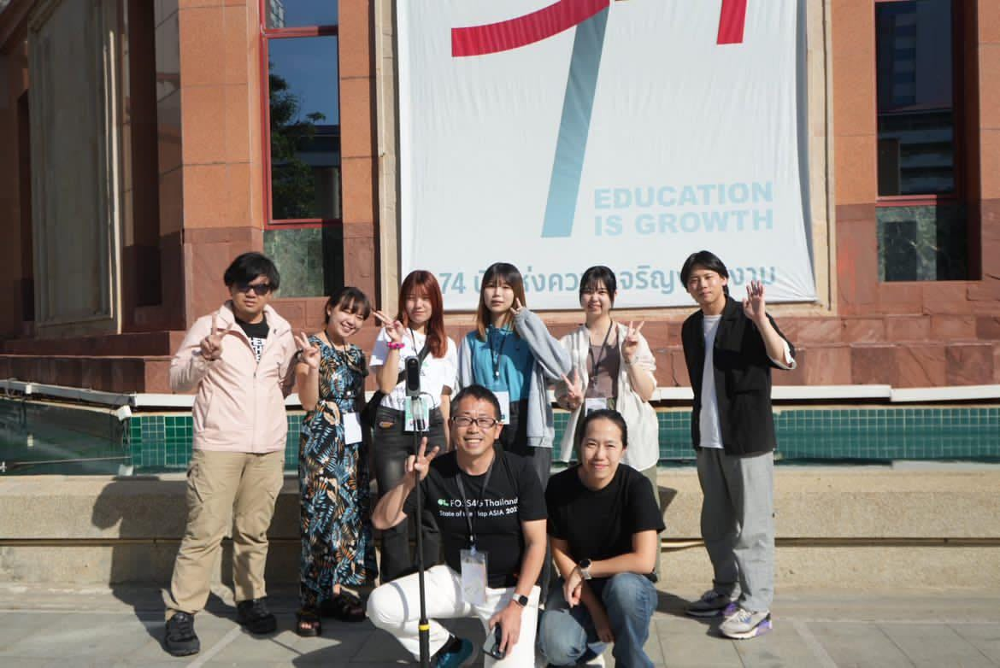
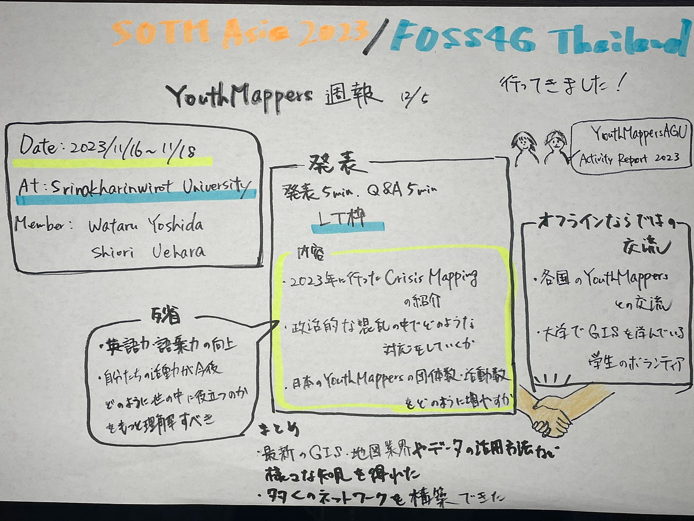

### SOTM Asia2023/FOSS4G Thailandに行ってきました！

### YouthMappers週報 12/5

こんにちは！4年の吉田です！

2023/11/16~11/18の3日間にタイのバンコクにて開催された[SOTM Asia 2023/FOSS4G Thailand](https://2023.foss4g.in.th/)に、[吉田航](https://medium.com/@Ywataru?source=user_profile-------------------------------------)と[Shiori Uehara](https://medium.com/@shioriuehara0202?source=user_profile-------------------------------------)がYouthMappersAGUとして参加・登壇してきました！

[Home | FOSS4G Thailand 2023
FOSS4G Thailand & State of the Maps Asia 2023 Open Geospatial Conference Conference…2023.foss4g.in.th](https://2023.foss4g.in.th/?source=post_page-----cf83c8bc533e--------------------------------)

今回の国際会議は[Srinakharinwirot University](https://www.swu.ac.th/)で開催され、世界中のマッパーやYouthMappers、HOTのチームなど多くの関係者が集まりました。

[SOTM Asia 2023/FOSS4G Thailand](https://2023.foss4g.in.th/)公式Webページによると、参加者が213人越え、スピーカーが25人、セッションは39個もあったそうです。

[古橋先生](https://medium.com/@mapconcierge)は2日目の13:30–14:00で登壇。

YouthMappersAGUは3日目の13:50–14:00の発表5分、Q&Aが5分のLT枠での登壇となりました。

我々の主な発表内容としては、

・2023年に行ったクライシスマッピング活動の紹介

・自然災害だけでなく**政治的な混乱**の中でどのような対応をしていくのか

・日本のYouthMappersの団体数・活動数をどのように増やしていくのか

について話しました。

国際会議と言っても急遽会場が変更になったり、発表者が来なかったりとかなりフランクなものでしたが、スピーカーの発表や質問は専門的で、非常に勉強になりました！

また、この国際会議ではオフラインならではの交流がたくさんありました！

会議に参加していた各国のYouthMappersを中心に、[Srinakharinwirot University](https://www.swu.ac.th/)で地理空間情報などを学んでいるボランティアの学生などと交流を深めることができました！非常に良い経験とまりました。

最新の地理空間情報や地図業界についてや、データの活用方法など様々な知見を得ることができ、かつ多くのネットワークを構築できた非常に価値のある国際会議参加・登壇となりました。

> _**グラレコ_**

