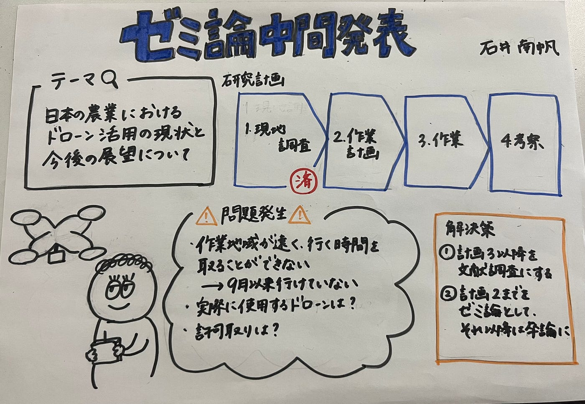

### ゼミ論中間発表

こんにちは、3年の石井です！

ゼミ論の中間発表を行いたいと思います。私のテーマは「日本の農業におけるドローン活用の現状と今後の展望について」です。

本研究のGitHubは[こちら](https://github.com/furuhashilab/2023gsc_Minaho_Ishii)です。

> 研究の計画

１． 現地調査（済）

→今何に困っているのか、何がどうなったらもっといいのか等、実際に現地に行って調査する

２． 作業計画

３． 作業

４． 考察

> 現状

9月に作業地域である岡山県に行き、調査を行いました。

しかし、

・作業地域（岡山県）が遠すぎる

・車で行くしかない（約９時間）

・授業やアルバイト等で行く時間を取れない

といった理由で9月以来行けておりません、、

他にも、実際に飛ばす農業用ドローンをどうするのか、許可取りはどうするのかなどの問題が発生しています。

> 今後

解決策として、

①計画３以降を文献調査にする

②計画２までをゼミ論として提出し、実際の作業と今後の考察は来年の卒論で発表する

という案を考えました。

Google slideは[こちら](https://docs.google.com/presentation/d/1gdurDVSF1AFUWF2giQYc3u5aXsIjuDLIAB4GoW1pmag/edit?usp=sharing)です！

> グラレコ

