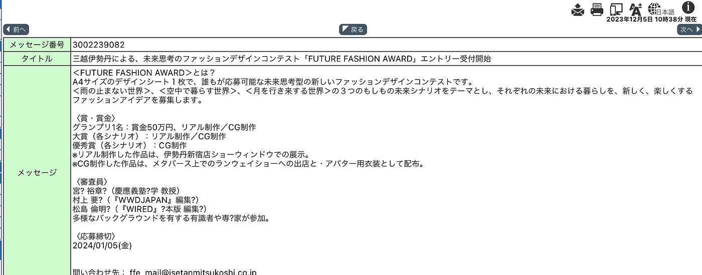
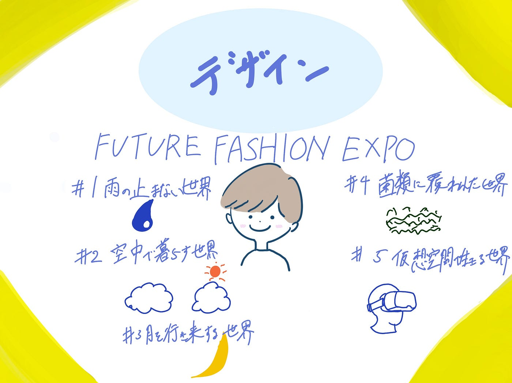

### リアル×メタバース横断型イベント

こんにちは。４年植松です。青学ポータルをのぞいていたら見覚えがある企業の名前があり、非常に面白い内容だったので共有です！

“もしもの未来の暮らしから、ファッションの可能性を考える” リアル×メタバース横断型イベント「FUTURE FASHION EXPO（フューチャー ファッション エキスポ）」が、2023年11⽉15⽇から2024年3⽉31⽇まで開催中だそうです。

三越伊勢丹グループは、顧客体験を革新するために、リアル店舗とオンラインの境界を取り払った新しい戦略に取り組み出しています。この戦略のさいたる例が、メタバース空間の三越伊勢丹でお買い物ができるというアプリ「REV WORLDS」です。今回はそのアプリ上でファッションイベントが開催されます。ファッションデザインコンテスト「[FUTURE FASHION AWARD](https://ffe.rev-worlds.com/award)」の受賞作品は[三越⽇本橋本店](https://www.mistore.jp/store/nihombashi.html)で表彰式が行われるほか、現実の衣服として再現されて[伊勢丹新宿本店](https://www.mistore.jp/store/shinjuku.html)ショーウィンドウで展⽰されるなど、文字通りリアルとメタバースを横断したイベントとなるそうです。

これにより、リアルとデジタルの融合から生まれる新たな顧客体験を創出し、社会課題への深い洞察やファッションの新たな可能性を探求しています。このリアルとデジタルの融合が斜陽産業と言われる百貨店がとらなければいけない新たな一歩であり、自分が魅力に感じた点です。

今回のイベントを見ても思いましたが私自身はREV WORLDSに関われるのならやりたいことが3つあります。

1つ目はお買い場での経験を活かしたデジタル空間の店舗作りです。REV WORLDSのようなデジタル領域では作ろうと思えばどんな空間、商材でも作れるため非常にマーケットインの視点が重要になると考えます。そのため、実際にお客様と接することができるお買い場での経験を通じて、デジタル空間上でもペルソナベースで考えながらキュレーションできるようになりなと思いました。

2つ目はアクティブユーザー数拡大のための新機能の追加です。理由は使用していてこのようなイベント以外の時間帯にログインしているユーザー数が少ないと感じるからです。もしユーザー数を増やすことができるのならば現実世界に比べて会話が生まれやすいバーチャル世界では面識のないお客様同士がチャットで盛り上がりながら買い物をする空間を提供できるようになるかも知れません。そのような新たな体験価値をて供していきたいです。

3つ目はREV WORLDSの海外展開です。時間や場所に縛られないバーチャルの強みを最大限活かして世界で三越伊勢丹ファンを増やしたいなと考えています。3年目までくらいにはREV WORLDSの部署いきたいです。

またこのイベントはイノベーションリサーチやコンセプトデザインに特化した未来予報株式会社と共同で、このイベント専用の「もしもの未来シナリオ」を開発したそうです。このシナリオは、[スペキュラティブデザイン](https://ideasforgood.jp/glossary/speculative-design/)という手法を用いて、現在とは異なる未来の可能性を探ることで、新たな思考のきっかけを探るものだそうです。

イベントで設定された5つのシナリオは、社会課題や最新テクノロジーを背景に、実際にあり得る未来を描いており、これらは未来の生活やファッションについて想像し、議論するための重要なツールとなっているそうです。

雨の止まない世界

空中で暮らす世界

月を行き来する世界

菌類に覆われた世界

仮想空間で生きる世界

＜FUTURE FASHION AWARD＞は、A4サイズのデザインシート１枚で、誰もが応募可能です。＜⾬の⽌まない世界＞、＜空中で暮らす世界＞、＜⽉を⾏き来する世界＞の３つのもしもの未来シナリオをテーマとし、それぞれの未来における暮らしを、新しく、楽しくするファッションアイデアを提出するもので入選すると以下賞金がついてくるそうです。

グランプリ1名：賞金50万円、リアル制作／CG制作

大賞（各シナリオ）：リアル制作／CG制作

優秀賞（各シナリオ）：CG制作

※リアル制作した作品は、伊勢丹新宿店ショーウィンドウでの展示。

※CG制作した作品は、メタバース上でのランウェイショーへの出店と・アバター用衣装として配布。

誰か一緒に応募しませんか？

グラレコ

