## Foss4g Asia 2023 Seoul

参加レポート : 深水友希

こんにちは、3年の深水です。

2023年の11月29〜12月2日の間、韓国で行われたFoss4g Asia 2023に参加して来たので、その報告をさせて頂きます。

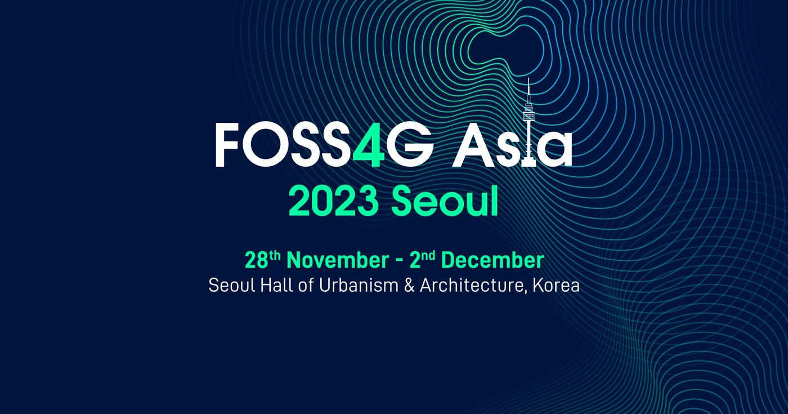

> UN Workshop

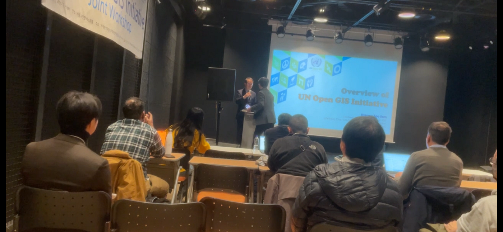

11月29日のUN Open GIS workshop では、国連がOpen GISを利用して実際にどんな活動を行なっているのかを学びました。

発表者と発表内容のリストです

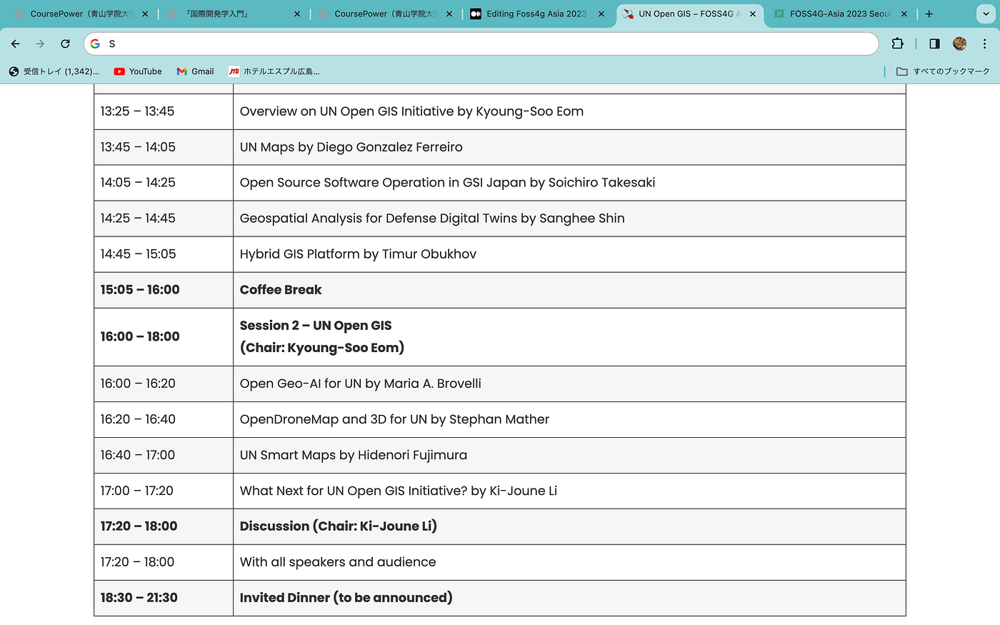

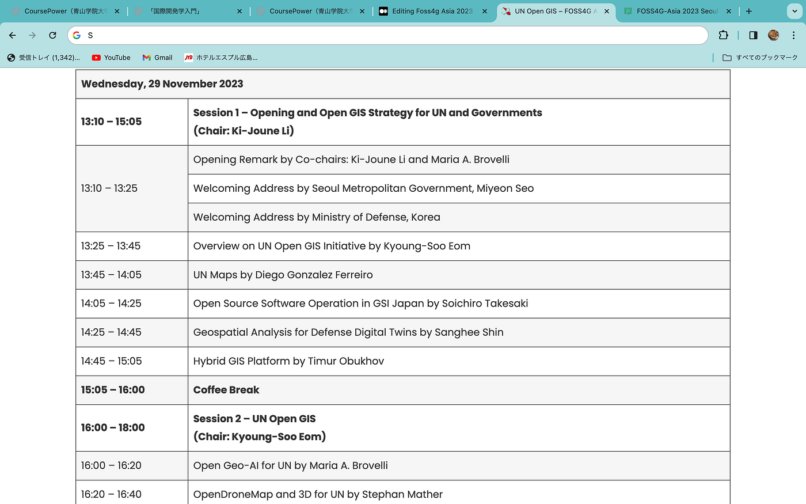

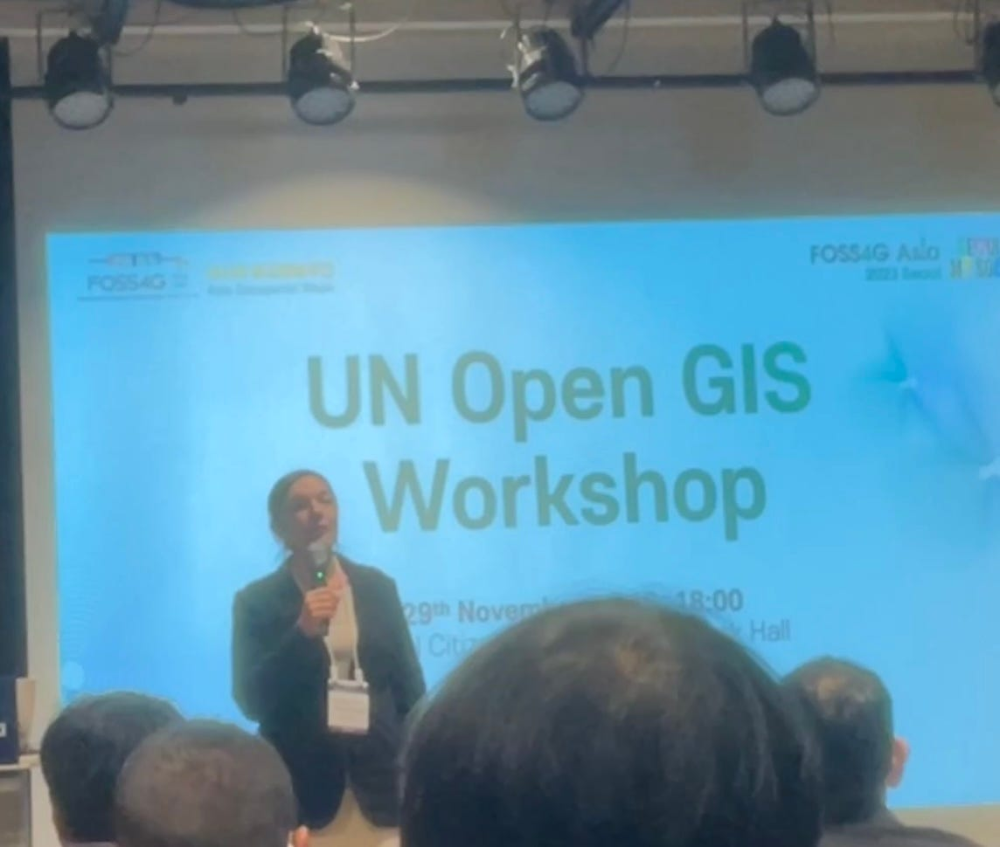

まず、この分野の国連の取り組みは、UN Open GIS Initiative と呼ばれる戦略の中で、国連以外の様々な団体をも巻き込んで行われています。

UN Open GIS Initiative は、状況認識の強化を効果的かつ効率的にサポートし、意思決定に情報を提供する、持続可能なハイブリッド GIS プラットフォームを提供することを目指しているそうです。

また、UN Smart Maps Groupは、地図を通して人々をスマートにすることを目的に活動しているそうです。長崎県の地図を3Dのタイルで作ったりもしているようでした。また、近い将来には一つの国の地図データを全て小さなデバイスに保存することが可能になるかもしれないそうです。

国連の中には、UN Global Service Center という部署があり、この部署ではUN map と呼ばれるオープンな地図が作られているそうです。特に田舎で国連が活動を行う時、情報が少なくて困らないようにあらかじめ情報や地形をUN mapに書き込むとのこと。また、国によっては国連に情報を共有してくれないことも多く、オープンなプラットフォームの存在は必要不可欠らしいです。

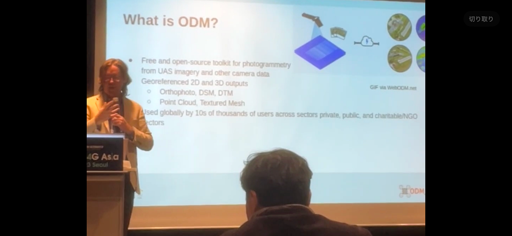

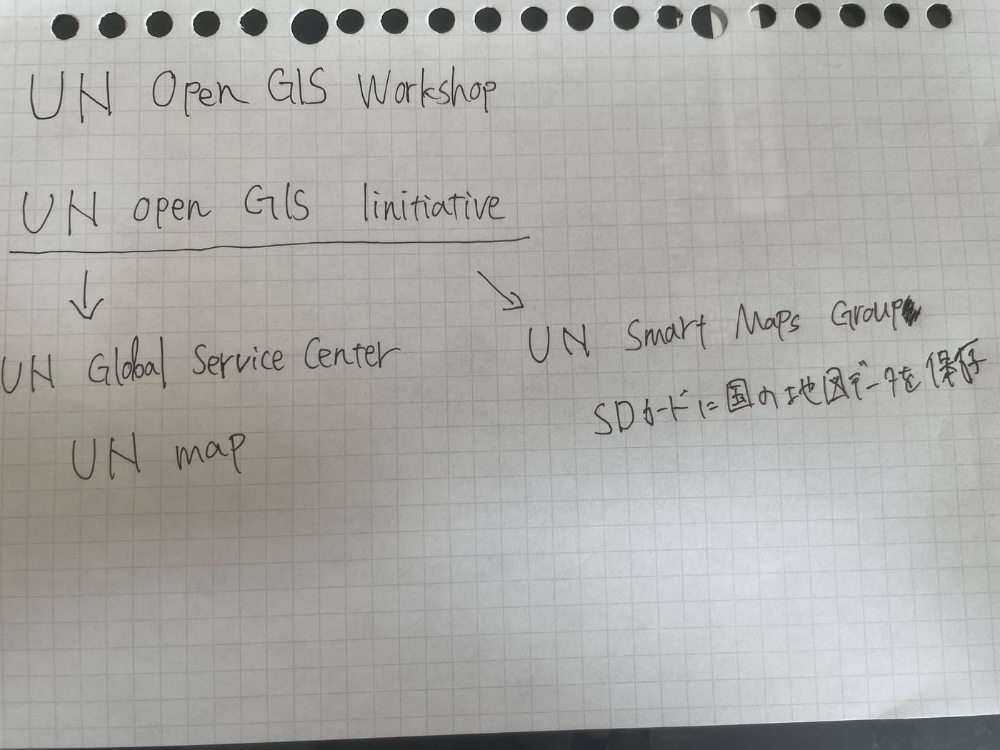

UN Open GIS workshop の中でも印象的だったのが、Sanghee Shin さんの話です。彼はもともと韓国の国防分野に携わっていて、国で利用できるオープンな地理的情報が少ないことを感じていたそうです。

そこで彼が開発したのがMilMapで、これはPostGISやGeoServerなどの多数のオープンソースプロジェクトをベースにして作られた、ブラウザ上で地理空間情報の検索やダウンロードが行えるシステムです。

将来的には、Milmapが戦場の分析やシュミレーションなども行える軍事デジタルツインシステムになるようにアップデートしていくそうです。

Shin さんとのツーショット

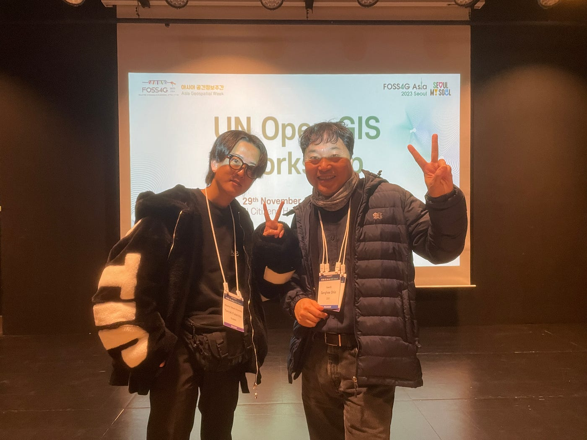

快く質問に答えて頂きました。

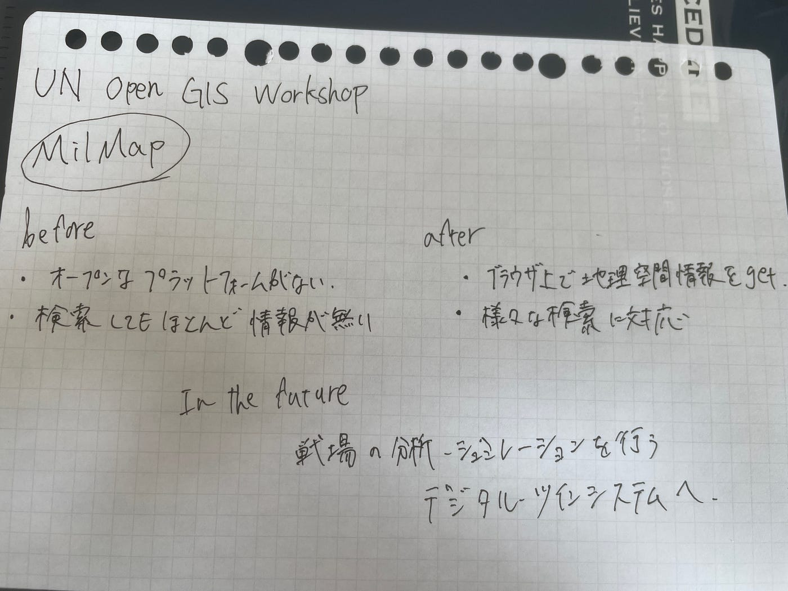

> Presentation

今回は、僕もspeakerとして参加し、Wheelmapのプレゼンを行いました。

↓使用したスライドです。

[https://docs.google.com/presentation/d/1516VNOD_bg0ul7gQkrJ1uO2l2ueTgYL7DBEW_xk0KB4/edit?usp=sharing](https://docs.google.com/presentation/d/1516VNOD_bg0ul7gQkrJ1uO2l2ueTgYL7DBEW_xk0KB4/edit?usp=sharing)

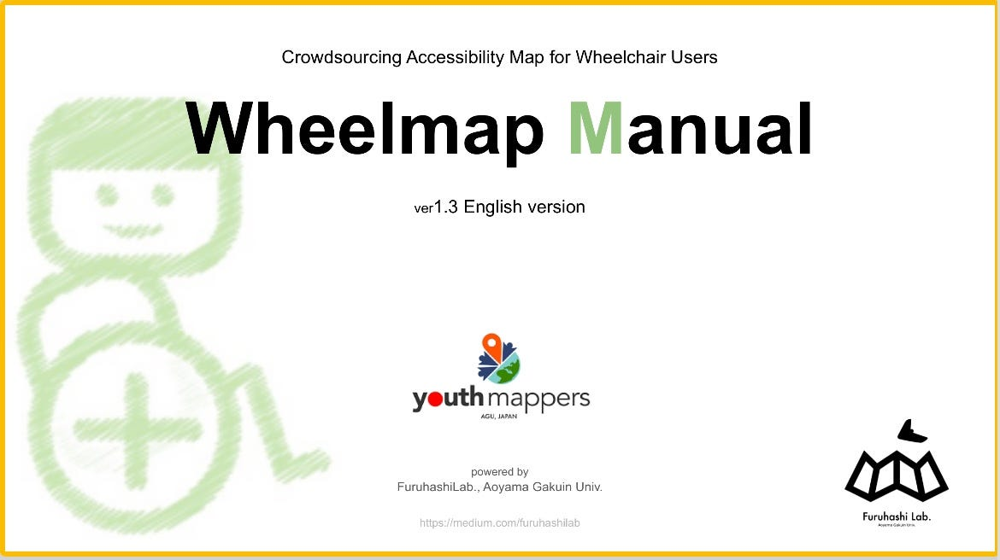

短い10分の間で、なんとか分かってもらおうと必死に説明したのですが、観客の一部はよく分からなそうな顔をしていて、もっと英語での発表に慣れる必要があるなと感じました。

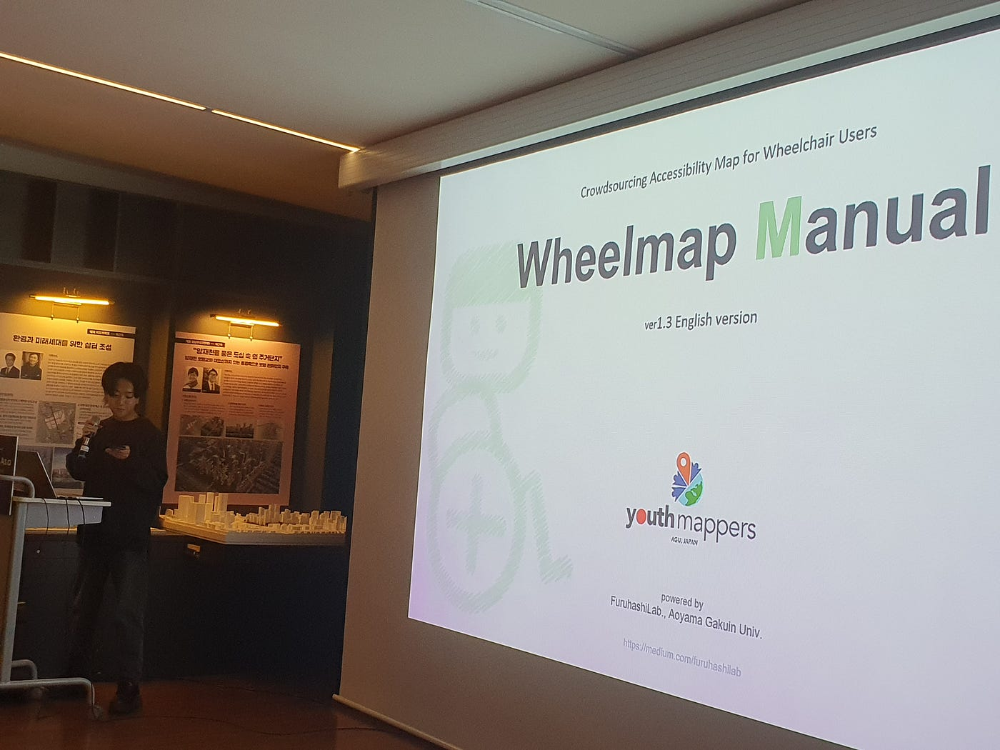

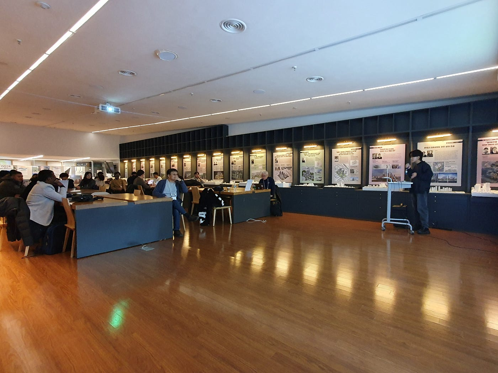

> Strava

[https://strava.app.link/233x6WUPWFb](https://strava.app.link/233x6WUPWFb)

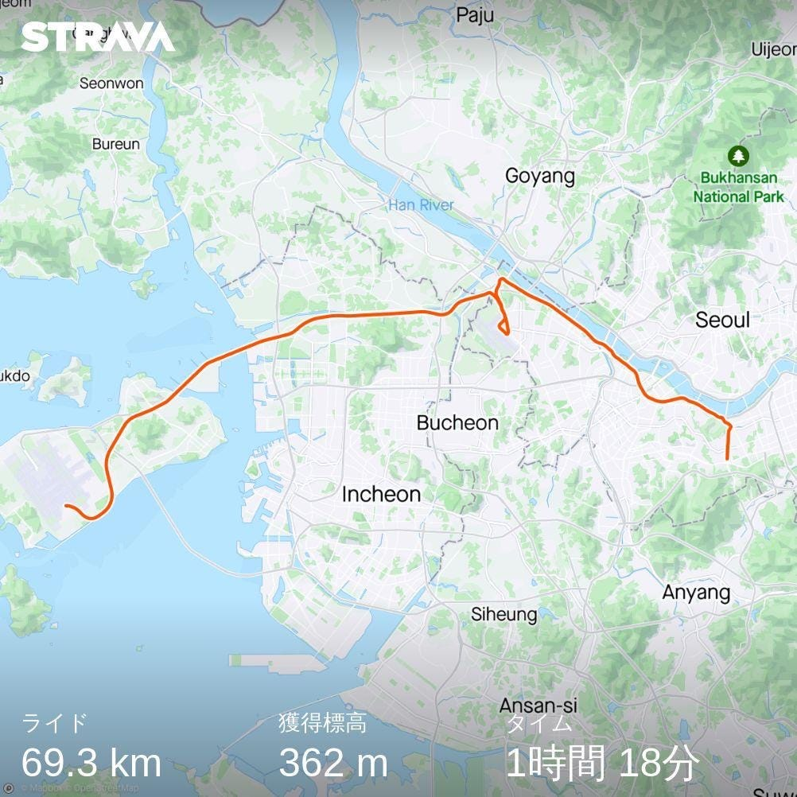
