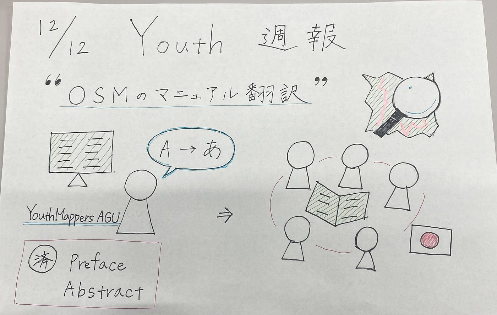

### Youth週報（12/12）

こんにちは！3年の上原です。日中の寒暖差が激しく、振り回されています。皆さまもどうぞお体に気を付けてお過ごしください。

#### 報告

今週のYouthMappersAGUの活動を報告いたします。

私たちはOpenStreetMapの記事([Open Mapping towards Sustainable Development Goals ](https://link.springer.com/book/10.1007/978-3-031-05182-1?fbclid=IwAR0mxXoILYo2Ar1akXx7F3QDRs6TqVAv7CIYDUPNo6YihQb4pQ0NFWNFV_g))の翻訳作業を開始しました！

[Open Mapping towards Sustainable Development Goals
This open access book collects the experiences of young people in YouthMappers to address pressing issues facing their…link.springer.com](https://link.springer.com/book/10.1007/978-3-031-05182-1?fbclid=IwAR0mxXoILYo2Ar1akXx7F3QDRs6TqVAv7CIYDUPNo6YihQb4pQ0NFWNFV_g)

今週の役割分担は以下の通りです。

吉田さん、石井さん：Preface
上原：Abstract

このように和訳しました！⇒[第一回目の和訳成果](https://docs.google.com/document/d/1t4SAWIjNs0r3eWKRKZHyXRDD87rA5Hcc9rwEdz72_ns/edit?usp=sharing)

和訳が完成したら、より多くの人にSDGsの観点でもOSMが有用であることが伝わると思うので、引き続き作業を進めていきたいと思います。

#### グラレコ

