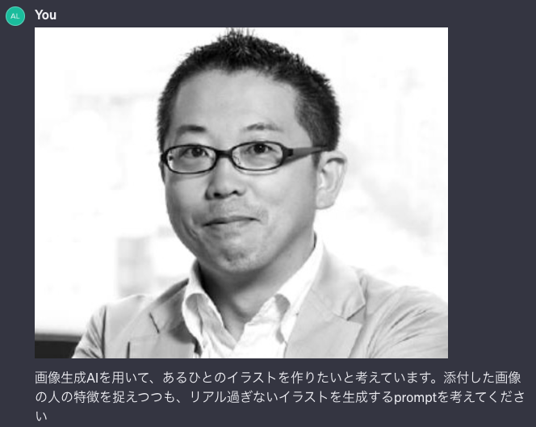
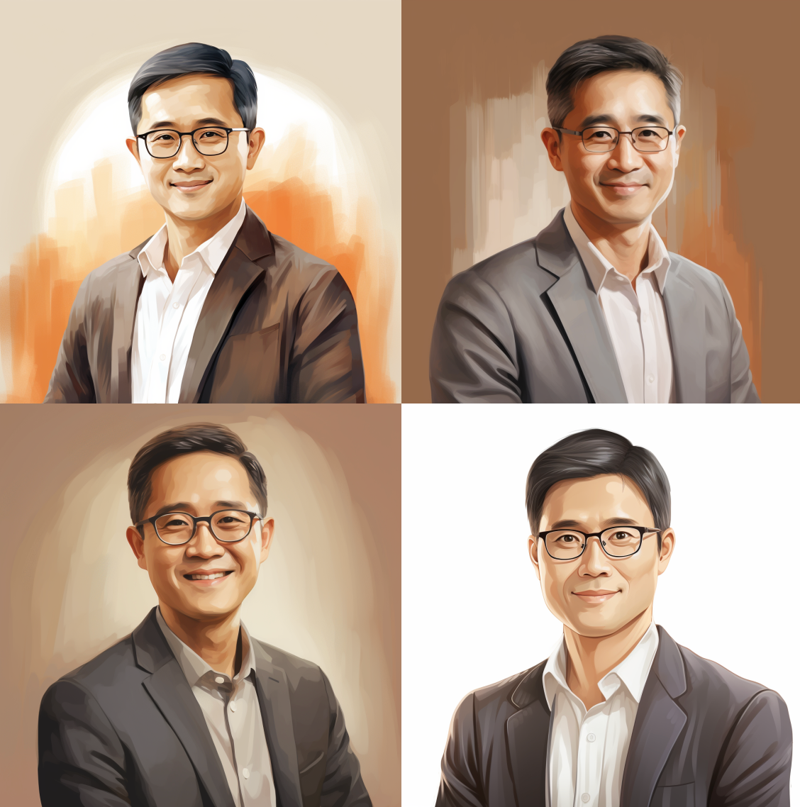
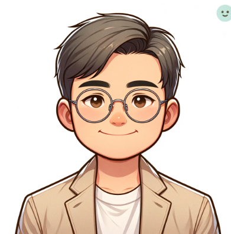
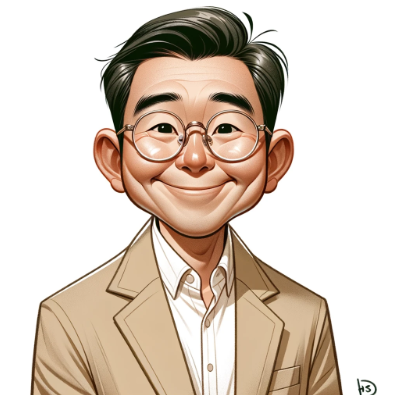
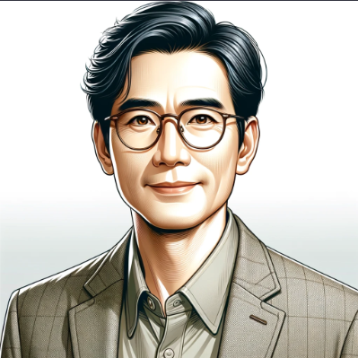
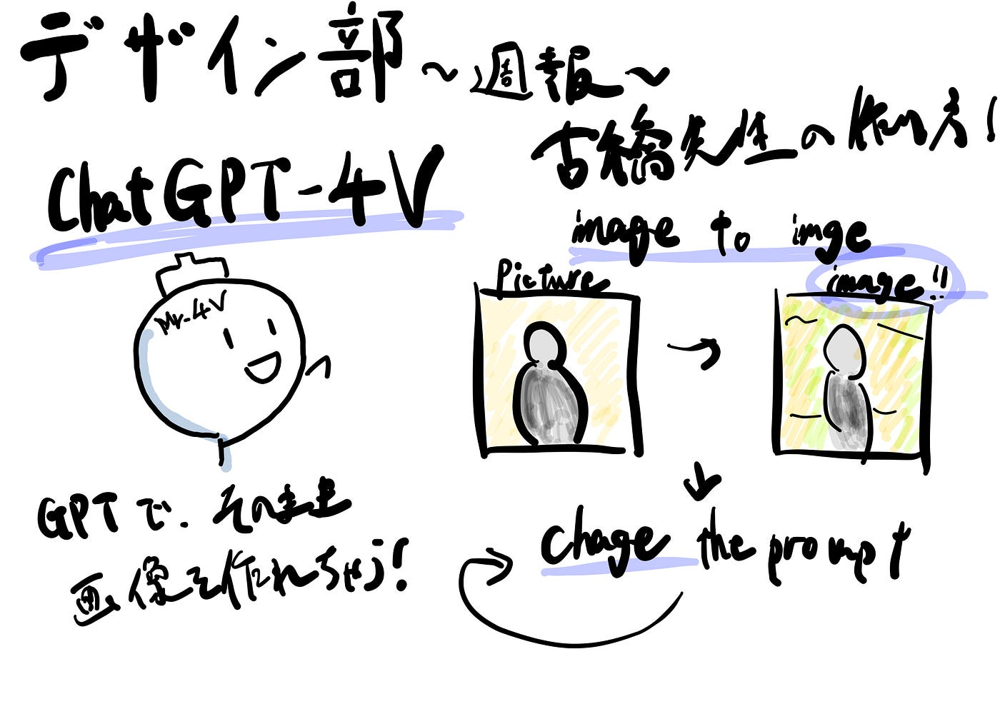

### デザイン部 週報

こんにちは！デザイン部4年の小澤です。
今回は、色んなデザインで使う「古橋先生」の画像生成AIでの作り方を模索してみました。

まずは、いつもやっているテキストから画像を生成する、
「text-to-image」ではなく、「image-to-image」という、画像を読み込ませて、その画像に近い画像を生成する手法を用いました。

まずChatGPTに、先生の画像を取り込んでもらいます（勝手にすみません🙇）。

一旦は、どんな感じで出力されるのだろうかと、特徴を捉えつつも、リアスすぎないイラストを作って！と依頼したら、、

めちゃめちゃ年齢が高くなってしまいました。

こちらの画像を生成するのに用いるpromptは、以下とのことです。

Illustration of a middle-aged Asian man with glasses, sporting a short hairstyle and a confident smile. He is dressed in a smart-casual style, wearing a light-colored shirt and a blazer. His posture is relaxed yet assured, and he exudes an aura of intelligence and approachability. The illustration has a cheerful and inviting atmosphere, with a balanced mix of realistic features and simplified, stylized elements to avoid hyperrealism, set against a light, non-distracting background

Midjourneyで以上のpromptで生成すると、こんな感じです。

一旦今回は、Midjourneyではなく、GPT-4Vでの画像生成を試していたのですが、

1番上手くいってこんな感じでした。ただ、やっぱり全体的に特徴を捉えら得ていないのと、逆にイラスト感が少し強いので改善の余地しかありません。

因みに指示を間違えると、以下の画像のように全然想定と違う画像出力されて、「違うんだよなぁぁーーー。」ってなります笑

やっぱりpromptの際に適切なワードで、補助をしてあげると、ぐっとイメージに近まるなと思いました。

グラレコです！

