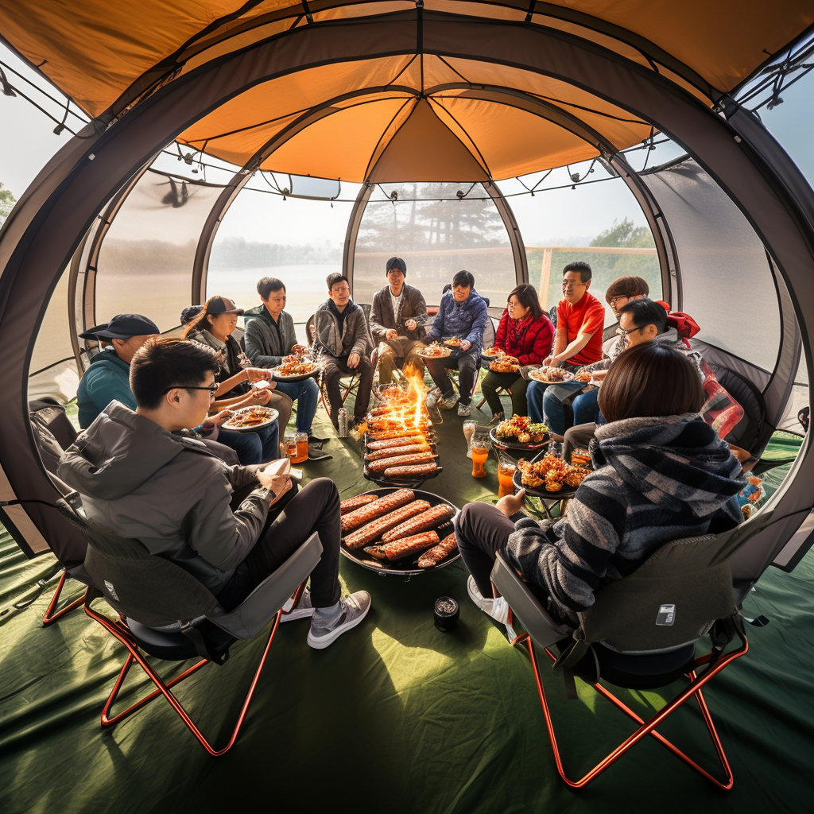
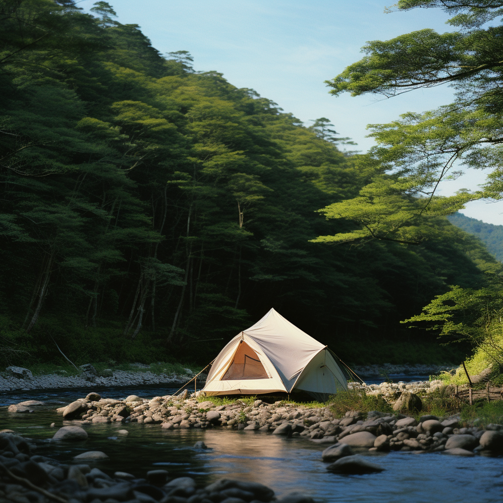
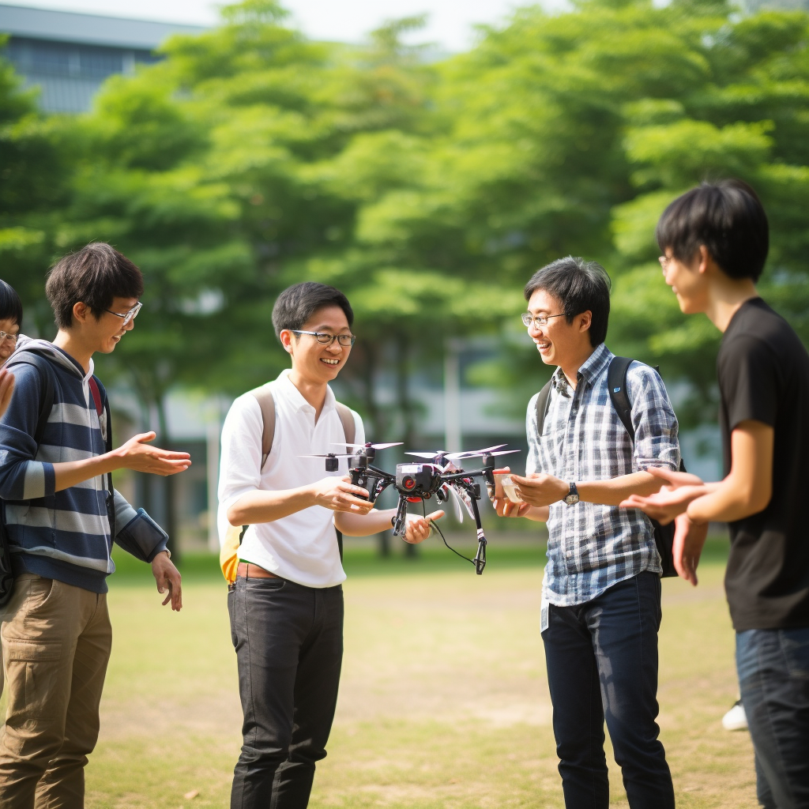
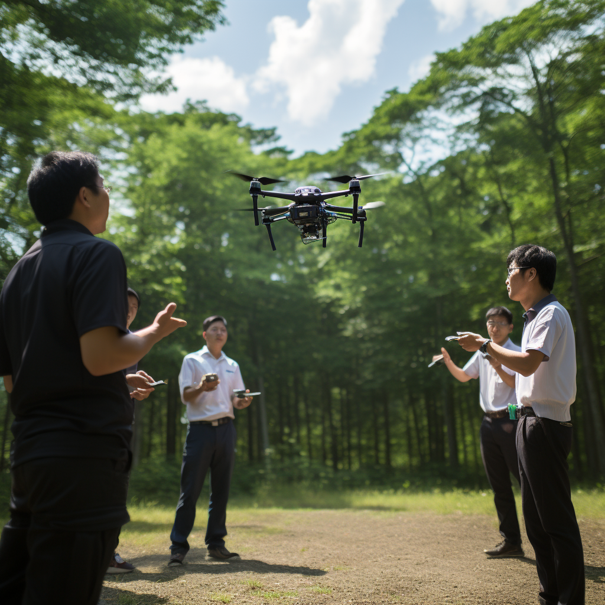
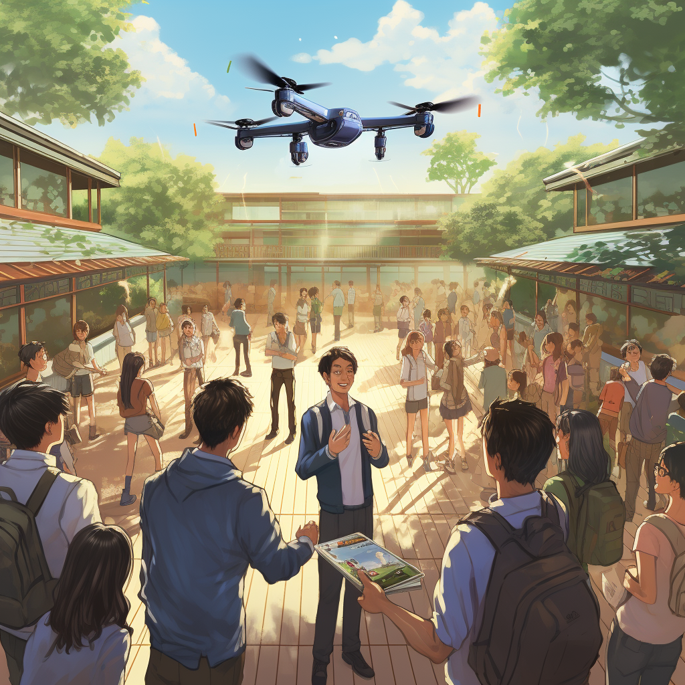
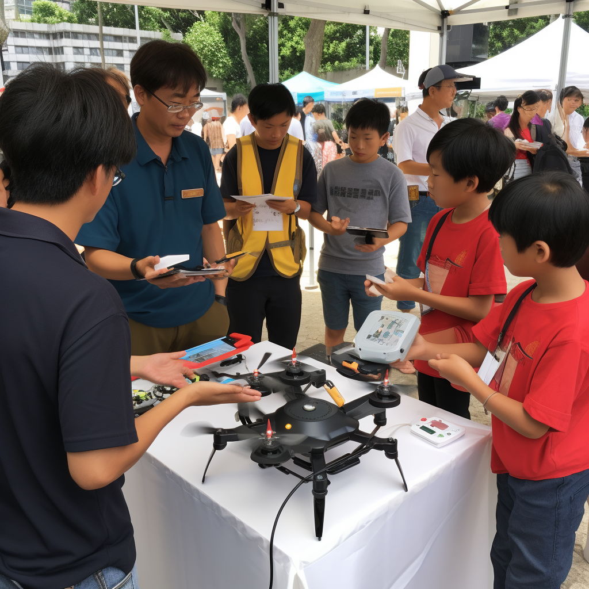
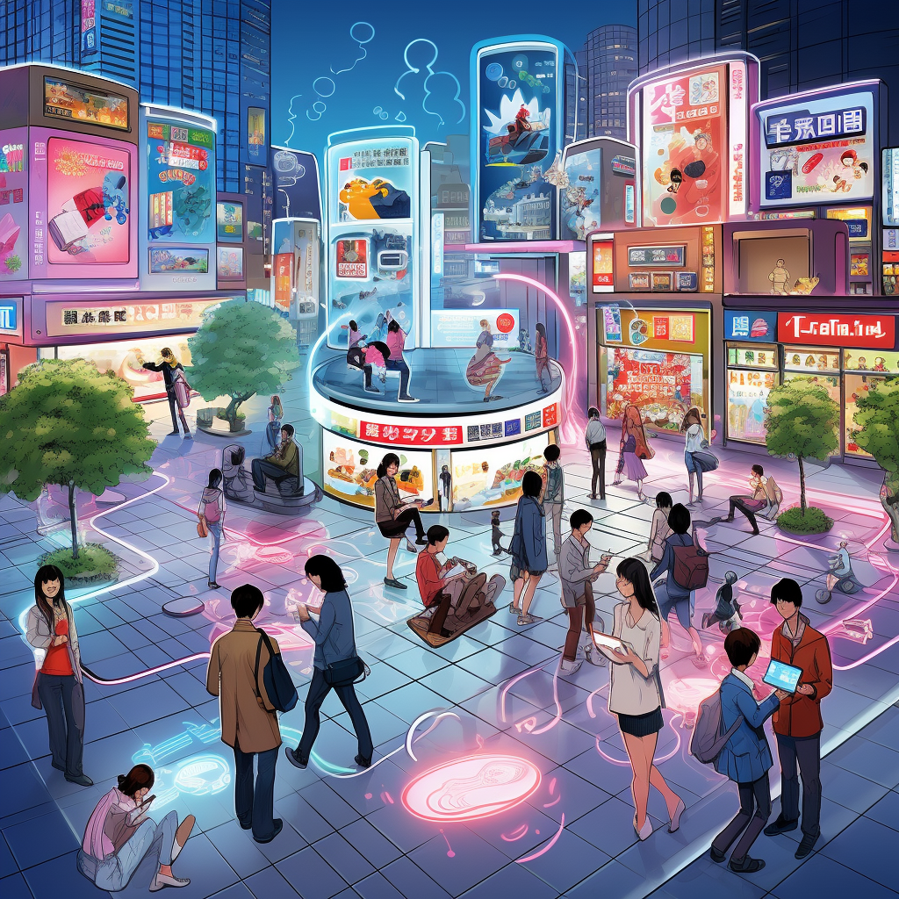
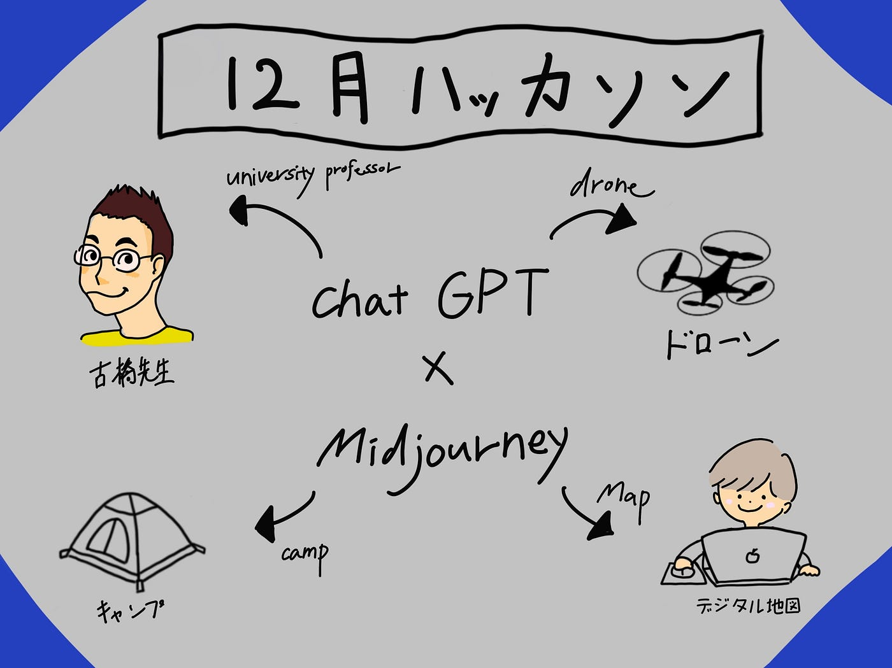

### 12月画像生成ハッカソン

こんにちは。4年の植松です。

今回のハッカソンは、画像生成ハッカソンということで、[Midjourney](https://www.midjourney.com/explore)と[ChatGPT-4](https://chat.openai.com/)を使用して「古橋研究室らしい地図や空間情報、キャンプなど関連するグラレコ素材的イラスト」10作品制作しました。

#### １地図づくり

古橋ゼミといったらデジタル地図ということでまずはパソコンで地図を作っている風画像を生成しました。

ポイントはものが多い古橋研究室を表現するためにプロンプトにものが散らかっているという文章を入れた点です。またiMacで操作している点もこだわりました。

プロンプト
A Japanese university student intently creating a map on the internet using their computer in a cramped room. The student, embodying a blend of traditional and modern Japanese culture, is focused, with complex map-making software displayed on their computer screen. The room is a fusion of Japanese and Western styles, reflecting a typical student’s space, with posters, academic notes, and perhaps a small traditional Japanese decoration. The desk is cluttered with scattered notebooks, books, a coffee cup, and maybe a small bonsai or a Japanese calendar. Natural light from a window illuminates the room, showing a sunny day outside, but the student is engrossed in their work.

こちらも地図づくりの画像です。OSMは皆で作るものなので複数人の大学生が地図を作っているという風にしました。初めはuniversity studentのプロンプトだけえではどうしようもなくダサい服装だったのでだいがくせいっぽくするためにおしゃれな服装をしたという要素を追加しました。

プロンプト
In a cramped university classroom, equipped with modern technological tools including several advanced drones, three stylishly dressed male Japanese university students are gathered around a MacBook. They are intensely focused on creating a map via the internet. The students, exemplifying contemporary fashion trends, add a vibrant and youthful energy to the room. The MacBook’s screen displays sophisticated map-making software, which they are adeptly navigating. Despite the limited space, the room buzzes with academic activity, scattered with books and notes on map creation. The walls are adorned with educational world maps and geographical posters. Sunlight streams through the windows, casting a warm glow over the students, who are deeply immersed in their innovative mapping project

#### ２キャンプ

横瀬で行われる合宿でのBBQの様子をイメージして作りました。こちらはChat GPTの手を借りずに作成しました。自分が入れたい要素の単語を羅列するだけでもかなり精度の高い画像が生成されることに驚きです。ポイントは牛タンです。先生がよくコストコでスライスされていない牛タンの塊を買ってきてくれるのであえてでかいままの牛タンを表現しました。さすがにおおすぎ、、、

プロンプト
BBQ, beef tongue, inside a large tent, multiple Japanese university students, sitting in a circle on camping chairs, camping

こちらは自分の自信作です。多分合宿に参加したことがある人ならこれが横瀬の河原でテントを立てている様子だとすぐわかると思います。ちょっとゴツゴツの石すぎますかね？

プロンプト
Captured in a serene and tranquil setting, a lone Japanese camper is sleeping peacefully in a tent beside a gently flowing river. The scene is set in a picturesque outdoor location, where the soothing sounds of the river create a calming ambiance. The tent, slightly open, reveals the camper snugly wrapped in a sleeping bag, suggesting a deep and restful slumber. The tent is pitched in a secluded spot, close enough to the river to enjoy the soothing sounds of water, yet safely nestled among natural surroundings. The early morning light is just beginning to filter through the trees, casting soft shadows and highlighting the beauty of the natural landscape. This illustration portrays a moment of solitude and connection with nature, showcasing the simple joy of camping alone in a scenic riverside setting.

#### ３ドローン

こちらドローンの操作方法を教えている様子を表現しました。おしゃれな大学生やかっこいい大学生などの指示をしないといわゆるいかにも東大生みたいな見た目になるのはどうしてでしょうか？面白かったのでこのまま残しました。

プロンプト
In an open area of a university campus, a young Japanese professor wearing glasses is leading a drone operation practice session with a group of university students. The professor, who is stylish and approachable, is demonstrating the advanced features of the drones. The students, a mix of curious and enthusiastic learners, are attentively following his instructions. They are each practicing with their own drones, trying to mimic the techniques shown by the professor. The scene is set against the backdrop of the university’s modern architecture and green spaces, with the drones buzzing in the air. The atmosphere is lively and interactive, with the professor occasionally offering individual guidance to students. Natural light and the outdoor setting add a vibrant and realistic touch to this innovative learning experience.

こちらもドローン画像の続きです。こちらはドローンを実際に操作しているシーンを表現しました。ポイントはプロンプトに”集中して経験豊富な様子で、学習者注意深くなるように機能を実演している”という文章を含め、真剣にドローンを見つめているシーンを表現している点です。何回も再生成を繰り返し、この画像に至りました。

プロンプト
In a scenic outdoor setting, a Japanese individual is conducting a drone training session. The scene captures him skillfully operating a sophisticated drone, guiding it through various maneuvers in the clear sky. He appears focused and experienced, demonstrating the drone’s capabilities to a small group of attentive learners. The background is a blend of natural beauty and technology, with lush greenery and perhaps a distant view of a modern cityscape. The atmosphere is one of learning and exploration, with the drone buzzing in the air, perfectly controlled by the operator. His expression is one of concentration and expertise, as he provides hands-on training, showcasing the seamless integration of technology and education in a modern world

リアルの画像ばかりを作成していたのでアニメ風タッチの画像も作成しました。プロンプトに青山学院大学でと固有名詞を含めてみましたがやはりまだうまくいかな気ですね💦

プロンプト
An anime-style depiction of a vibrant seminar at Aoyama Gakuin University, where students are engaged in a drone-related project. The scene is set in a spacious classroom or perhaps an outdoor area of the university’s picturesque campus. The students, drawn in an appealing anime style, are gathered around a high-tech drone, each displaying expressions of curiosity and enthusiasm. The professor, also in anime style, is actively demonstrating the drone’s capabilities, with a remote control in hand. The university’s distinctive architecture and lush greenery serve as a beautiful backdrop, enhancing the academic and innovative atmosphere. Light and shadows are used artistically to give the scene depth and a sense of animation, capturing the essence of an engaging, educational drone seminar in the heart of one of Tokyo’s most prestigious universities.

こちら防災訓練でドローンのブースを出店している様子を表現しました。子供たちが興味深々にドローンを見つめる様子を再生成を繰り返すうちに辿り着きました。ドローンの種類をDJI Phantomとかにできればなおよきです。

プロンプト
Using a drone to teach children how to operate a drone at a disaster prevention training booth. Japanese.

#### ４位置情報ゲーム

こちら位置情報をスマートフォンで取得し、デジタルな世界が広がっていくというようなことを表現しました。初めはポケモンGOとプロンプトに含めていたのですがうまくいかず街中でケータイに夢中な若者が拡張現実ゲームを行うというようなプロンプトにしたところ目に見えない電波などを表現したいい感じの画像になりました。

プロンプト
“In the heart of a bustling Japanese city, a group of Japanese college students are deeply immersed in playing a location-based information game on their smartphones. The scene is lively and full of energy, capturing the students’ enjoyment as they navigate through the city streets, their eyes fixed on their phone screens. They are depicted in casual yet fashionable college attire, each student showing a unique style. The city around them is a blend of traditional and modern architecture, with neon signs and historical landmarks in the background. The students are interacting with each other, pointing out game features on their screens, laughing, and sharing their excitement. Some students might be seen celebrating a successful in-game achievement. The illustration portrays the dynamic blend of technology and real-world exploration, highlighting the popularity of augmented reality games among young adults in an urban Japanese setting.”

#### 5オンライン授業

どこにいてもインターネットでつながり、ゼミを受けられる古橋研究室を表現した画像です。黒人やアジア人などの複数の人種を含め、差別もなく先生を中心に全ての人が繋がっています。プロンプトにslackなど含めましたがうまく反映されず、、でも良い画像だと個人的に思います。

プロンプト
A scene of Japanese college students engaged in online classes using Zoom and Slack, set in a variety of home environments. Each student is depicted in their own personal space, some sitting at desks with computers, others lounging with laptops or tablets. The screens of their devices show Zoom meetings in progress, with classmates and professors interacting in a virtual classroom. The students are portrayed as focused and attentive, taking notes, participating in discussions, or typing messages in Slack channels dedicated to their courses. The background of each student’s space reflects their individual personalities, ranging from neatly organized to creatively chaotic. Some might have posters, bookshelves, or even a small indoor plant in their surroundings. The illustration captures the essence of modern education amid a pandemic, highlighting how technology like Zoom and Slack bridges the gap between students and their educational pursuits in Japan.”

グラレコ

