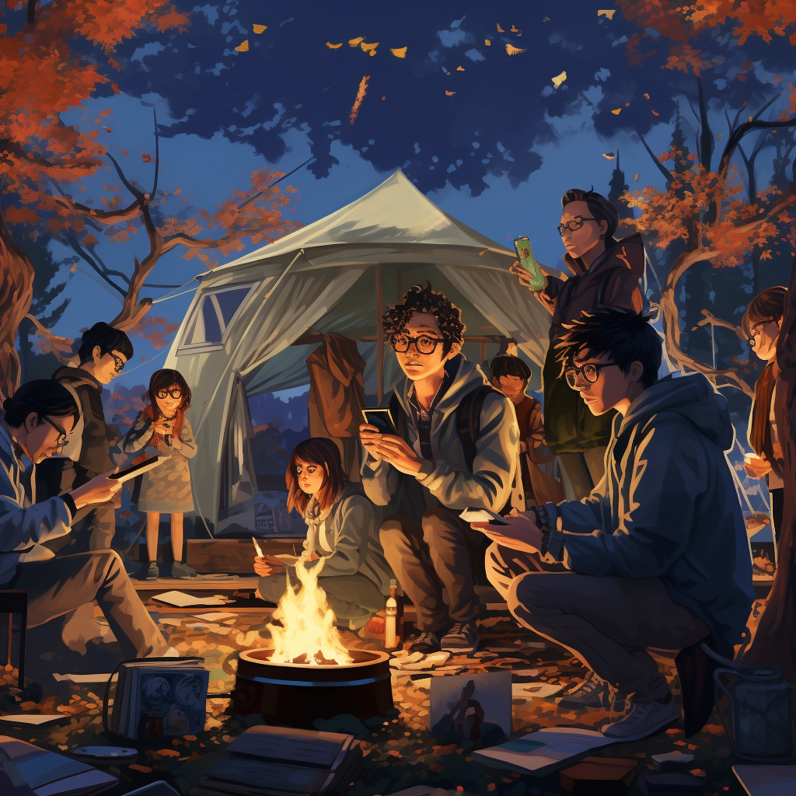
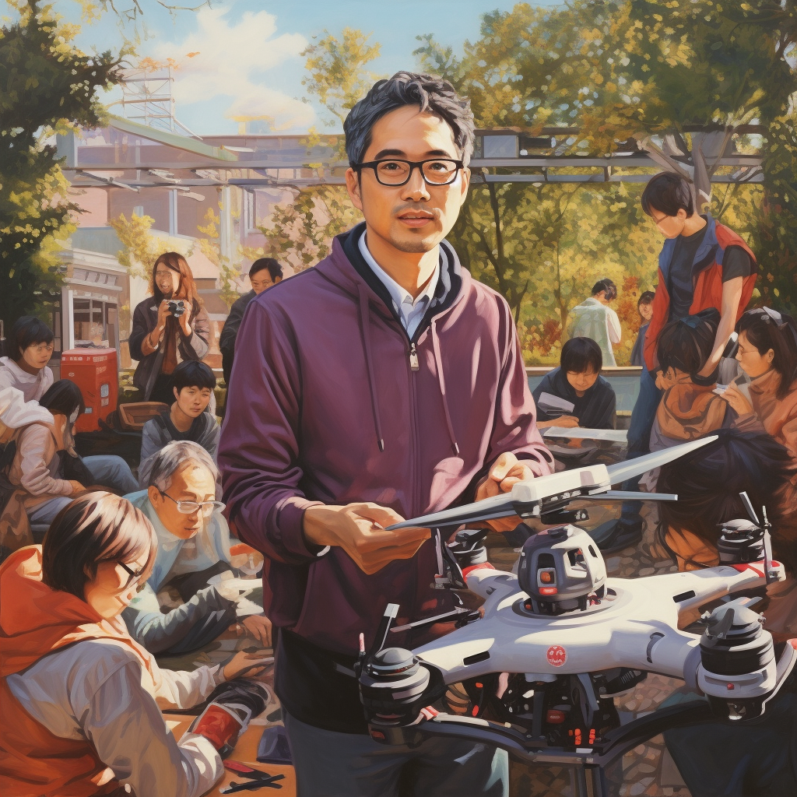
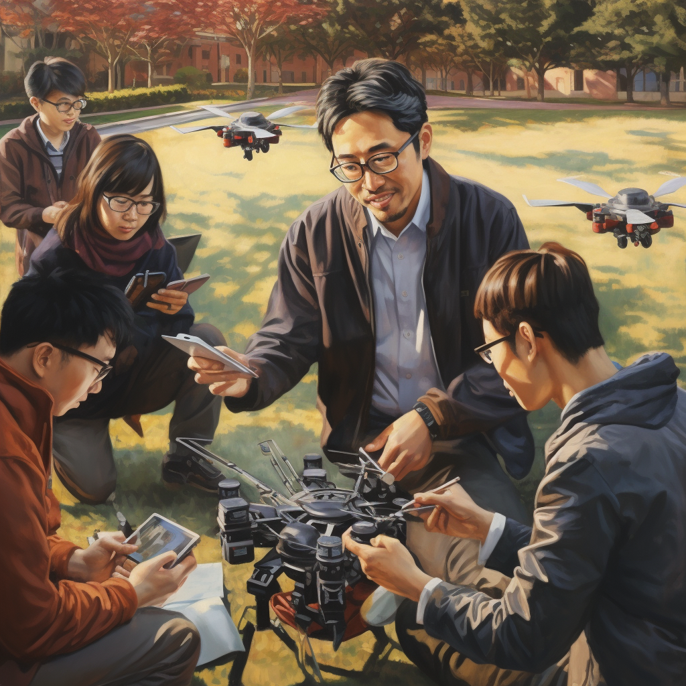
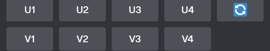
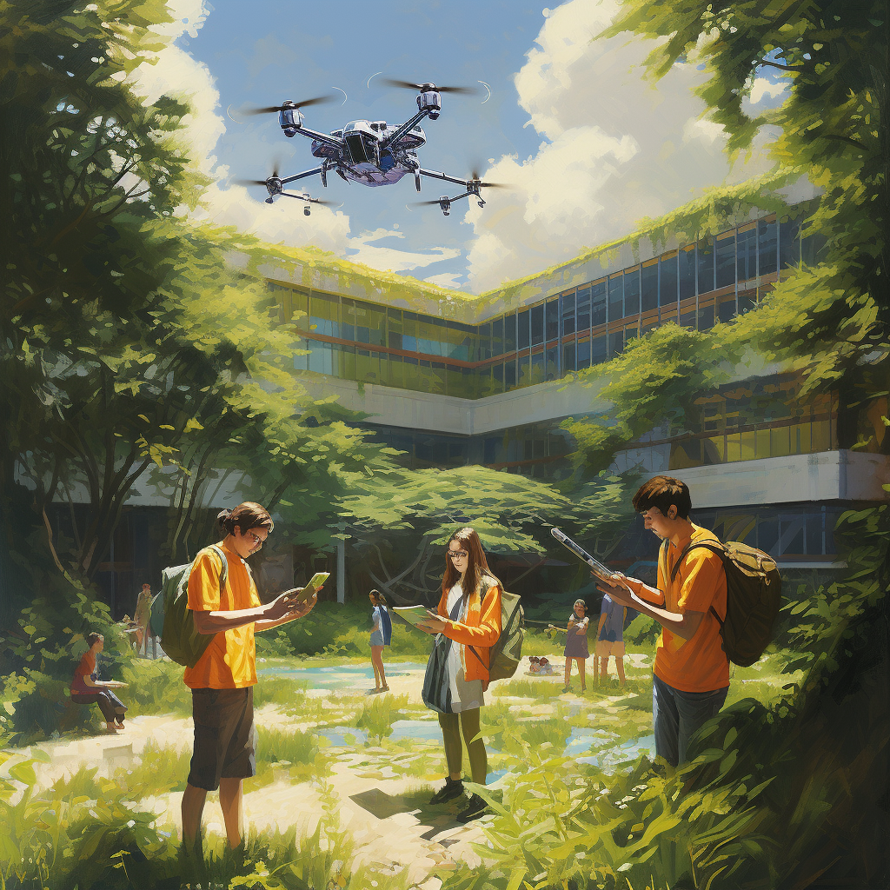
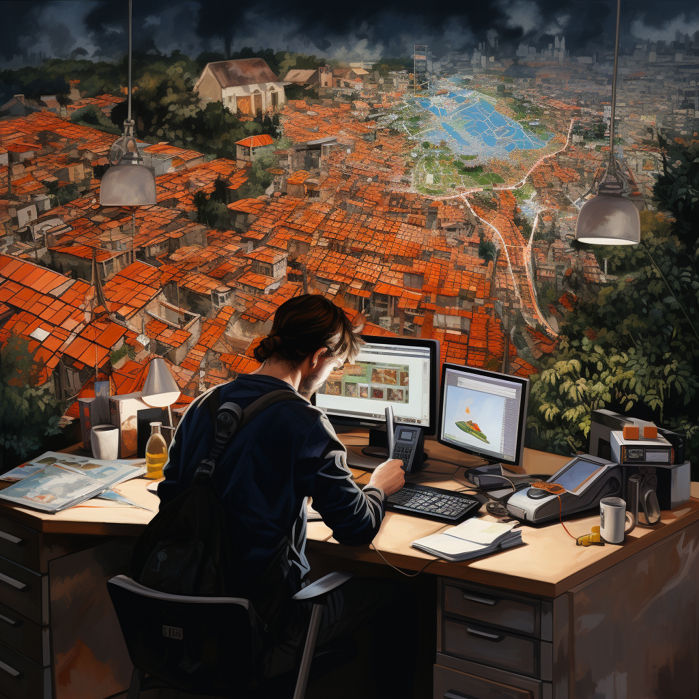
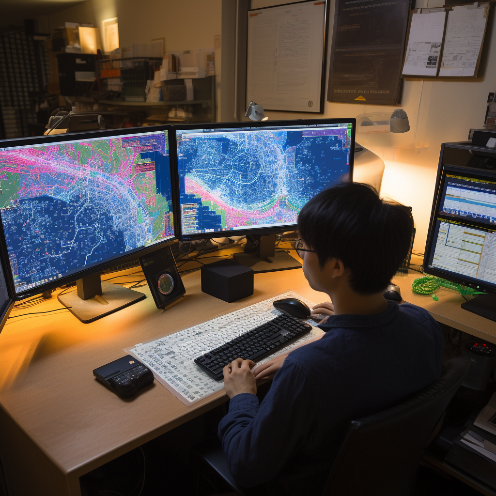
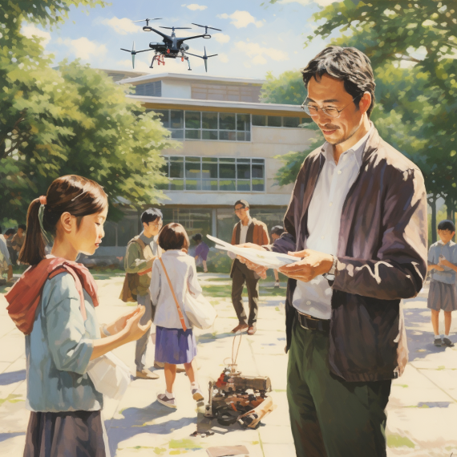
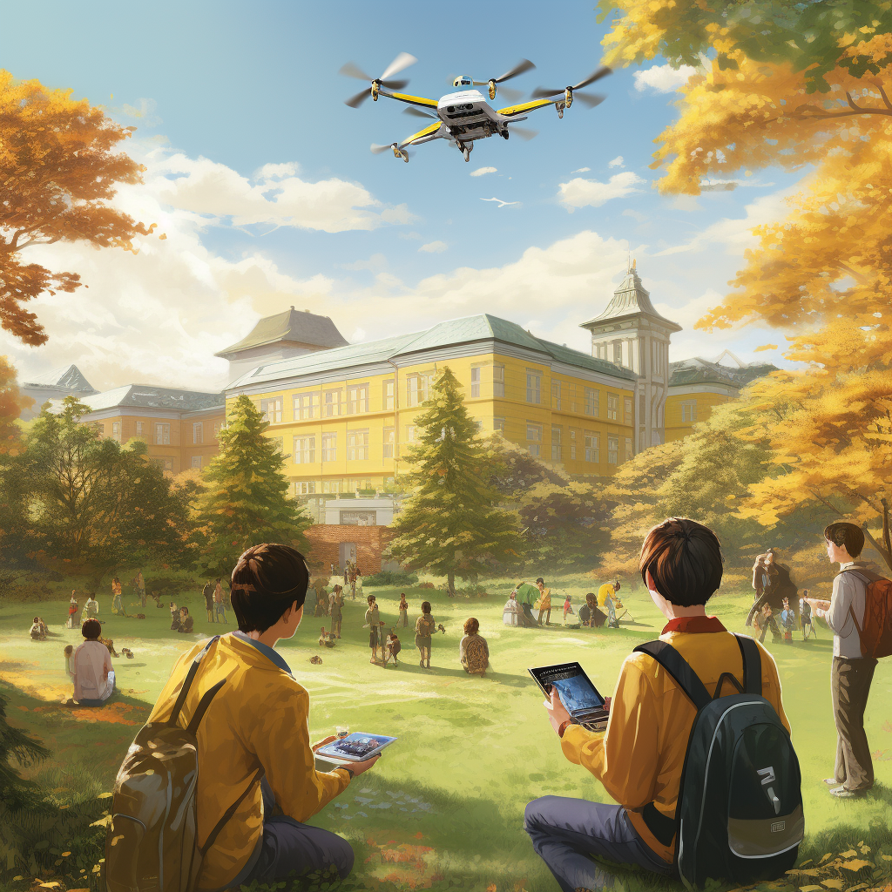
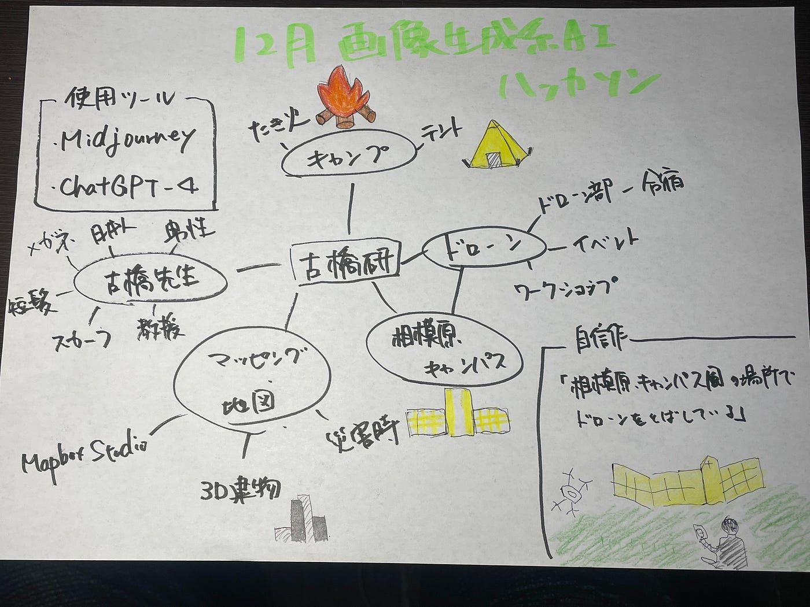

### 吉田 12月画像生成系AIハッカソン

こんにちは。4年の吉田です！

今回のハッカソンは、画像生成系AIハッカソンということで、[Midjourney](https://www.midjourney.com/explore)と[ChatGPT-4](https://chat.openai.com/)を使用して「古橋研究室らしい地図や空間情報、キャンプなど関連するグラレコ素材的イラスト」10作品制作しました！

[吉田 · Issue #1 · furuhashilab/AIdrawing4furuhashilab
画像生成系AIを用いて、古橋研究室らしい地図や空間情報、キャンプなど関連するグラレコ素材的イラストを一人10作品つくる＋プロンプト含む 使用ツール ChatGPT4 Midjourneygithub.com](https://github.com/furuhashilab/AIdrawing4furuhashilab/issues/1)

#### 1. キャンプ風

割とリアルな古橋研の雰囲気に近くできました。古橋先生の雰囲気もかなり似せることができました！

#### 2. ドローンを操縦している様子

この二つは画像下指定した番号の絵と似たデザインのものを4枚生成するvボタンを使用して生成したものです。

しかし、研究室の顔である先生に寄せる男性をつくるのに、苦戦しました、、

RealisticやphotographよりもPaintingなどの絵ぽい方がまだ先生ぽさが出せるなと思いました。

#### 4. ドローンin キャンパス

相模原キャンパスの教会前でドローンを飛ばしている様子を描きたかったので、プロンプトを「中庭」としたらかなり狭めの庭になってしまいました。

#### 5. ドローンin キャンパス2

「黄色いキリスト教会が近くにある」というプロンプトを追加した結果、かなり相模原キャンパスに近づきました！

周りの雰囲気もドローンを飛ばしている学生も日本人の大学生風でいい感じになりました。

#### 6. マッピング

地図っぽい部屋の雰囲気が出ており、学生もかっこよくできました笑。

なにより、PCの画面がきちんとマッピングしているような内容になっており、古橋研ぽさが出ている一枚となりました！

#### 7. マッピング2

マッピングしている感じを全面的に出すべく、マッピングしているPCの画面のみを描いてもらおうとプロンプトを組みましたが、なぜかPCの外側に大きくマッピングの様子が描かれてしまいました。

しかし、これはこれでマッピングの様子が分かりやすく描かれていると思ったので、採用しました。

#### 8. Mapbox Studio使っている風

古橋研で[Mapbox Studio](https://www.mapbox.jp/mapbox-studio)を多用していたので、Mapbox Studioでカラーを変更している様子を描きました。割と本家に近い内容になりました！

#### 9. 3D建物モデルのマッピング

自分が3D建物モデルの研究をしているため、3D建物モデルをテーマに取り入れました。

Futuristicと3D renderを指定したらいい感じになりました！

#### 10. ドローンワークショップ

各地でドローンのワークショップを行ってるのでドローンワークショップをテーマにしました。最初outdoorを入れないと、全て屋内になってしまったので、「outdoor」のスクリプトを入れ、完成させました。

> _**自信作_**

10作品の中で一番良いと思ったのは、この「相模原キャンパス風の場所でドローンを飛ばしている」作品です。

ドローンも良く描かれていますが、何より相模原キャンパスでドローンを飛ばしている様子が実に古橋研ぽく、グラレコ等の素材にも使えると思い、選択しました。

> _**グラレコ_**

