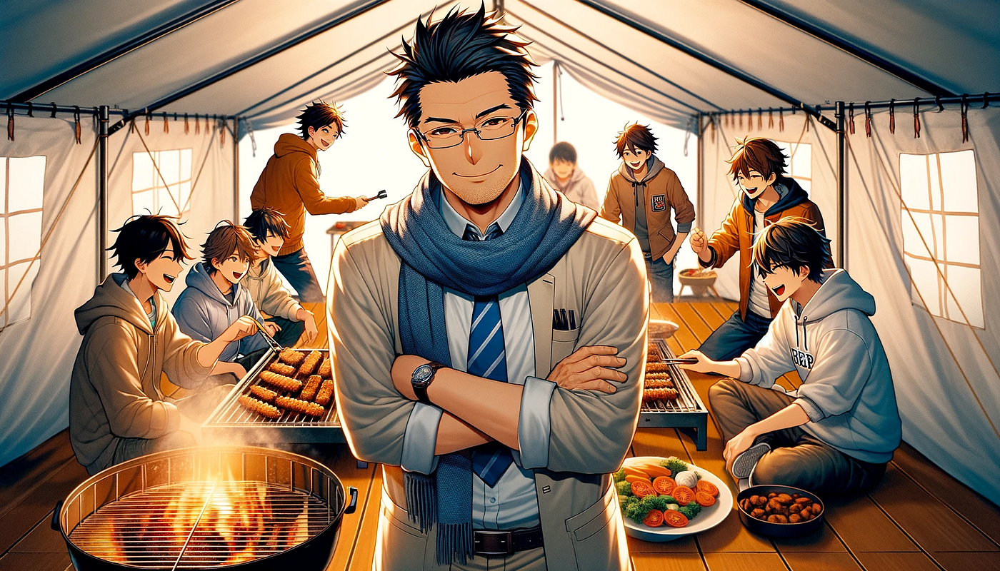
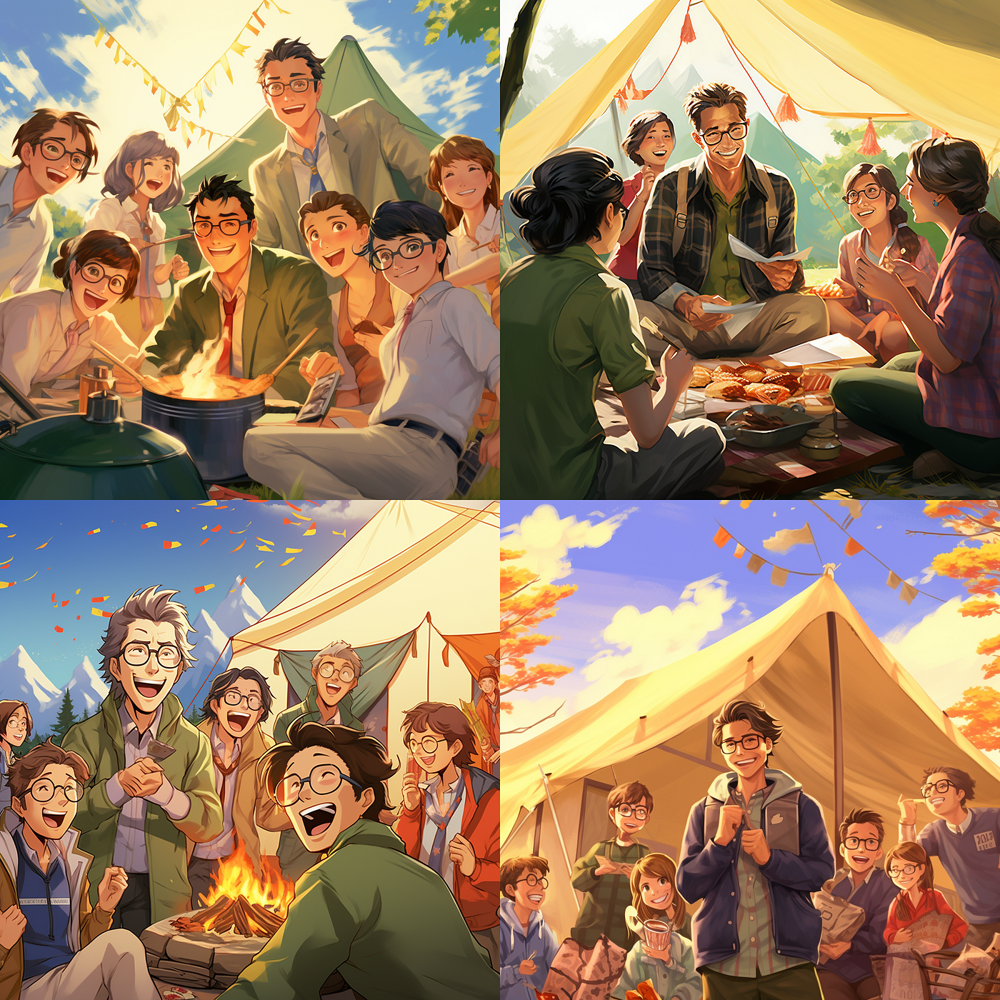
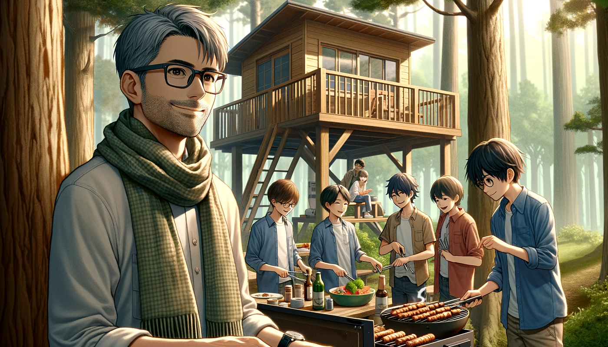
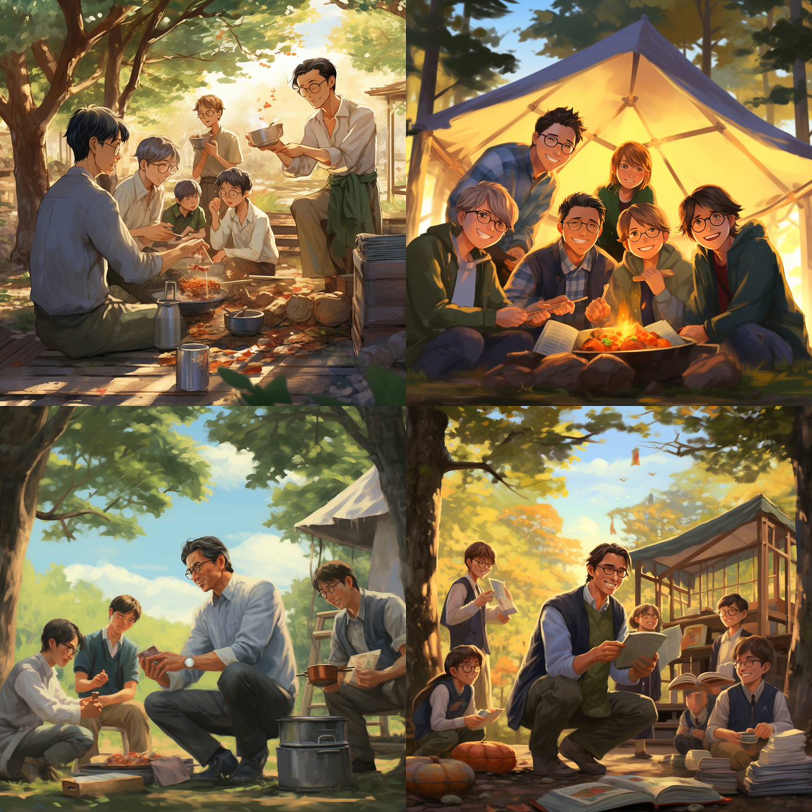
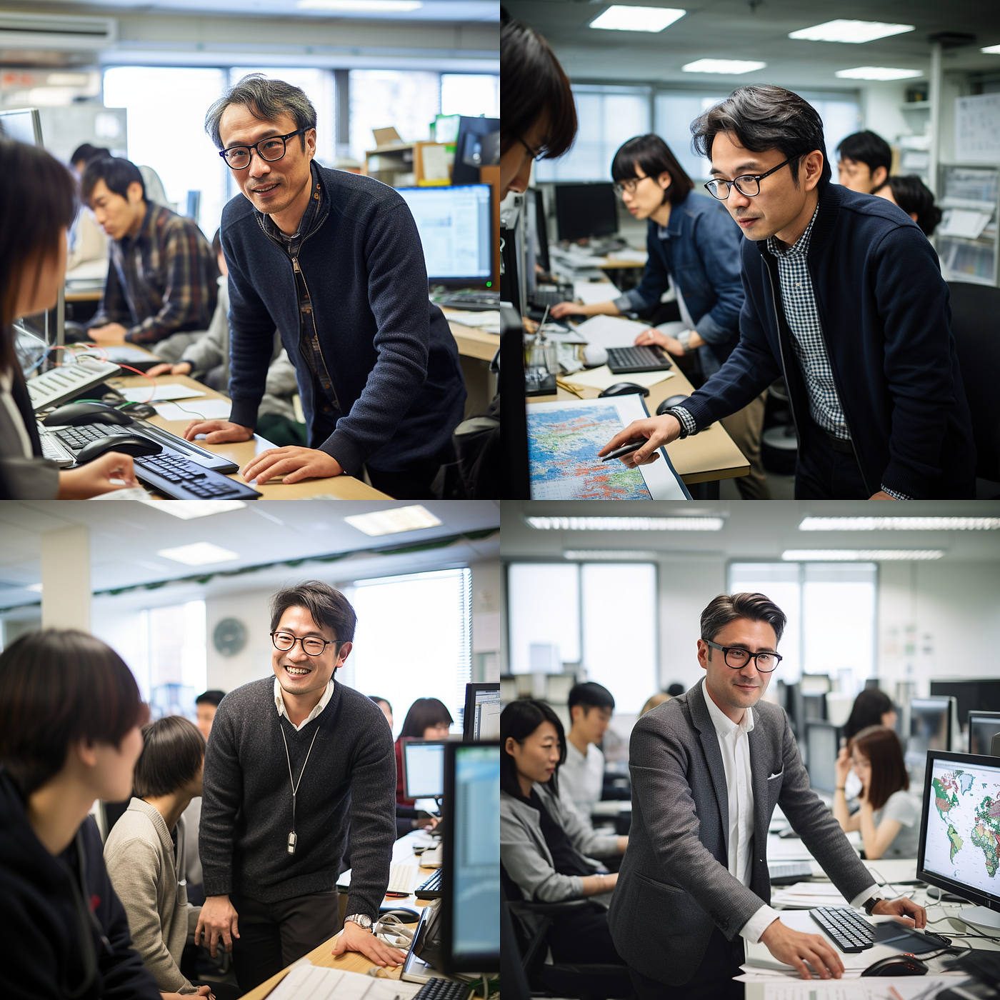
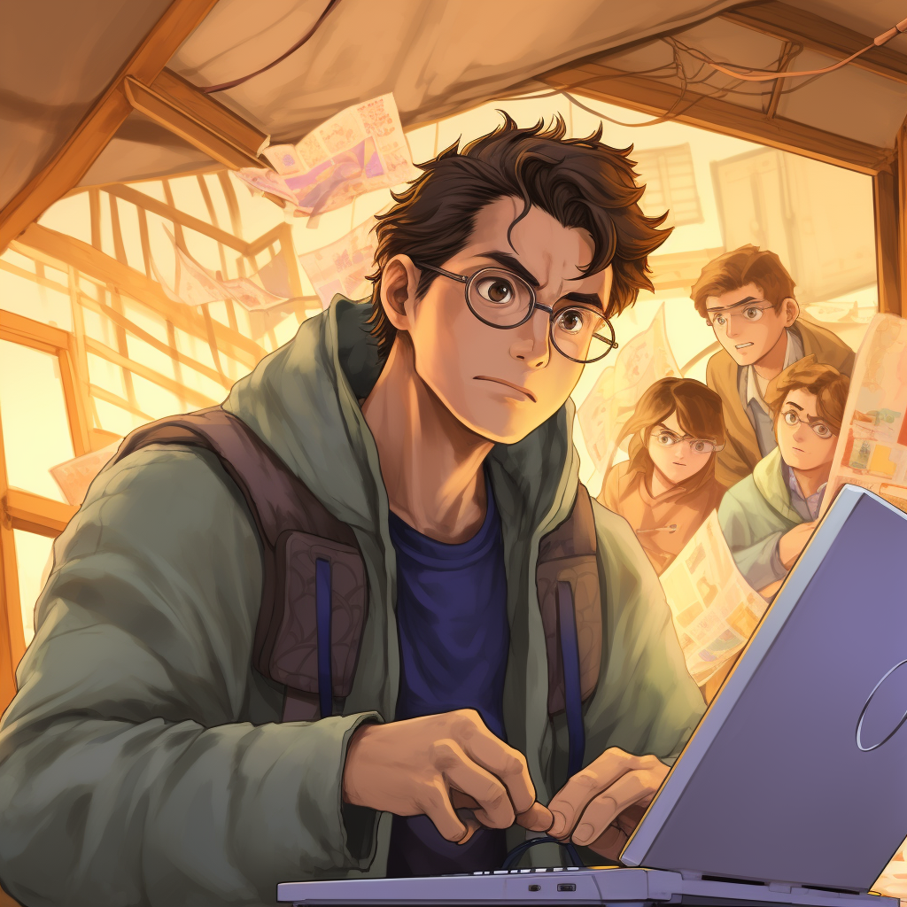
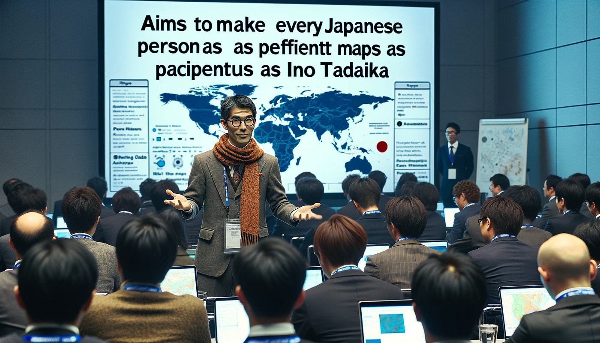
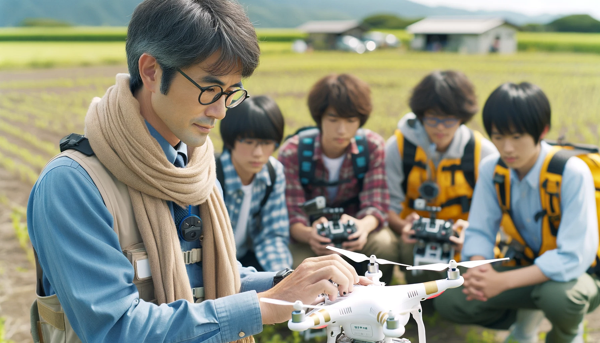
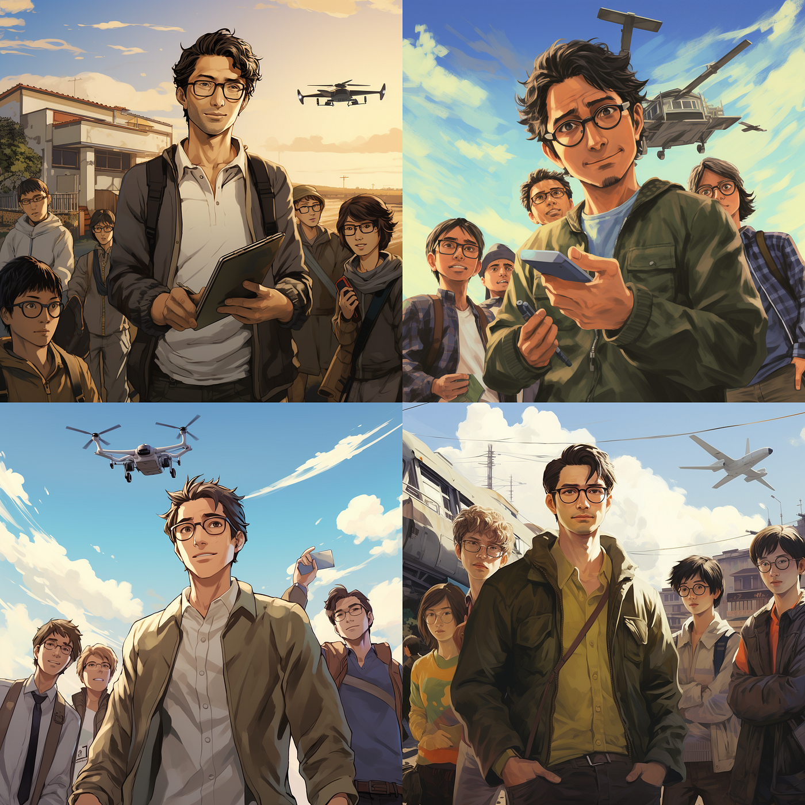
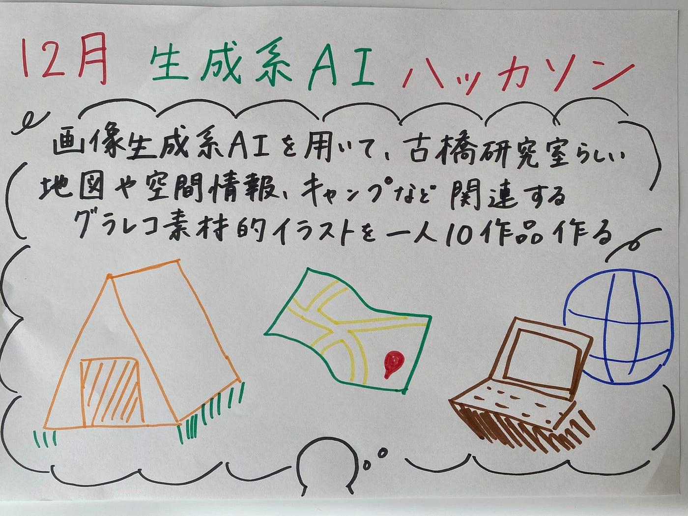

### 12月画像生成AIハッカソン 上原

こんにちは！3年の上原です。

12月のハッカソンは、AIを使った画像生成でした。

> **テーマ**

「画像生成系AIを用いて、古橋研究室らしい地図や空間情報、キャンプなど関連するグラレコ素材的イラストを一人10作品つくる（プロンプトを含む）」

> _**作成ツール_**

- ChatGPT-4

- Midjourney

私は、古橋研究室らしいイラストということで、①キャンプ、BBQ、ツリーハウス系、②マッピング系、③ドローン系

#### ①キャンプ、BBQ、ツリーハウス系

古橋先生の特徴である、眼鏡とスカーフを入れ込むこと、楽しさや歓迎ムードが伝わるような明るい雰囲気に落とし込むことについてこだわりました。

また、同じプロンプトで、ChatGPT-4とMidjourneyでどのように生成されるか比較してみました。そちらが以下２つの画像です。

プロンプト：Glasses , Scarf, around 40s, Short hair, Clean-shaven, Male teacher, six students, Harmonious, Japanese, a standard Tree house, Nature, Forest, BBQ, Cutting a tree, Outdoor, Welcome

どちらも古橋研究室らしくキャンプやBBQをしているのですが、よりツリーハウス感が出たのはChatGPT-4だったかなと思います。

#### ②マッピング系

マッピングについての画像生成では、世界中のどのような人でも携われることを重要視しました。しかし、あまりうまく反映してくれなかったので、どのような単語を含めれば良かったのかアイディア募集中です。

③ドローン系

ドローンやフィールドワークをテーマにした場合は、ChatGPT-4とMidjourneyで重要視する要素が違うのかなと思いました。ChatGPT-4は田舎要素（プロンプトには入れていない）が強く、Midjourneyは災害時の活動という要素が強そうに思えました。

#### まとめ

今まで課金のハードルが高く、生成系AIを使ったことがありませんでしたが、いざ実際に使ってみるとその精度の高さに驚かされました。

また、今回生成した画像では、わざとプロンプトを少しずつ変えてみました。その結果、ChatGPT-4もMidjourneyも、英単語を区切る方法が最も自分のイメージに近いものが出来上がるのではないかなと思いました。少なくとも、日本語で打った場合に比べて、英語の方が精度が高かった気がします。そして、単語もランダムに並べればよいわけではなく、関連するものを近くに置いたり、場面設定を最初に持って来たりすると反映されやすかったです。

#### グラレコ

