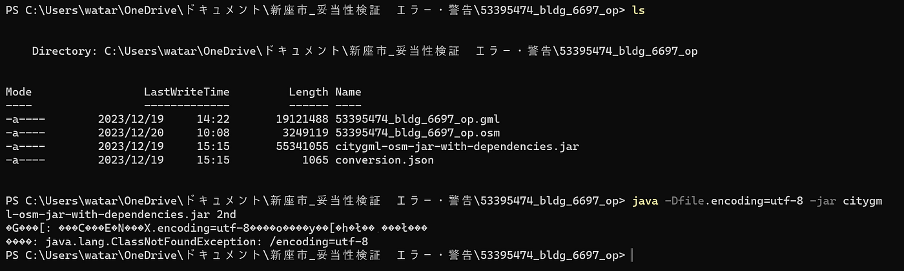

### PLATEAU LOD1建物データをOSMにインポートする際の事前準備法の確立【アドベントカレンダー12/21】

こんにちは。4年の吉田です。

今回はアドベントカレンダー12月21日分として、私が取り組んでいる卒業研究の進捗状況をお伝えします！

私は卒業研究として、国土交通省主導のプロジェクト「[PLATEAU](https://www.mlit.go.jp/plateau/)」内にあるLOD1建物データを、誰でも自由に地図を編集することができるオープンデータの共同作業プロジェクト「[OpenStreetMap](https://www.openstreetmap.org/#map=11/35.7582/139.4323)」にインポートする作業及び事前準備について研究を行っています！

前回(11/21)の発表スライドはこちら

> _**Introduction_**

近年、**デジタルツイン**という概念が世界的な注目を集めています。

デジタルツインは、インターネットに接続した機器などを活用して現実空間の情報を取得し、サイバー空間内に現実空間の環境を再現する技術です。(参考：総務省「デジタルツインって何？」[https://www.soumu.go.jp/hakusho-kids/use/economy/economy_11.html](https://www.soumu.go.jp/hakusho-kids/use/economy/economy_11.html)、2023年12月21日情報取得)

特に中国、米国、ドイツ、英国などの国々がデジタルツイン技術の先進国として力を入れており、産業界や学術界での注目度も高くなっています。(参照：国立研究開発法人科学技術振興機構 研究開発戦略センター「デジタルツインに関する国内外の研究開発動向」[https://www.jst.go.jp/crds/pdf/2021/RR/CRDS-FY2021-RR-09.pdf](https://www.jst.go.jp/crds/pdf/2021/RR/CRDS-FY2021-RR-09.pdf)、2023年12月21日情報取得)

デジタルツインによって、現実世界のリアルタイムな監視やシミュレーションが可能になり、業務の効率化、コスト削減、開発時間の短縮といった多岐にわたるメリットをもたらします。これらのメリットを踏まえると、デジタルツインの導入と発展は今後の技術革新において欠かせないものと言えるでしょう。

日本においても、デジタルツイン技術の重要性は認識されており、国土交通省都市局が主導する**「PLATEAU」**というプロジェクトがその一例です。

[PLATEAU [プラトー] | 国土交通省が主導する、日本全国の3D都市モデルの整備・オープンデータ化プロジェクト
国土交通省が主導する、日本全国の3D都市モデルの整備・オープンデータ化プロジェクト「PLATEAU」。データを活用するためのガイドやさまざまなシーンでの活用事例、最新ニュースやアプリケーションなど、PLATEAUに関する情報をお届けします。…www.mlit.go.jp](https://www.mlit.go.jp/plateau/)

このプロジェクトは、日本全国の3D都市モデルの整備およびオープンデータ化を目指しています。PLATEAUは、地理空間情報に関する国際標準化団体である[Open Geospatial Consortium](https://www.ogc.org/)（OGC）によって策定された、3次元都市空間を記述するためのデータ交換フォーマット**「CityGML」**を採用しています。これにより、建物や道路など都市の構成要素が、形だけでなく、用途や築年数、行政計画といった都市活動情報を含む形でデジタルツイン化されます。(参照：PLATEAU by MLIT「CityGML仕様及び品質評価手法についての解説」[https://www.mlit.go.jp/toshi/daisei/content/001614666.pdf](https://www.mlit.go.jp/toshi/daisei/content/001614666.pdf)、2023年12月21日情報取得)

一方で、[OpenStreetMap](https://www.openstreetmap.org/#map=11/35.7582/139.4323)（以下OSM）は、誰でも地図の編集が可能なオープンデータの共同作業プロジェクトです。OSMの特徴は、その地域に住む地元の人々が編集することで、ローカルエリアの詳細な情報が反映されている点にあります。しかし、3D建物データが不足しているか、十分に拡充されていない地域が多く、課題の一つとなっています。

そこで注目されるのが、国土交通省都市局が主導し、高精度な3D建物データを提供している**PLATEAUのデータをOSMにインポート**する動きです。この取り組みにより、OSM上の3D建物データは量的にも質的にも大きく向上する可能性があります。重要な点は**、PLATEAUがOSMと互換性のある[ODbL](https://opendatahandbook.org/glossary/ja/terms/odbl/)を採用**していることであり、これにより両プロジェクト間でのデータの共有と活用が容易になります。

本研究では**、PLATEAUのLOD1建物データをOSMにインポートする作業及びその事前準備の方法を確立**することを目指しています。この研究の目的は、**CityGML形式のデータをOSMに実践的にインポートし、OSMの3D建物データを量的にも質的にも向上させること**です。PLATEAUのデータを活用することで、OSMが提供するデジタル地図のリアリティと詳細性が高まり、より実用的で信頼性の高い地図情報の提供が可能になることが期待されます。

> _**Method_**

使用するツール

**・[JOSM**](https://josm.openstreetmap.de/)

**・(CityGML形式のデータをOSMにコンバートするための)[コンバーター**](https://github.com/yuuhayashi/citygml-osm/releases/tag/v2.1.1)(ver. 2.1.1)

[林優さん](https://github.com/yuuhayashi)が作成したコンバーターを使用

私は現在新座市の妥当性検証に取り組んでいます。

現状を報告します。

> _**Results_**

#### 変換作業が、Powershellで実装されなかったが、コマンドプロンプトではできた

.osmのファイルを.org.osmファイルに変換する過程に行うコマンド実装がpowershellでは実装されなかったですが、コマンドプロンプトでは実装できました。

現在はコマンドプロンプトで変換作業を行っています。

#### 新座市における妥当性検証時に発生したエラー・警告の事例収集

PLATEAUの3D建物データをOSMにインポートする前に妥当性検証を行うのですが、その際に発生する新座市におけるエラー・警告の数がかなり多いため、事例収集を行い、完了しました。

[新座市_妥当性検証_エラー・警告 5411-5494 · Issue #3 · furuhashilab/2023gsc_WataruYoshida
新座市_エラー・警告 SpreedSheet…github.com](https://github.com/furuhashilab/2023gsc_WataruYoshida/issues/3)

[新座市_妥当性検証_エラー・警告 5415-5437 · Issue #4 · furuhashilab/2023gsc_WataruYoshida
53395415_bldg_6697_op **.osm 53395415_bldg_6697_op.zipgithub.com](https://github.com/furuhashilab/2023gsc_WataruYoshida/issues/4)

[新座市_妥当性検証_事例
シート1 ID,type,number,detail,lat,lon,image,File 1,Error,5473 .osm,ウェイが同じ区間を二度含んでいる,35.81170895,139.5500545,<a ...docs.google.com](https://docs.google.com/spreadsheets/d/1g_SA-b3N3m7rKWzYLOa16hlr8yBpsMljPL22gAJN4FQ/edit?usp=sharing)

> _**Discussion_**

妥当性検証時に発生したエラー・警告に関しては自分で修正可能な部分は修正をし、修正方法が明らかでない場合はOSMでPLATEAUのインポート作業に関わっている方やYouthMappersやOSMのチームでValidationを行っている人たちに確認及び対処法の共有をしてもらおうと考えています。

エラー・警告の修正作業が完了次第、新座市のインポート作業に取り組みます！

_※ この投稿は [古橋研究室アドベントカレンダー2023](https://qiita.com/advent-calendar/2023/furuhashilab)、[青山学院大学 地球社会共生学部アドベントカレンダー2023](https://adventar.org/calendars/9665) に合わせて執筆しました。_
