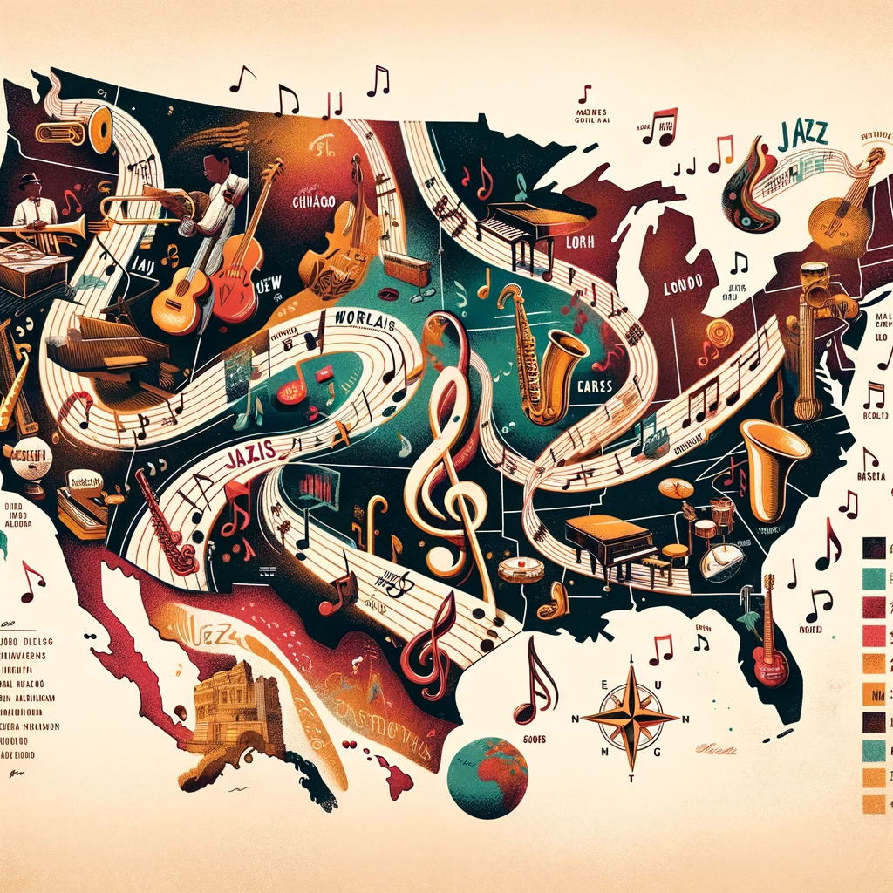

### 検索ワードを変えるだけで面白い論文がたくさん見つかります！-アドベントカレンダー12/23-

こんばんは！3年の上原です。

[古橋研究室のアドベントカレンダー](https://qiita.com/advent-calendar/2023/furuhashilab)の投稿として、私が取り組んでいるゼミ論の進捗報告をいたします。他の授業の課題や課外活動などに時間をとられ、11月21日の中間報告からあまり進めることができなかったのですが、どうかお許しくださいm(__)m

### Introduction

私の研究テーマは『グローバルに融合する音楽とその地理的な拡散について』で、ジャズがどのように伝播していったのか地図上に可視化しようとしています。

「音楽は国境を越える」という言葉にあるように、音楽は今や世界的な交流手段の1つと見なされることも多くなりました。昨今のK-POPブームもその一例ではないでしょうか？しかしながら、それは今に限ったことではないはずです。異なる地域や文化にどのように影響を与えてきたのか、自分の音楽経験のバックグラウンドもあり、興味を持ったので調べてみることにしました。

先行研究として、日本／英語を問わず、文献調査をしています。これまでに参考にした文献は以下5つです。

- [ヨーロッパ近代音楽とジャズ和声における相互関係の研究](https://soar-ir.repo.nii.ac.jp/record/2362/files/KE03R101.pdf)（山本理人・小野貴史, 2010）

- [アメリカ文化論としてのジャズ・ライティング-音楽の二次テキストの国際比較研究に向けて-](https://doshisha.repo.nii.ac.jp/?action=repository_action_common_download&item_id=16995&item_no=1&attribute_id=28&file_no=1)（鳥居祐介,2000）

- [Jazz as cultural practice](https://www.researchgate.net/profile/Bruce-Johnson-15/publication/290886917_Jazz_as_cultural_practice/links/5f62c90b4585154dbbd7422a/Jazz-as-cultural-practice)（B. Johnson, 2022）

- [Jazz and the Disconnected: City Structural Disconnectedness and the Emergence of a Jazz Canon, 1897–1933](https://www.journals.uchicago.edu/doi/abs/10.1086/661757)（Damon J. Phillips, 2011）

- [Jazz/Not Jazz: The Music and Its Boundaries](https://books.google.co.jp/books?hl=ja&lr=lang_ja%7Clang_en&id=dbMwDwAAQBAJ&oi=fnd&pg=PR8&dq=jazz+geography&ots=mXd2tut4I-&sig=nYHWuVyu1g6epbxeURjajKMgU58)（David Ake、 Charles Hiroshi Garrett、 Daniel Goldmark 編集, 2012）

### 進捗報告

そして、11月21日の中間発表でのアドバイスを経て “cartography” という検索ワードでも調べてみました！研究の役に立ちそうな、以下のような文献が見つかりました。

・[Navigating Jazz: Music, Place, and New Orleans](https://deepblue.lib.umich.edu/handle/2027.42/133368) (Suhadolnik, Sarah Ezekiel, 2016)

・[We make sense of all that jazz: mapping in social contexts](https://www.emerald.com/insight/content/doi/10.1108/13620430110405677/full/html) (Alexander J.J.A. Maas, Erik M. Manschot, Ton J. Roodink, 2001)

軽く読んでみたところ、Introductionで言及した文献よりも、さらに地理空間での視点からの論述が充実しているように感じました。冬休み中に、じっくりと読み解きたいと思います。

### おまけ

12月のハッカソンとして、生成AIによる画像生成を行いました。その関係で、今せっかくChatGPTが課金モード（ChatGPT-4）なので、イメージ画像を作成してもらいました！

