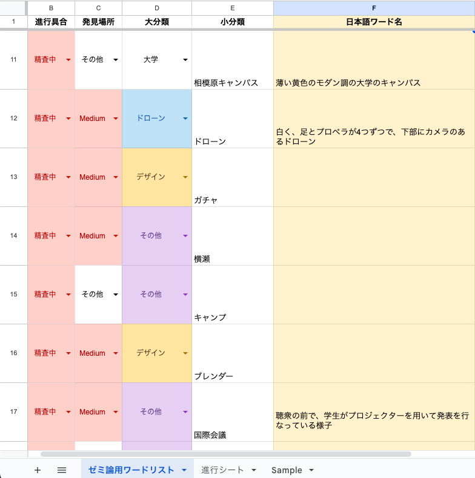

### アドベントカレンダー

こんにちは！4年の小澤です。

2023年のアドベントカレンダーに関して、こちらに記載させて頂きます！
私の卒論テーマは、「画像生成AIによる、ゼミ用画像生成におけるゼミワードリストの構築」です。

詳しくは、「Midjourney」を用いて、ゼミの様々な場面で活用することができる画像を、精度高く生成できるよう、promptにおける中枢となるワードを、ゼミワードリスト化し、誰でも簡単に画像を生成できるようにすることが目的です。

GitHubレポジトリ[https://github.com/furuhashilab/2023gsc_TaiyuOzawa-/blob/main/README.md](https://github.com/furuhashilab/2023gsc_TaiyuOzawa-/blob/main/README.md)

以下に、introductionを記載します。

— — — — — — — — — — -

近年、自然言語によって構成される「prompt」に応じて、文章や画像、動画を生成するAIモデルが、急激に発展している。画像生成AIに関しては、2022年7月13日に「Midjourney」と呼ばれる画像生成AIのオープンベータ版がリリースされた。画像生成AIにおいては、その他にも「stable diffusion」や「Novel AI」といったモデルが存在し、同じpromptを使用したとしても、モデルによって生成される画像はモデルによって大きく異なる。

本論文では、さきに紹介した、画像生成AIの一種である「Midjourney」を用いて、ゼミの様々な場面で活用することができる画像を、精度高く生成できるよう、promptにおける中枢となるワードを、ゼミワードリスト化し、誰でも簡単に画像を生成できるようにすることが目的とする。ゼミワードリストとは、古橋ゼミに関連する、例えばドローンや位置情報ゲームなどいった様々なワードを、分類ごとに分け、各データを順序を付けて格納した一覧のことを指す。

画像生成AIとは、ラフスケッチのような画像をより完成度の高い画像に仕上げる「image to image」と呼ばれるものと、Promptと呼ばれる指示文章から画像を生成する「text to image」と呼ばれるものがあるが、今回は後者の画像生成AIを活用する。「text to image」では、GAN（敵対的生成ネットワーク）と呼ばれる、2つのネットワークを競い合わせることで生成する画像の精度を高める仕組みや、拡散モデルといった、元データに徐々にノイズを加えたり、逆にノイズを消去するプロセスを経て新しいデータを生み出すなど、事前に学習されたモデルを活用し、文字情報からクリエイティビティ豊かな画像を生み出す。 画像生成AIが登場してまだそこまで時間が経っていない現在では、学業においてはあまり用いられていないが、今後画像生成AIで作られる画像はより発達、一般化し、さまざまな場面で使用されると考えている（xxx）。

それを踏まえ、この仕組みを用いて私が作成したいのは、、プレゼンテーションやゼミの紹介動画、場合によってはゼミのイメージ画像として用いることのできる、バラエティ豊かかつ、さまざまなシチュエーションに可能が画像を生み出すことができる、「ゼミワードリスト」を作成することである。青山学院大学 古橋研究室は、同大学の他ゼミに比べて外部への露出が非常多い。そこで、どんなシチュエーションでも活用可能な画像を、即座に、簡単に生成することができる、中枢ワードリストを作成することで、本ゼミでの活動内容や雰囲気、実績がより他のコミュニティ、人々が認識しやすくなると考えた。また、その内容は完全なる独自的なものではなく、他の分野・業界にも転用可能な普遍的な項目も非常に多いと考えている。

promptではなく「ワードリスト」を作成する理由としては、画像生成AIが日々目まぐるしい変化と成長を遂げる中で、それに呼応してpromptも大きく変化しており、どうしても変数になり得てしまうと考えたからである（a）。一方でワードは、どんなに画像生成AIや最適とされるpromptが変化しようと、必ず必要かつ重要となる普遍的な定数となりうると考え、今回のこの「ワード」に絞って研究を進めたいと考えた。

研究の方法としては、Discordというチャットサービスプラットフォームを介して画像を生成する「Midjourney」において、自然言語処理AI「ChatGPT-4」でpromptを作成しながら、各シチュエーションにおいて最適なワードを発見し、リスト化を行う。

— — — — — — — — — — — — — — -

初めは、英語のワードのリストを作成する前提で考えていましたが、ChatGPTでprompt生成を行う場合、各ワードを、このリストのワードに置き換えても違和感のある画像しか出力されず、逆にChatGPTでprompt生成を行う過程で、日本語のワードを適切なものに変更した場合、理想の画像生成に非常に近づいたため、途中で「日本語」でのワードに切り替えを行いました。

[https://docs.google.com/spreadsheets/d/1GLylHkcSu2AUoVp84yU7rH-v1CkUVd7WUmREGl45T1I/edit#gid=804927239](https://docs.google.com/spreadsheets/d/1GLylHkcSu2AUoVp84yU7rH-v1CkUVd7WUmREGl45T1I/edit#gid=804927239)

リストは上記のようになっています。

今までは、ChatGPT-4Vの「image to image」を用いて、該当するものを画像からワードを生成する方法も行なっていましたが、あまり効率が良くなく、自分でワードを試行錯誤した方が完成度が高いため、今後はそのような形で進行していきたいと考えています。

ちなみに、これまで「相模原キャンパス感」を出すワードが難しく、苦戦していましたが、前回のハッカソンでワタルが考案していたpromptの完成度が非常に高かったため、使用させて頂いております笑🙇

引き続き頑張ります！！

アドベントカレンダーの遷移先URLは[コチラ](https://qiita.com/advent-calendar/2023/furuhashilab)から（[https://qiita.com/advent-calendar/2023/furuhashilab](https://qiita.com/advent-calendar/2023/furuhashilab)）
