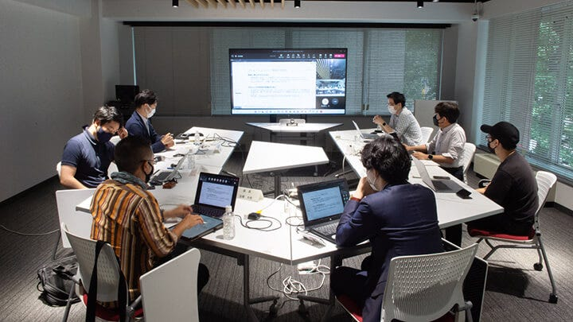
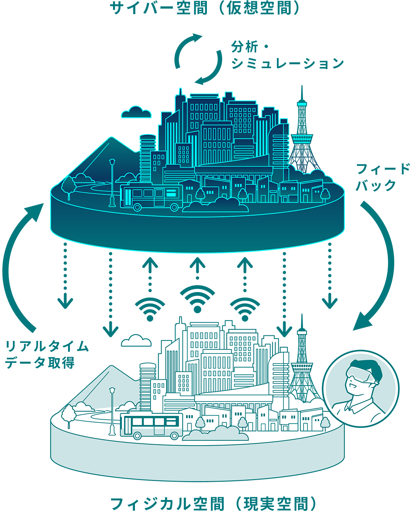
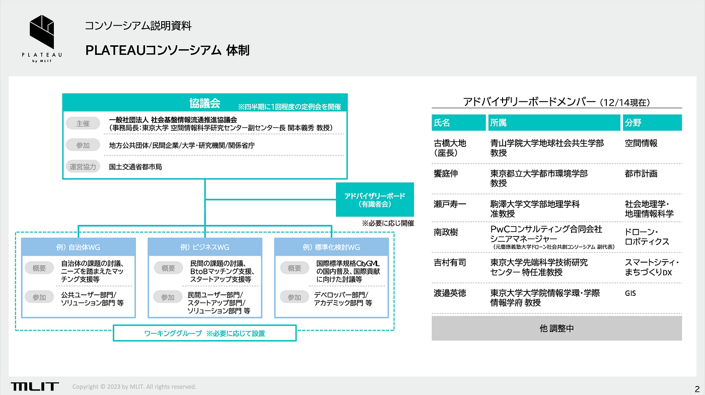

### PLATEAUコンソーシアム始動！

我々は３次元空間で生きています。

しかし地図の世界では我々が生活している空間を図化し、その図面上で都市を分析したり、未来の都市をデザインしていく都市計画の現場で使われる地図としてはまだまだ2次元の地図が主流です。

例えば、カーナビやスマホのナビゲーションアプリは地図表示そのものは3次元風表現になってきているけれども、ナビルートそのものは2次元のまま。

3次元の現実世界をデジタルデータとしてモデル化し、様々な都市の分析、評価、シミュレーション、利活用の多様化を広げていくための都市の**[デジタルツイン**](https://ja.wikipedia.org/wiki/%E3%83%87%E3%82%B8%E3%82%BF%E3%83%AB%E3%83%84%E3%82%A4%E3%83%B3)は、これからの都市が今よりもっと便利で、もっと楽しい空間に変わっていくデータのインフラとなっていくと考えています。

2020年から**[東京都のデジタルツイン実現プロジェクト**](https://info.tokyo-digitaltwin.metro.tokyo.lg.jp/)の立ち上げに有識者として関わるとともに、国土交通省が様々なプレイヤーと連携して推進する、**[日本全国の都市デジタルツイン実現プロジェクト・3D都市モデル Project PLATEAU**](https://www.mlit.go.jp/plateau/)「[3D都市モデルの整備・活用促進に関する検討分科会](https://www.mlit.go.jp/scpf/archives/index.html)」の座長として様々な方々とデジタルツインのこれからと3年間議論をすすめてきました。

そして、2023年12月15日、都市のデジタルツインを次のフェーズに移していくために、今まで[スマートシティ官民連携プラットフォーム](https://www.mlit.go.jp/scpf/about/index.html)に位置づけられていた Project PLATEAU の分科会は、**[PLATEAUコンソーシアム**](https://www.mlit.go.jp/plateau/consortium/)として3D都市モデルの整備・活用・オープンデータ化のエコシステム構築を加速していく新たな議論の場へとアップデートしました。

[Consortium | PLATEAU [プラトー]
3D都市モデルの整備・活用・オープンデータ化により社会に新たな価値をもたらすPLATEAUの取組をサステナブルなものとするためには、国、地方公共団体、企業、大学等の研究機関、地域コミュニティなどの多様なプレイヤーによるフラットな連携が重要で…www.mlit.go.jp](https://www.mlit.go.jp/plateau/consortium/)

新しいPLATEAUコンソーシアムの中心はG空間情報センターの運営で有名な**[AIGID(一般社団法人 社会基盤情報流通推進協議会)**](https://aigid.jp/)が担い、アドバイザリーボードとして、微力ながら古橋が初代座長として担当させていただくことになりました。

様々なバックグラウンドを持つメンバーと、引き続きデジタルツインのこれからを議論していきます。

コンソーシアムへはどなたでも参加できますのでぜひ**[こちら**](https://www.mlit.go.jp/plateau/consortium/#join)からサクッと申し込んでください。

[Consortium | PLATEAU [プラトー]
3D都市モデルの整備・活用・オープンデータ化により社会に新たな価値をもたらすPLATEAUの取組をサステナブルなものとするためには、国、地方公共団体、企業、大学等の研究機関、地域コミュニティなどの多様なプレイヤーによるフラットな連携が重要で…www.mlit.go.jp](https://www.mlit.go.jp/plateau/consortium/#join)

PLATEAUコンソーシアム第1回の座長挨拶のプレゼン資料も貼っておきます！！

_※ この投稿は [PLATEAU アドベントカレンダー2023](https://qiita.com/advent-calendar/2023/plateau) と [古橋研究室アドベントカレンダー2023](https://qiita.com/advent-calendar/2023/furuhashilab)、[青山学院大学 地球社会共生学部アドベントカレンダー2023](https://adventar.org/calendars/9665) に合わせて執筆しました。_
