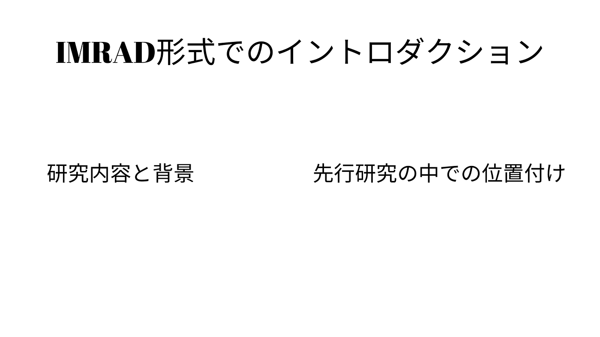

アドベントカレンダー

こんにちは、3年の深水です。アドベントカレンダーに添付する記事を作っていなかったので、書きます。

僕の今年度のゼミ論は、就活における失敗学の応用についてです。

中間発表の課題は、IMRAD形式でのイントロダクションを作ることでした。

IMRAD形式のイントロダクションとは、

研究内容とその背景、そして先行研究の中での位置づけを含む必要があるということでした。

ということで今回は、前述した３つの項目に分けて記述したいと思います。

１ 研究内容

失敗学を体系化した先行研究である『失敗学のすすめ』（畑村洋太郎）を参考にしながら、失敗学における原因の分類や、それを生かしていくための手法を全て実行し、その結果を記録、評価していく。

２ 背景

就活において、多くの大学生が失敗を経験する。

３ 先行研究の中での位置づけ

明確に失敗学を結びつけたような研究はないものの、失敗から学ぶことを推奨するような研究が多くあり、新規性がない。

失敗学は、経済学や心理学、教育学の文脈で語られることが多い。

ゼミ論のテーマを変更しようと思うので、１月中に新しいイントロダクションを考えようと思います。
