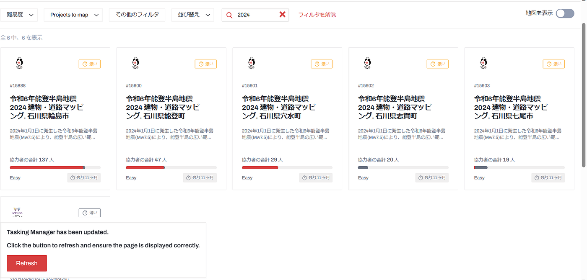

### Youth週報

こんにちは、3年の石井です。

前回に引き続き、私たちは[Open Mapping towards Sustainable Development Goals ](https://link.springer.com/book/10.1007/978-3-031-05182-1?fbclid=IwAR0mxXoILYo2Ar1akXx7F3QDRs6TqVAv7CIYDUPNo6YihQb4pQ0NFWNFV_g)の翻訳作業を行いました。

今週は、The Emergence of YouthMappers（YouthMappersの登場）とWhere YouthMappers Connect to the SDGs（YouthMappersとSDGsのつながり）を3人で分担しました。

和訳した文書は[こちら](https://docs.google.com/document/d/1t4SAWIjNs0r3eWKRKZHyXRDD87rA5Hcc9rwEdz72_ns/edit)です！

完成した和訳を通してYouthMappersの活動が広まり、日本のYouthMappersの団体数・活動数が増えたらいいなと思います。

令和6年能登半島地震におけるOpenStreetMap クライシスマッピングを行っています。

すでに珠洲市のタスクは完了しており、現在、[輪島市](https://tasks.hotosm.org/projects/15888)・[能登町](https://tasks.hotosm.org/projects/15900)・[穴水町](https://tasks.hotosm.org/projects/15901)・[志賀町](https://tasks.hotosm.org/projects/15902)・[七尾市](https://tasks.hotosm.org/projects/15903)のプロジェクトが公開中なので、引き続きマッピングを行っていきます。

> グラレコ
