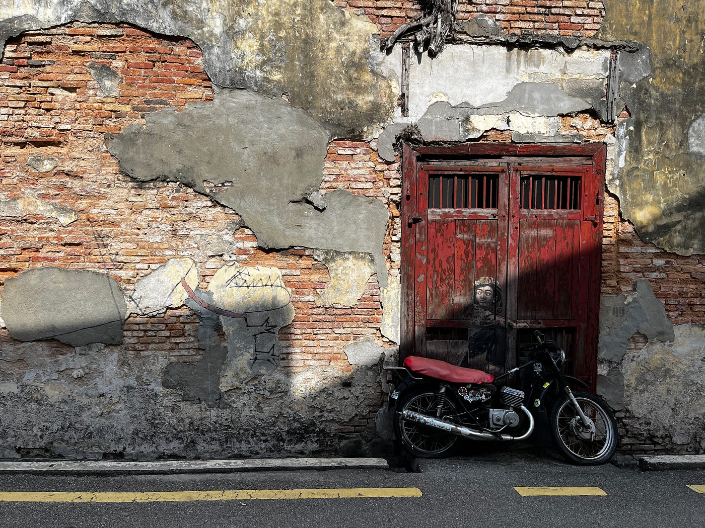

### 留学中に行った観光のストーリーテリング作品

こんにちは。2年生の高井健太郎です。

私は8月下旬から12月下旬までの約4か月間、マレーシアに留学していました。その期間中に何度かマレーシア国内を旅行したのですが、その中の1つの旅行の過程を記録し、ストーリーテリング作品を制作しました。

今回私が訪れたのは、マレーシアの北西部に位置するペナン島 (Penang Island) です。ペナン島はマレーシアの離島の観光地として有名であるため、私は留学が始まる前からずっとそこに観光してみたいと考えていました。そして留学開始から約3か月半が経過した12月上旬にようやく訪れることができました。その旅行の過程を記録とともに紹介します。

まず、ストーリーテリング地図としてまとめたものがこちらです。

[Google Earth
Aw snap! Google Earth isn’t supported on your browser. You may need to update your browser or use a different browser…earth.google.com](https://earth.google.com/earth/d/1ppzCnNb7sA-CtcsAulgVVhHchsHSVPCx?usp=sharing)

この地図上で目印が置かれているのが今回の観光の代表地点です。その代表地点についての説明とスマホで撮影した写真を加えました。前日の夜にバスとフェリーを利用してペナン島のホテルに前乗りして、午前中から観光を始めるというプランでした。バスの乗車時間が約4時間弱あり相当疲労が蓄積したので、結果的に前乗りしてよかったと思います。

次に、Stravaで記録したログのPermalink URLがこちらです。

[https://strava.app.link/1VTd8LsV3Fb](https://strava.app.link/1VTd8LsV3Fb)

私は今回のツアー中、常にStravaを起動させていました。スタートから近場の地点までは徒歩で移動し、途中のスターバックス、ディナーまでの移動はGrabを利用しました。私は今回のフィールドワークで初めて自分の行動を記録したのですが、直線の道を歩いている時にジグザグに歩いていたり、「ここは一度しか通っていないだろう」と思っていた道を何度も通ったりしていたことに驚きました。普段は一人称視点からしか見えないので全く気づきませんでしたが、今回のStravaの記録を通して自分の移動を俯瞰的に見ることでそのような興味深い発見を得ることができました。なので、今後も散歩をする時などにStravaを使用して記録をつけようと思います。

次に、MapillaryデータのPermalink URLがこちらです。

[Mapillary
Street-level imagery, powered by collaboration and computer vision.www.mapillary.com](https://www.mapillary.com/app/user/takaken?lat=5.416969916102204&lng=100.33585201912001&z=17&pKey=7502558936441269)

今回のツアー中にMapillaryを利用してツアーの代表地点をぐるりと撮影してみましたが、後から見返してみると写真同士が綺麗に繋がっていなかった部分があったので、そこは次回以降の作品で意識して修正したいと思います。

最後に、キメのスクリーンショットがこちらです。

この画像は、ペナン島の有名なストリートアートを撮影したものです。このストリートアートでまず注目すべき点は、右にあるバイクの少年です。これは、壁に描かれた少年の絵と実在するバイクが組み合わさってできたアートであり、架空と現実がうまく混ざり合っていて素晴らしいと感じました。それに加えて左側に恐竜が描かれていますが、バイクに乗った少年が後ろを振り返っており、少年が恐竜からバイクで逃げている構造になっていて面白いと感じました。このアートの面白さとペナン島の観光地としての高い知名度から、この画像を今回のツアーのキメのスクリーンショットに設定しました。

今回のツアーを通して初めてこのような作品を作りましたが、いくつか改善点が発見されたので、今回発見したことを次回以降のストーリーテリング作品に生かしていこうと思います。
