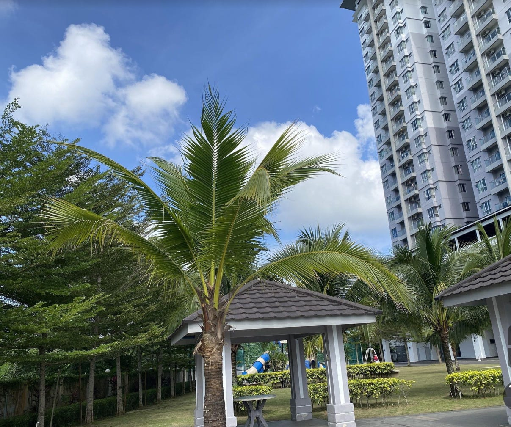
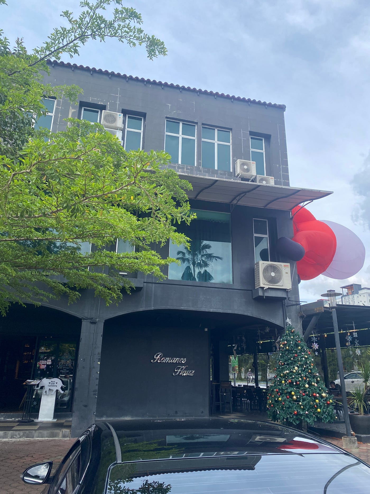

### 留学フィールドスタディストーリーテリング地図作品

こんにちは、2年生の福田宏娜（こうな）です。

留学中に記録したツアーについて紹介します。

今回私が考えた観光ツアーは私が実際に観光した場所ではなく、留学先で生活をしていた町、KAMPARについて皆さんに紹介したいと思います。よく知っている場所なので、より詳しい説明ができるかと思って作ってみました。私が生活していてよく行っていたお店やおすすめのお店を記録と共に紹介します。

まず、ストーリーテリング地図作品はこちらになります。

[Google Earth
Aw snap! Google Earth isn't supported on your browser. You may need to update your browser or use a different browser…earth.google.com](https://earth.google.com/earth/d/1A42d5tVXUweAvnx28q2xsnfgcOsrOYx2?usp=sharing)

私が住んでた場所に加えて、どんなお店でどんなタイミングで行っていたのか説明と写真を加えてアニメーションにし、実際に散歩したルートで作成しました。

記録したStravaログのPermalink URLはこちらになります。

[https://strava.app.link/EF8OPy8A3Fb](https://strava.app.link/EF8OPy8A3Fb)

お土産をスーパーで買い終わってから記録してみました。お店を回りながら食べたくなってしまい、お店で足を止めてしまい時間が長くなりました。普段Grabを使って移動することが多かったので、お散歩気分でKamparをゆっくりと満喫することができました。

Mapillaryデータはこちらになります。

[Mapillary
Street-level imagery, powered by collaboration and computer vision.www.mapillary.com](https://www.mapillary.com/app/user/kounadayo?lat=4.331067269476122&lng=101.14409241354997&z=17&pKey=1335350257344388)

初めてこのアプリを使い、360度うまく撮れなかったりもしました。もっとうまく使いこなせるようにこれからたくさん写真をとっていきたいです。地図で見るのと違い、自分で撮影したものは見返しをしていて、この時こんな感じだった、このお店はこういう雰囲気だったと、実際の体験を思い出すことがありました。

キメのスクリーンショットは2枚にしました。住んでいたWestlakeにいた時間が一番長く、ここから私の記録が始まりました。ベランダから見た外の景色が大好きです。家の下のテニスコートでよく運動してました。ここに泊まることができて本当によかったと思っています。

もう一枚はストーリーテリングにもあるEntertainment Hubです。家以外で一番よく行っていた、数少ない遊ぶ場所でした。現地の仲良くなった友達との思い出がたくさん詰まった場所です。

このように、私が生活していた町の紹介というより、私が好きな場所についてでした。この紹介のまとめとして、キメの写真はいろんな場所の中で、一番落ち着く場所と一番楽しめる場所の二つにしました。マレーシアの小さな町でしたが、少しでもKamparの魅力が伝わっていればと思います。

この課題で初めて使用したアプリやツールがほとんどで、色々な使いかたについて学ぶことができたので、これからも活用し、課題だけでなく、日常を記録するなどしていきたいと思います。
