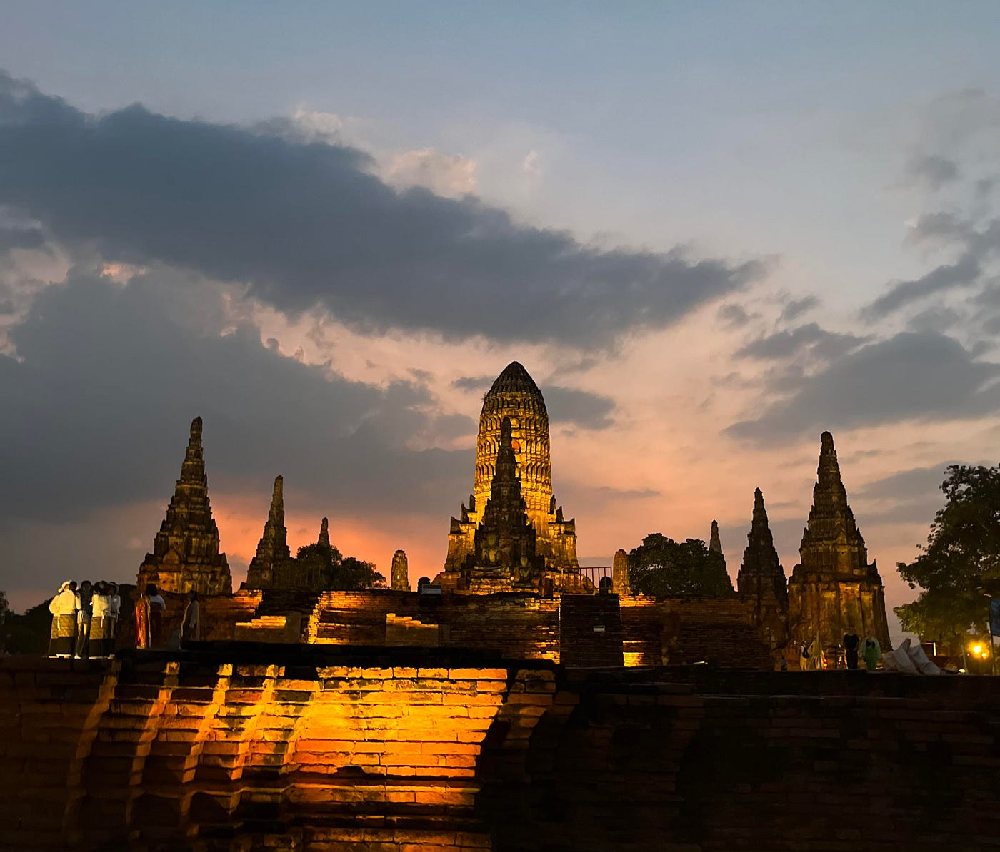

### アユタヤに是非行って欲しい！（私の留学中の一日）

こんにちは。2年の林優香里（はやしゆかり）です。

私は、8月から12月までの約5か月間、タイのカセサート大学に留学にしていました。ここでは、留学生活中に訪れた「アユタヤ」という地域について記録してきたものを紹介します。

「アユタヤ」はバンコクの北部に位置し、世界遺産にも認定されています。今回、そこに私は友達と日帰り旅行に行ってきました。アユタヤはバンコクの中心部から列車で約1時間半と短時間で行けるため、半日での旅行にお勧めの地域です。

はじめに、ストリーテリング地図作品はこちらになります。

今回「Storymaps」というツールを使用し、制作しました。

[Ayuttaya Trip 12月14日
午後から半日アユタヤ日帰り旅行に行ってきました。アユタヤの有名なフードやマーケット、遺跡を半日で回りました。半日でしたがアユタヤの雰囲気を十分に楽しむことができ、充実した一日となりました。arcg.is](https://arcg.is/1qyGqD)

約４時間という短い旅行でしたが、アユタヤの有名スポット、おすすめの屋台フードを楽しむことができ、とても充実した旅行になりました。

次に、Stravaで記録した自分の住んでいたバンコクに位置する寮からアユタヤまでの移動軌跡です。

[https://strava.app.link/avQU2KxyiGb](https://strava.app.link/avQU2KxyiGb)

私たちは、バンコクからアユタヤまで列車で向かいました。バンコクから北部に向かうにつれて、都会の景色から農地や自然を感じる風景へと変わっていきました。アユタヤでは3つの有名な遺跡を見て回りました。アユタヤ市内にある有名観光スポットは駅から比較的近場に集結されているので、1日あれば十分充実した旅行になると思います。

さらに、Mapillaryというツールを用い、各地を360°撮影してきました。

こちらがURLになります。

[http://mapillary.com/app/user/Yukari1008](http://mapillary.com/app/user/Yukari1008)

使い方をうまく理解できず、ぶれていたり、友達などの人が映り込んでしまったり、枚数が少なくなったりしてしまっている分もあり、見返した時にうまくとれておらず、反省したため、次回は今回の反省を生かし、うまく使いこなせるようにしたいです。

最後に、キメのスクリーンショットを1枚紹介します。

これは、ワット・チャイ・ワタナラームがライトアップされた時に撮影した写真です。はるか昔に作られたとは思えないほど広大で繊細なレンガ造りの遺跡にタイでしか感じることができない幻想的な雰囲気に包まれました。また、ライトアップされた遺跡は神秘的に感じ、足を運んでよかったと感じられた景色を見ることができました。

今回、自分が観光したスポットを記録し、その時に感じた感情を言語化したり、行った記録を地図や写真に残すことで、思い出を振り返りやすくなり、鮮明に記憶に残るため、とても良い機会となりました。今後はさらに上手にツールを使いこなせるようになると共に、自分が体験した経験を記録していきたいと思いました。
