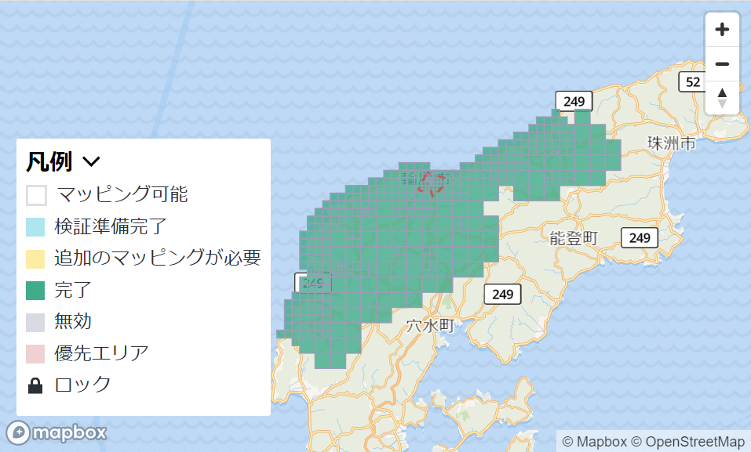

### Youth週報 1/16

こんにちは！

4年の吉田です。

2年間活動してきた古橋ゼミの授業も今回で最後となりました。

今週のYouthの活動は

・_[Open Mapping towards Sustainable Development Goals_](https://link.springer.com/book/10.1007/978-3-031-05182-1?fbclid=IwAR0mxXoILYo2Ar1akXx7F3QDRs6TqVAv7CIYDUPNo6YihQb4pQ0NFWNFV_g)の翻訳作業

・石川県のマッピング作業

でした。

> Open Mapping towards Sustainable Development Goals_の翻訳作業_

前回指摘された、「です、ます体」か「だ、である体」にするか問題は、

あくまで論文調にしていきたいので、**「だ、である体」**を採用しました。

文書は全部で380ページあり、現在、翻訳作業をしていますが、まだまだ全て翻訳できそうにないため、翻訳作業は来年のYouthMappersのメンバーに引き継いでもらおうと思います。

[翻訳文](https://docs.google.com/document/d/1t4SAWIjNs0r3eWKRKZHyXRDD87rA5Hcc9rwEdz72_ns/edit?usp=sharing)

[GitHub - furuhashilab/furuhashilab_Open-Mapping-towards-Sustainable-Development-Goals_TRANSLATIONS
Contribute to furuhashilab/furuhashilab_Open-Mapping-towards-Sustainable-Development-Goals_TRANSLATIONS development by…github.com](https://github.com/furuhashilab/furuhashilab_Open-Mapping-towards-Sustainable-Development-Goals_TRANSLATIONS)

・石川県のマッピング作業

石川県のマッピングでは輪島市を中心に、マッピングを行っていきました。

[HOT Tasking Manager
Tasking Manager is a the tool for coordination of volunteers and organization of groups to map on OpenStreetMap.tasks.hotosm.org](https://tasks.hotosm.org/projects/15888/tasks)

1/15日現在でも

・石川県志賀町([https://tasks.hotosm.org/projects/15902](https://tasks.hotosm.org/projects/15902))

・石川県七尾市([https://tasks.hotosm.org/projects/15903](https://tasks.hotosm.org/projects/15903))

・石川県内灘町([https://tasks.hotosm.org/projects/15933](https://tasks.hotosm.org/projects/15933))

・石川県羽咋市([https://tasks.hotosm.org/projects/15944](https://tasks.hotosm.org/projects/15944))

・石川県中能登町([https://tasks.hotosm.org/projects/15945](https://tasks.hotosm.org/projects/15945))

のマッピングがまだ残っているので、引き続きマッピングを行っていきいます！
