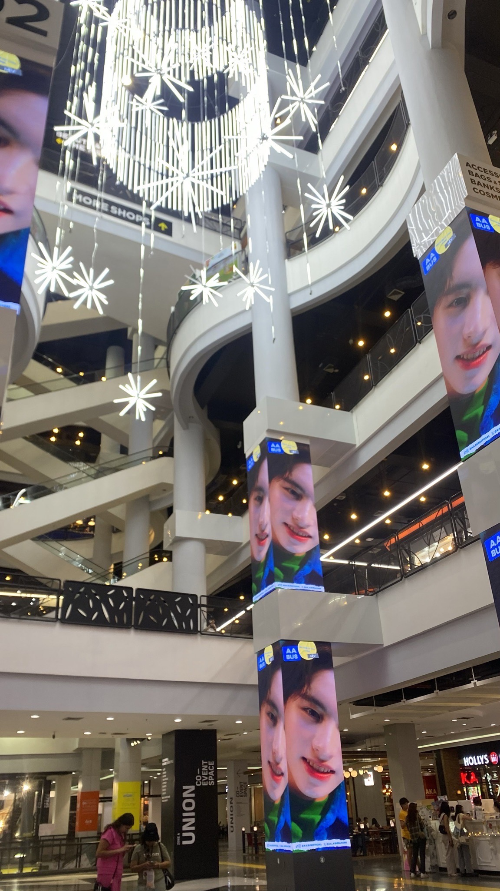

タイ留学中のストーリーテリング

私はタイへ留学中に、”私が寮からショッピングへ行くまで”のストーリーテリングを行った。目的地は StationCentral LadpraoとUNION MALLという二つのモールであり(下記写真)、そこでションピングをした。

↑StationCentral Ladpraoの館内の様子

↑UNION MALLの館内の様子

今回ストーリーテリングで使用した記録ツールは、GoogleEarth、Mapillary、Stravaの三つである。以下、それぞれ記録を紹介する。

１GoogleEarth

今回は、私が寮（Krissana International Dormitory）からRoyal Forest Departmentという最寄の駅からHa Yaek Lat Phraoという駅で降り、2つのモール、 StationCentral LadpraoとUNION MALLにショッピングに行くルートをGoogleEarthを用いて紹介する。

[Google Earth
Aw snap! Google Earth isn't supported on your browser. You may need to update your browser or use a different browser…earth.google.com](https://earth.google.com/web/@13.83344885,100.57147921,5.41878037a,7654.01005891d,30.00000034y,0h,0t,0r/data=MikKJwolCiExWjJTeXp2R1RjNXJIU2JqTnZpc0NQZ0NKd0RrVFhyMzUgAToDCgEx)

２Strava

※Stravaとは、スマホのGPS/GNSSを毎秒ごとに記録するツールである。このツールを使用し、寮からショッピングへ行くルートをマップに落としたものを以下紹介する。

[午後のライド - 滝沢 未's 7.3 mi bike ride
滝沢 未 rode 7.3 mi on Dec 15, 2023.www.strava.com](https://www.strava.com/activities/10383103904?utm_source=ios_share&utm_medium=social&share_sig=C280D11F1705138054&_branch_match_id=1070165450055603631&_branch_referrer=H4sIAAAAAAAAA8soKSkottLXLy4pSixL1EssKNDLyczL1vfzjQgtdjM3znJPAgCDY3GfIwAAAA)

３Mapillary

※Mapillaryとは、位置情報付写真を記録・公開できる市民参加型ストリートビューである。最後にこれを用いて、StationCentral LadpraoとUNION MALLそれぞれのモールを360度撮影したものを紹介する。

[Mapillary
Street-level imagery, powered by collaboration and computer vision.www.mapillary.com](https://www.mapillary.com/app/?pKey=611886944396046)

[Mapillary
Street-level imagery, powered by collaboration and computer vision.www.mapillary.com](https://www.mapillary.com/app/?pKey=1733145527176135)
