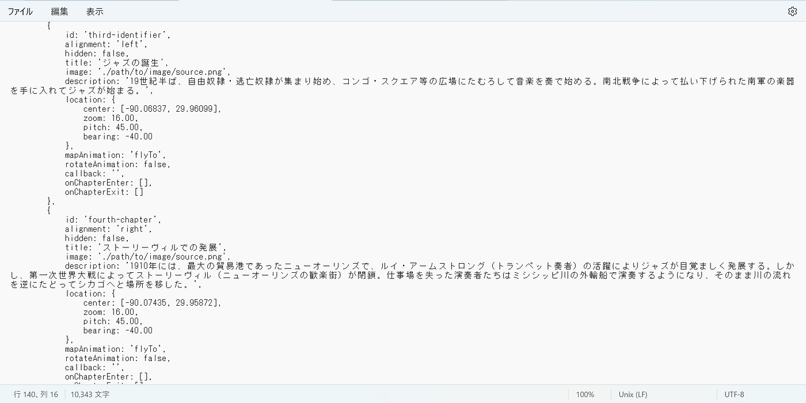
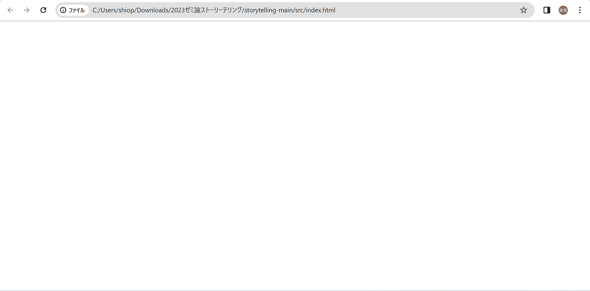
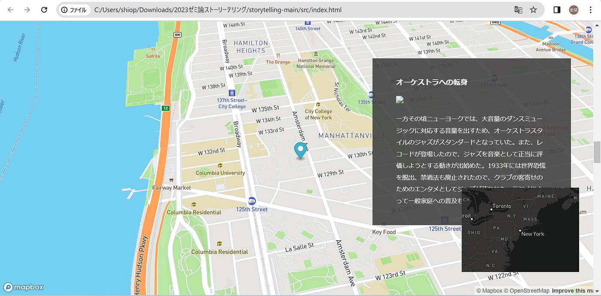
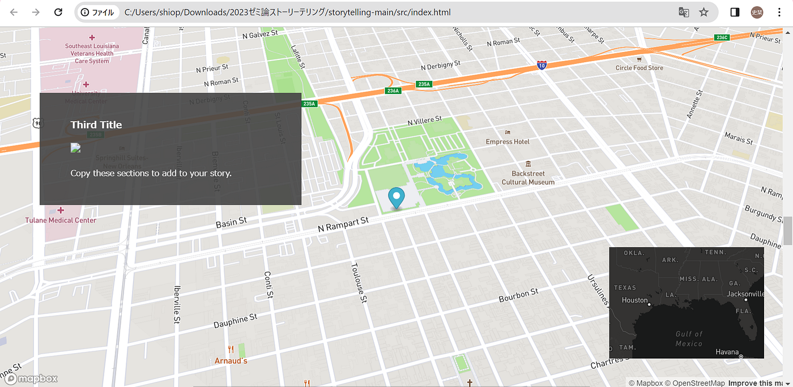

### **グローバルに融合する音楽と
その地理的な拡散について**

おはようございます！3年生の上原です。

2023年度のゼミ論として研究した内容を紹介します。

私は、「グロバールに融合する音楽とその地理的な拡散について」というテーマで、主にジャズがどのように広がって人々に親しまれるようになったかについて研究を進めていました。近年、「音楽は国境を越える」「音楽は世界共通言語だ」というのはよく聞かれる言葉で、今や音楽は、地理的境界を超えて社会的な交流や文化の共有を促進する力強い手段となっている、と留学経験を通して実感したことから、このテーマに決めました。

研究で使用した資料等は全て専用の[GitHubレポジトリ](https://github.com/furuhashilab/2023gsc_ShioriUehara)に格納されています。以下、[IMRAD](https://ja.wikipedia.org/wiki/IMRAD)形式で紹介していきます。

### Introduction

**〈研究の目的〉**

音楽の地理的拡散が、異なる地域や文化にどのような影響を与えているかを解明すること。具体的には、ジャズミュージックを取り上げ、その音楽ジャンルやスタイルがどのように広がり、変容し、他の地域の音楽文化に影響を与えているかを明らかにする。

〈先行研究〉

先行研究の把握として、4つの論文を調査した。簡潔にまとめると、ジャズはヨーロッパ音楽の派生形として誕生し、100年にも満たない短期間で、和声側面でヨーロッパ音楽の歩んできた生成から崩壊への道程を繰り返したことから、ヨーロッパ近代音楽がジャンルを越えてジャズに大きな影響を与えた（山本、小野,2010）と結論づけられそうだ。また、日本においては1930年代にジャズを用いて「アメリカ文化」を語った日本知識人（秦豊吉、池崎忠孝）がいたらしい（鳥居,2000）。山本や小野の見解と同様に、英語文献から得た知見として、B. Johnson（2022）によると、ジャズは相互作用・再解釈的に演奏される、つまり自分の個性を出すことによって伝統音楽（＝クラシック音楽）への抵抗を図ったという側面があるようだ。また、拡散の仕方について、都市を越えて再録音されていき、断絶性の高い都市ほど再録音されたという見方もあった（D.Phillips,2011）。言い換えれば、都市を越えると、社会的に遠くの異質なソースからの目新しさや文化に惹かれることで注目されていき、新鮮さを消費することを聴衆が求めたことによってアレンジされていった、つまり、D.Phillips（2011）は、遠く離れているなどして、自分たちにとって異質であればあるほど、その曲に対する興味を引き起こされると述べている。

以上のことから、「ジャズの拡散は、その時々の流行に反発するようにして、遠く離れた都市を何度も行き来しながらアレンジされ続け、今日に様々なジャンルが派生する結果となった」と仮説をたてて進めていく。

### Methods

文献調査により、ジャズの発展・拡散の歴史を調べる。その結果をストーリーテリングでまとめる。世界共通のジャンルとして広がっているジャズの拡散のされ方を調べることで、音楽の地理的な「面」での動きを可視化できるところに新規性があると感じる。

〈使用ツール〉
- [文献（論文、書籍）](https://docs.google.com/spreadsheets/d/1VDGI0ggjRuoWZbTHGGcxZK3Zis2dVklIGidlAeMQwjs/edit?usp=sharing)
- [Mapbox Storytelling](https://www.mapbox.jp/blog/how-to-build-a-scrollytelling-map)

### Results

文献調査によってジャズの歴史を紐解くことができたので、それをストーリーテリングにまとめる。

〈作成したストーリーテリング〉[https://github.com/furuhashilab/2023gsc_ShioriUehara/deployments/github-pages](https://github.com/furuhashilab/2023gsc_ShioriUehara/deployments/github-pages)

〈作成における技術的なトラブル〉

1. ストーリーテリングが表示されなくなる
テンプレートは4チャプターしか用意されていないため、チャプター数を増やすためコピペしたら、index.htｍlに表示されなくなってしまった。config.js.templeteのコードを、’third-identifier’と’fourth-chapter’のみコピー＆ペーストしたことが原因と思われる。’slug-style-id’から’fourth-chapter’の4つのまとまり全てをコピーすることで解決した。

2. 座標が移動しない
コピーした箇所以降、新しい座標を入力しても最初の4つの座標が引き継がれてしまって正しい位置に移動しない。idを変更していなかったことが原因と考えられる。idを順番に応じて、fifth…、sixth…と変えることによって解決した。

### Discussion

本研究では、「ジャズの拡散は、その時々の流行に反発するようにして、遠く離れた都市を何度も行き来しながらアレンジされ続け、今日に様々なジャンルが派生する結果となった」と仮説をたてて研究を進めてきたが、実際は、黒人の手によって白人文化と混ざり合いながら双方の特徴をせめぎ合うように反映しつつ発展し、ジャズというジャンルの中で更新されていったことが分かった。例えば、1930～40年代のスウィング時代では、ニューヨークでジャズ・オーケストラがエンタメとして一般普及していった傍ら、それに反発するような形で、カンザスシティにおいて譜面という定型にとらわれることを嫌った、即興演奏が流行った。その10年後の1950年代でも、東海岸のニューヨークで今までの黒人系のルーツを持つジャズがメインストリームであった一方、西海岸のロサンゼルスでは、第2次世界大戦によって亡命してきた音楽家たちの影響で現代音楽とジャズの融合が起こった。地理的にも、ニューオーリンズ→シカゴ→ニューヨークの流れを主流とすると、カンザス、ロサンゼルス、テキサスなど、都市をまたいで別のムーブメントが起こっていることが分かった。これは、先行研究で取り上げたD.Phillipsの意見を裏付けるもので、「断絶性の高い都市ほど再録音された」の言葉通り、ニューヨークから最も離れたロサンゼルスでは、今も名曲として語り継がれる「テイクファイブ」のような名曲が数多く生み出された。

### Conclusions

文献調査を通じて音楽の拡散の様子を知ることができた。また、それをストーリーテリングによって可視化し、最終的に「黒人の手によって白人文化と混ざり合いながら双方の特徴をせめぎ合うように反映しつつ発展し、ジャズというジャンルの中で更新されていった」という結論を得た。内容面の信憑性には課題が残るし、技術的に面での見せ方をもっと工夫することもできたかもしれないと感じるため、空間を面的に表現する方法について、さらなる研究を進める必要がありそうだ。

### 謝辞

本研究を進めるにあたり、古橋教授をはじめ、多くの方々より多大な助言を賜りました。厚く感謝を申し上げます。

### 参考文献リスト

[古橋ゼミ_ゼミ論2023_参考文献・参考資料リスト（上原）
Templete ID,大分類,中分類,小分類,著者,発行年,最終更新日,タイトル,雑誌名,雑誌号数,該当ページ,出版社,ISBN,URL,URL4archives,閲覧日,MEMO1,MEMO2 論文,査読つき 論文,査読なし 書籍…docs.google.com](https://docs.google.com/spreadsheets/d/1VDGI0ggjRuoWZbTHGGcxZK3Zis2dVklIGidlAeMQwjs/edit?usp=sharing)

### 最終発表資料

[https://docs.google.com/presentation/d/1pZwT7W_6kpkBA1S1iDfR4YTi5-yesElzjBsl5gpX81M/edit?usp=sharing](https://docs.google.com/presentation/d/1pZwT7W_6kpkBA1S1iDfR4YTi5-yesElzjBsl5gpX81M/edit?usp=sharing)
