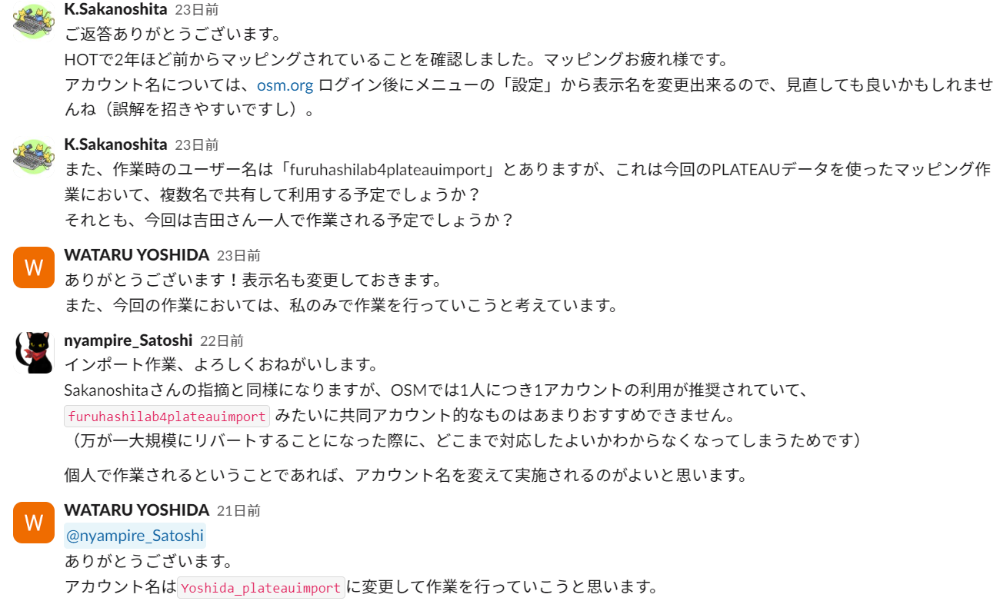
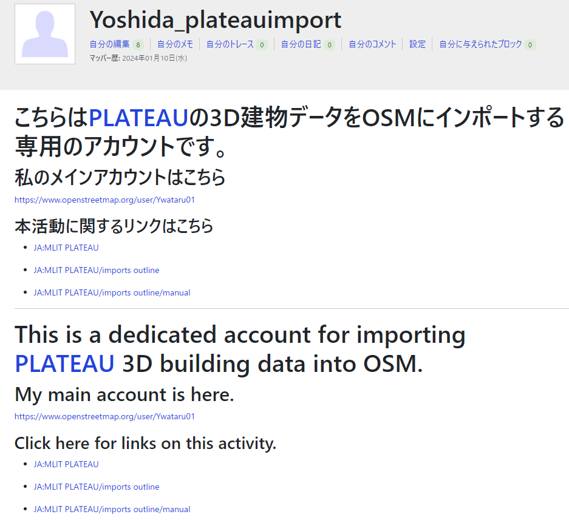
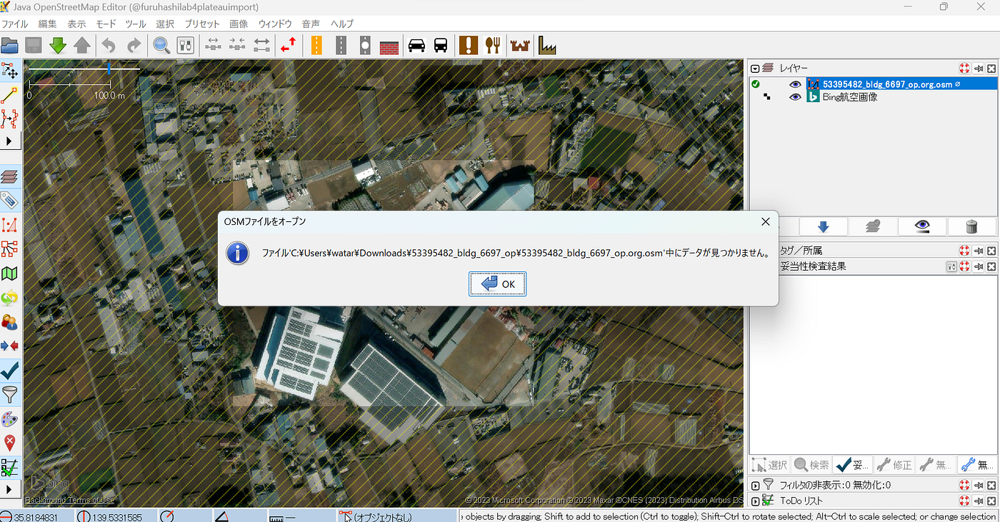
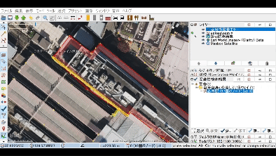
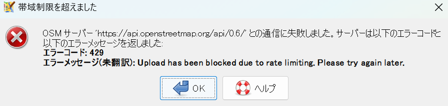
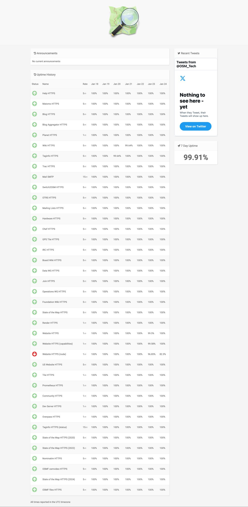
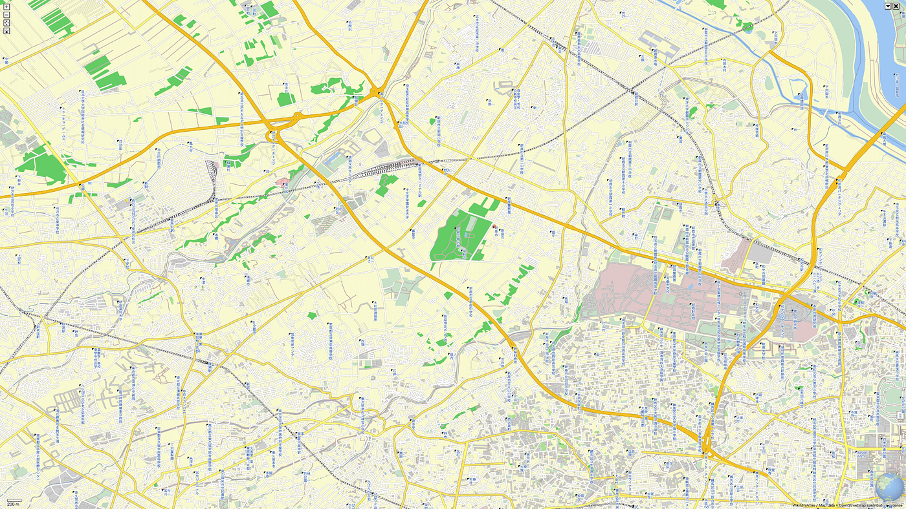
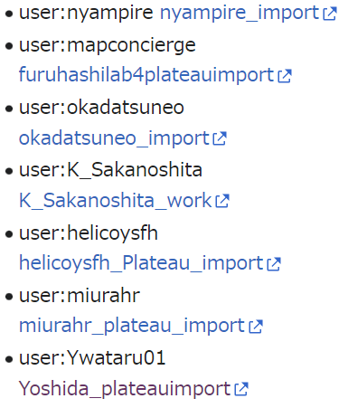
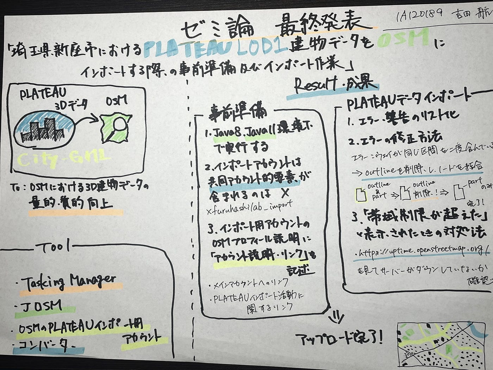

### 【ゼミ論】**PLATEAU LOD1 建物データをOSMにインポート！**

こんにちは！

4年の吉田です。

今回は、2023年度ゼミ論の最終報告を行わせていただきます。

私のゼミ論のテーマは、昨年から取り組んできた「**埼玉県新座市におけるPLATEAU LOD1 建物データをOSMにインポートする際の事前準備及びインポート作業**」です。

本研究に至った詳細については、こちらの記事をご覧ください！

[PLATEAU LOD1建物データをOSMにインポートする際の事前準備法の確立【アドベントカレンダー12/21】
こんにちは。4年の吉田です。medium.com](https://medium.com/furuhashilab/plateau-lod1%E5%BB%BA%E7%89%A9%E3%83%87%E3%83%BC%E3%82%BF%E3%82%92osm%E3%81%AB%E3%82%A4%E3%83%B3%E3%83%9D%E3%83%BC%E3%83%88%E3%81%99%E3%82%8B%E9%9A%9B%E3%81%AE%E4%BA%8B%E5%89%8D%E6%BA%96%E5%82%99%E6%B3%95%E3%81%AE%E7%A2%BA%E7%AB%8B-%E3%82%A2%E3%83%89%E3%83%99%E3%83%B3%E3%83%88%E3%82%AB%E3%83%AC%E3%83%B3%E3%83%80%E3%83%BC12-21-6eec99e14ec0)

本研究では、誰でも編集可能な地図[OpenStreetMap](https://www.openstreetmap.org/#map=15/35.7449/139.4576) (以下OSM)の**3D建物データの量的・質的向上を目的**として、国土交通省主導の日本全国の3D都市モデルの整備・活用・オープンデータ化を目指すプロジェクト**[PLATEAU](https://www.mlit.go.jp/plateau/)のLOD1の建物データをOSMにインポートする**という作業を行っています。

インポートを実施する地域は[JA:MLIT PLATEAU/imports list](https://wiki.openstreetmap.org/wiki/JA:MLIT_PLATEAU/imports_list)を参考として埼玉県新座市とし、[JA:MLIT PLATEAU/imports outline/manual](https://wiki.openstreetmap.org/wiki/JA:MLIT_PLATEAU/imports_outline/manual)に基づいて、PLATEAUデータのインポート作業を行います。加えてインポート作業の前段階に当たる「事前準備」の必要性及びその手順についても考察します。

> _**事前準備の留意点_**

**1. CityGMLデータを違う形式のファイルに変換する際のコマンドが実行されない**

→citygml-osm開発者である[林優氏](https://github.com/yuuhayashi)に助言をいただきながら、OS・Javaの動作環境を変えながら検証した結果、

**citygml-osmで利用されている”apache camel v2.25.4"がJava8,Java11にしかサポートされていないため**

**・Java 8**

**・Java 11**

をインストールした環境下でしかコンバーターが動作しない、という**Javaのバージョンが原因であった**ことが判明しました。

**2. コミュニティへの事前告知**

当初はインポート用のアカウント名を**furuhashilab4plateauimport**とする予定であったが、**共同アカウント的要素**が含まれるアカウント名であったため、**Yoshida_plateauimport**とインポート用のアカウントを変更して作業を行うことに。

**個人でインポート作業を行う際は、アカウント名に共同アカウント的要素を含まないように留意しましょう。**

3. **OSMのインポート用アカウントのプロフィール説明のところに「私のメインアカウントはこちら」「こういう活動（インポートのWikiページ）に関わっている」などを書く**

インポート作業中、新しいアカウントでいきなり大量のアップロードを行ったことが原因で、 自動破壊行為防止スクリプトによってインポートアカウントがブロックされてしまいました。

この問題の解決法の一つとして、

**インポート用アカウントのOSMプロフィール説明に「アカウントの説明やリンク」を記述しておく**ことが挙げられます。

また、このほかにも

**建物データが少ない地域からインポートしていく**のも一つの手として考えられます。

> _**PLATEAUデータインポート_**

1. **コンバーターを使用して変換作業を行う際のツール**

変換作業が、Powershellで実装されなかったが、コマンドプロンプトでは実装できたため、今回はコマンドプロンプトを使用してインポート作業を行っています。

**2. 1st-validation, 2nd-validation**

1st-validation：解凍したフォルダに含まれている _***.osm_ の妥当性検証

2nd-validation：コンバーターで_***.org.osm_に変更したファイルの妥当性検証

**林優氏が中心となって行った、PLATEAUで公開されている各市町村のCity-gmlを_***.osm, ***.org.osm, ***.mrg.osm_に変換したデータファイルが[PLATEAU-BLDG import task](http://surveyor.mydns.jp/task-bldg/mesh/11230)に格納されています。**

**そこで公開されている新座市の_***.org.osm_の一部が開けないものがありました。**

**このような場合は***.org.osmファイル、***.mrg.osmファイルを削除し**

**$ java -Dfile.encoding=utf-8 -jar citygml-osm-jar-with-dependencies.jar 2nd**

**をコマンドプロンプト等で実行して新たに***.org.osmを作成すると正しく読み込まれるようになります。**

3. **エラー・警告のリスト化及び修正**

1st-validation, 2nd-validation時に発生したエラー・警告のリスト化を行いました。

[新座市_妥当性検証_事例
シート1 ID,type,number,detail,lat,lon,image,File 1,Error,5473 .osm,ウェイが同じ区間を二度含んでいる,35.81170895,139.5500545,<a ...docs.google.com](https://docs.google.com/spreadsheets/d/1g_SA-b3N3m7rKWzYLOa16hlr8yBpsMljPL22gAJN4FQ/edit?usp=sharing)

エラーの修正方法に関しては、[Taichi Furuhashi](None)先生にアドバイスをいただき以下の方法をとることとしました。

**エラー：ウェイが同じ区間を二度含んでいる**

**修正方法**

**・outlineを削除し、飛び出したノードを隣のノードと結合させる**

4. **データアップロード**

**データをアップロードする際に帯域制限を超えたとの表示がでて、アップロードできない状況がありました(2024/1/20)**

2024/1/23前後にOSMの**Webサーバーがダウン**していたため、このような状態になったと考えられます

**5. OSMの埼玉県新座市にPLATEAUデータアップロード**

アップロード前

> _**Discussion_**

1. **事前準備**

**[JA:MLIT PLATEAU/imports outline/manual**](https://wiki.openstreetmap.org/wiki/JA:MLIT_PLATEAU/imports_outline/manual)には記述がありませんでしたが、

- **個人でインポート作業を行う際は、共同アカウント的要素を含まないようなアカウント名にする**

- **インポート用アカウントの信用度を上げるために、OSMのインポート用アカウントのプロフィール説明に「私のメインアカウントはこちら」「こういう活動（インポートのWikiページ）に関わっているよ」などを記述する**

等の事前準備が必要なことが判明しました。

**上記は今後インポートマニュアルに追記しても良いのではないかと考えています。**

**2. 妥当性検証の重要性**

今回のインポート対象地域であった**埼玉県新座市**では、1st-validation, 2nd-validationの段階で、他の市町村([東京都東村山市](http://surveyor.mydns.jp/task-bldg/mesh/13213)、[東京都西東京市](http://surveyor.mydns.jp/task-bldg/mesh/13229)、[長野県岡谷市](http://surveyor.mydns.jp/task-bldg/mesh/20204)、[長野県茅野市](http://surveyor.mydns.jp/task-bldg/mesh/20214)と比較)よりも明らかにエラー数が多かったです。

国土交通省が主導しているとはいえ、**データにばらつきがある**可能性大いにあります

**→そのため、PLATEAUデータとOSMの既存データをマージさせる前段階で妥当性検証を行う1st-validation, 2nd-validationが重要になってきます。**

**3. インポート活動の現状**

現在、PLATEAUデータインポートマッパー数は**わずか7人**です。

OSMの既存データを尊重してインポート作業を行うため、誰でも作業できるというわけにも行かないが、**マッピング歴**や**今までの議論を見たか**など、**条件を決め**SNS等を使ってマッパーを募ることも将来的には必要であると考えます。

今回の私の研究が、日本の地図開発をより活発にする一助になっていれば幸いです。

> _**Google Slide_**

> _**グラレコ_**

> _**GitHubリポジトリ_**

[GitHub - furuhashilab/2023gsc_WataruYoshida
Contribute to furuhashilab/2023gsc_WataruYoshida development by creating an account on GitHub.github.com](https://github.com/furuhashilab/2023gsc_WataruYoshida)
