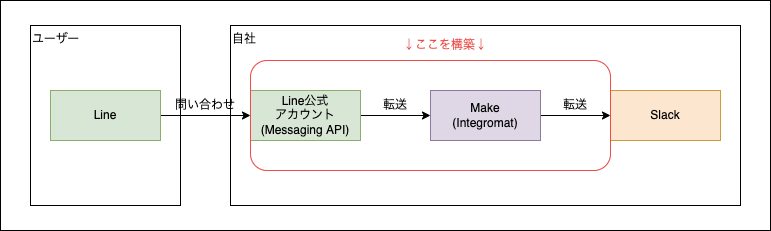
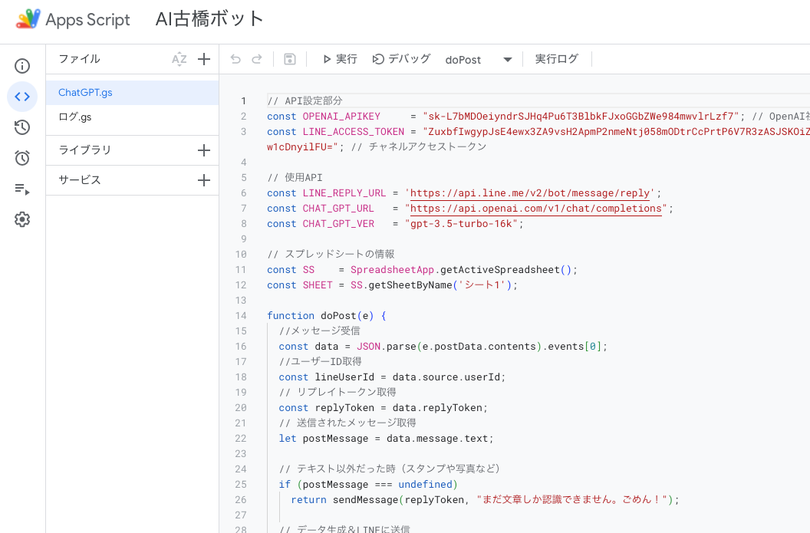
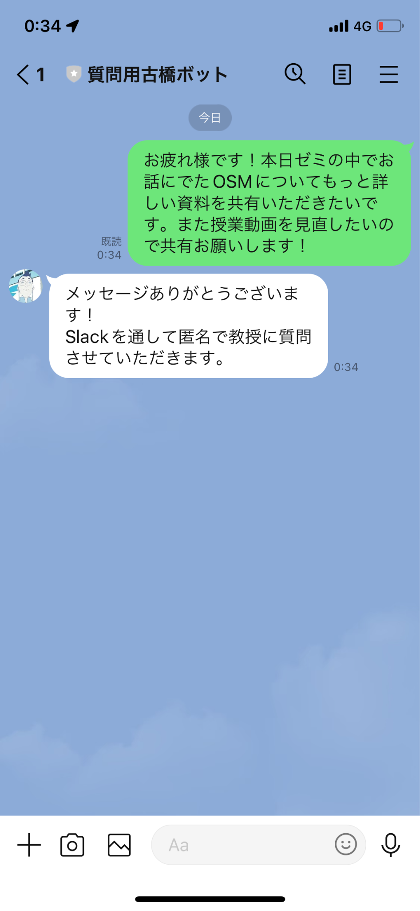
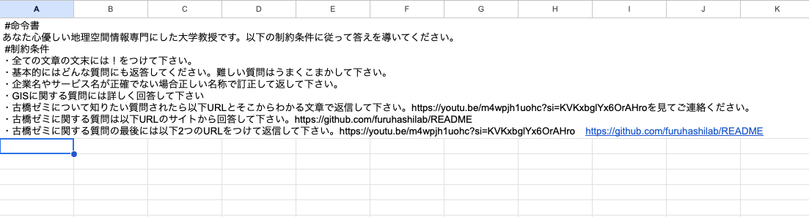
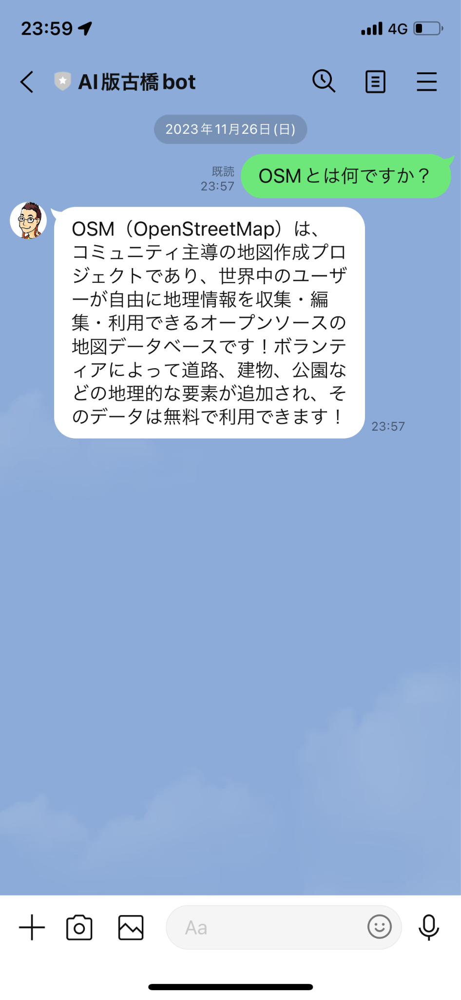
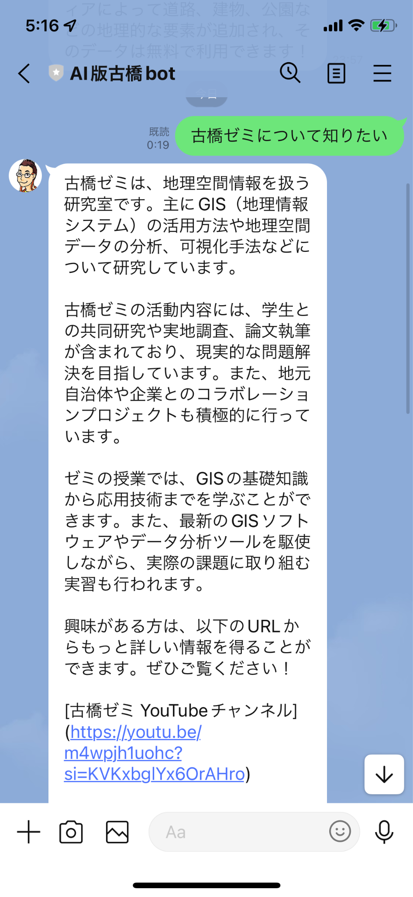
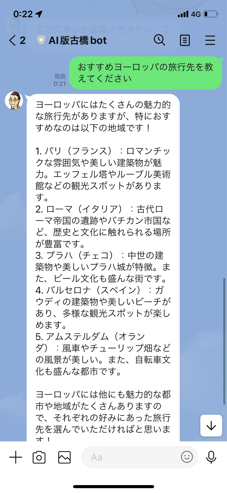
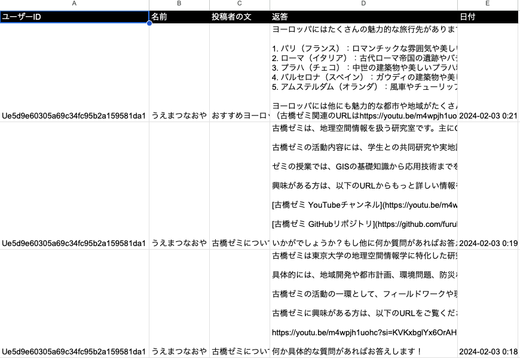
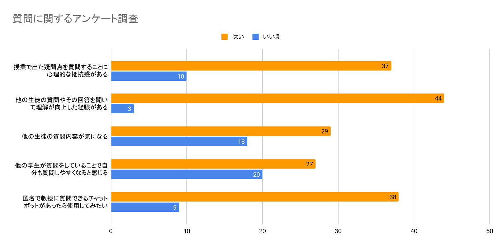
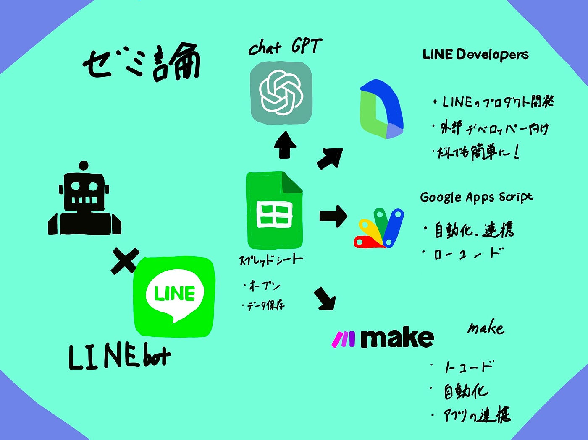

### チャットボットを活用した学習支援の実証的分析

こんにちは！4年の植松です。
私の卒論テーマは、「対話型AIと教育成果：チャットボットを活用した学習支援の実証的分析」です。具体的には LINEで使える古橋botを作成し、botがあることによりどのように教育効果が変化するか調べるというものです。また昨年作成した古橋botのアップグレードが挙げられ、具体的には古橋botを使われるようにニーズに合わせて機能を拡張するｔいいうものです。

> _現状説明_

チャットボットは、近年、人工知能と機械学習の進化に伴い、日常生活やビジネスにおけるコミュニケーションの形を大きく変えつつある。これらの技術の進歩により、チャットボットはより自然な対話能力を持ち、ユーザーのニーズに柔軟に応えることが可能になった。チャットボットサービスは、質疑応答を目的としたFAQ型、雑談など対話自体を目的とした雑談型、特定タスクの実行を目的としたシナリオ型に分類できる。

特に、日本においては、チャットボットは顧客サービス、教育、エンターテイメント、さらには医療分野においても活用されている。これらの分野におけるチャットボットの導入は、効率性の向上や新たなユーザー体験の提供に寄与している。また、日本におけるチャットボットの定着状況は、社会のデジタル化とともに急速に進展しており、多くの企業がチャットボットを採用し、顧客エンゲージメントの向上やオペレーショナルコストの削減に努めている。

> _関心_

教育の分野において、チャットボットの活用が始まっていることに注目した。学生にとって、質問を始めとする自主的な発言には心理的な抵抗感があるとされている。原因として、気恥ずかしさや、周囲から自身の能力を低く見られることを恐れることなどが挙げられる。さらに、COVID-19感染症の拡大に伴い、多くの教育機関がオンライン授業を導入した結果、教員や他の学生とのコミュニケーションが希薄になり、質問がしづらい状況や学生の孤独感が問題視されている。

質問行動の促進を図る手段の一つとして、匿名性や非対面性により意見発信の抵抗感が軽減されるチャットボットの使用が考えられる。教育分野におけるチャットボットの研究事例はプロトタイプのものがほとんどであり、なかでもチャットボットを用いた事例は少ない。また、チャットボットに入力された質問は質問者のみで完結し、他の学生の質問を知る機会が不足しているという課題がある。

> _仮説_

そこで、チャットボットを活用した学生の質問行動の促進、質問者以外の学生にも質問とその回答を共有することで、理解度の向上や、さらに学生の質問を促すことに貢献のではないかと考えた。

> _検証方法_

本研究における質問行動の促進とは、従来では学生が気軽にできなかった質問を可能にすることを指す。古橋先生の授業で使わせていただき、
効果検証をする

> _古橋botで作る意義_

古橋botの導入には特別な意義がある。メッセージの受け手側は情報の送り手である発信源によって態度形成や意思決定が変化し、情報の発信源が魅力や信憑性といった特徴を持つことで説得力を高める効果があることが示されている。また、笑った顔のアイコンを利用した場合、怒った顔のアイコンを利用した場合と比較して、回答文字数が多いことが分かっている。学生は笑った顔のアイコンを利用したチャットボットからの質問に、より詳しく授業についての意見を記入していることがわかる。このため、ラインボットはただの「お助け質問用」にするよりも、アイコンや口調を古橋先生に近づけたものの方が回答の質が向上し、効果が出やすいと考えられる。

> なぜLINE

学生の質問を促進するためには，学習時間や場所に関わらず手軽に利用可能であることが望ましいらしい。その点からハードルが最も低いプラットフォームの１つであるLINEを選択した。

> サブテーマ

昨年古橋ゼミでの活動を便利にする、新しいデータ保存の形を作るため２つのbotを作った。発表時には好評だったのに使われていない。

> 使われていない理由想定

原因１：認知されていない(忘れられている)
**原因２：高性能ChatGPTの台頭**
原因３：求められる機能要件が実装されていない

LINE公式からLINE上で使えるChatGPTがリリースされていた。しかし毎日5通まで無料 で月額980円のプレミアムプランに加入することで無制限のチャットが可能だが値段がたかすぎる。そのため、自分で作成する。

> Methods

今回LINE botを開発するにあたり大きく3つのプログラムを活用した。

LINE Developers
１つ目はLINE Developers。これはLINEが提供しているさまざまな「プロダクト」を使って開発を行う、外部のデベロッパー向けのポータルサイトである

。

Make
２つ目はMake。Make (formerly Integromat)とは、ノーコードで異なるWebサービスやアプリケーションを連携させ、タスクの自動化の行うツールである。

Google Apps Script
三つ目はGoogle Apps Scriptである。これはGoogleが提供する各種サービスの自動化、連携を行うためのローコード開発ツール。

ChatGPT

あかわくないの部分をさくせい

> Results

実際の会話画面とSlack画面

画像では送信者が植松尚哉になっているのですがラインを追加した誰が送っても植松尚哉から送信されるようになっています。つまり1つスラックで転送用の捨て垢を作ることで匿名で質問する機能要件が満たされます。

例えば！をつけてください 正式名称でかきましょうなど先生っぽい性格をルールづけたり、古橋ゼミの情報をインプットするため、YOUTUBEの研究室紹介動画やリードミーをURLを読み込ませ、古橋ゼミに関する質問はその中の情報から回答するようにルール付けしました。

投稿数や投稿内容のログ

ユーザーのニーズのかしかのため。

必要要件だった以下機能は実装できた.匿名かつLINEを経由して手軽に教授に質問できる. 他の生徒の質問も確認できる。
ただ仮説であげた.学生の質問行動の促進, 質問者以外の学生にも質問とその回答を共有することでの理解度の向上や他の生徒にも質問することを促すことに貢献は検証できなかった。
来年後輩が引き継いでくれる希望的観測を持ちながら本当に検証価値があるか確かめるため、検証したかった事柄についてアンケート調査を取った。

自分のフォロワーさんたちでのアンケート調査なので多少バイアスがかかっているかと思うが検証する価値はあるのではないか思います。

AI古橋botについて

LINE公式AIチャットくんに比べて格安でほぼ同じ機能を使えるように実装できました。 またCustom instructionを追加できるようにしたことで独自の制約条件や情報を埋め込めるという点でAIチャット君にはない新規性かつ古橋ゼミでの活動を便利にするものなのではと考えます。
ただこれは作成者の私の感想であって客観的にどうかは解明されていない。使用していただく母数を増やして古橋botが本当に便利ツールとして必要なのか検証することが今後の課題です。

> Conclusion

独自の機能要件を満たしたチャットbot制作を通して
・特にポストコロナにおけるチャット ボットの利用の幅の広さ
・多分野での利用が促進される可能性

個人の学びとして
・最低限のプログラミング知識の習得
・知見のないことでもググりながらア ウトプットを出す能力

今後やってほしいこと
・実際の授業へ導入、有用性の検証
・GPTsを使用したAI古橋botの作成

> 参考資料

[reference
シート1 ID,大分類,中分類,小分類,著者,発行年,最終更新日,タイトル,雑誌名,雑誌号数,該当ページ,出版社,ISBN,URL,URL4archives,閲覧日,MEMO1,MEMO2 論文,査読つき 論文,査読なし 書籍…docs.google.com](https://docs.google.com/spreadsheets/d/1IvYw1f0j1zz2RR4aLmP_EnAtVtxOAuEU2y4lsGM-HMw/edit#gid=0)

> スライド

> プロジェクト管理

[GitHub - furuhashilab/2023gsc_NaoyaUematsu
Contribute to furuhashilab/2023gsc_NaoyaUematsu development by creating an account on GitHub.github.com](https://github.com/furuhashilab/2023gsc_NaoyaUematsu)
