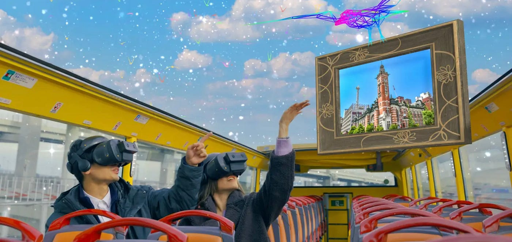
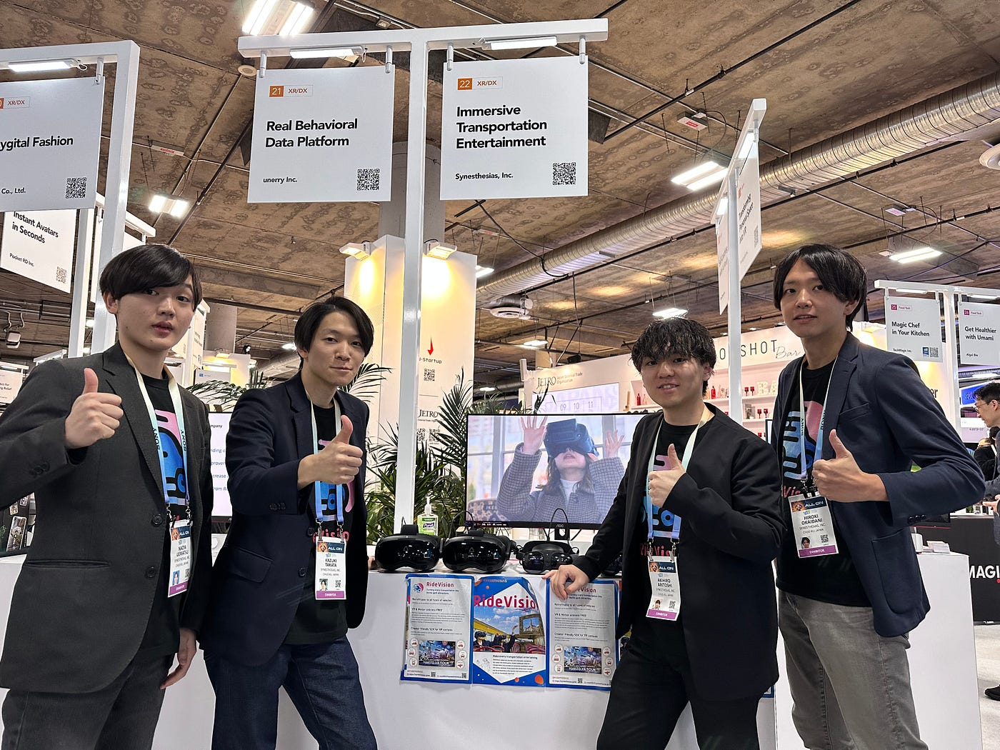
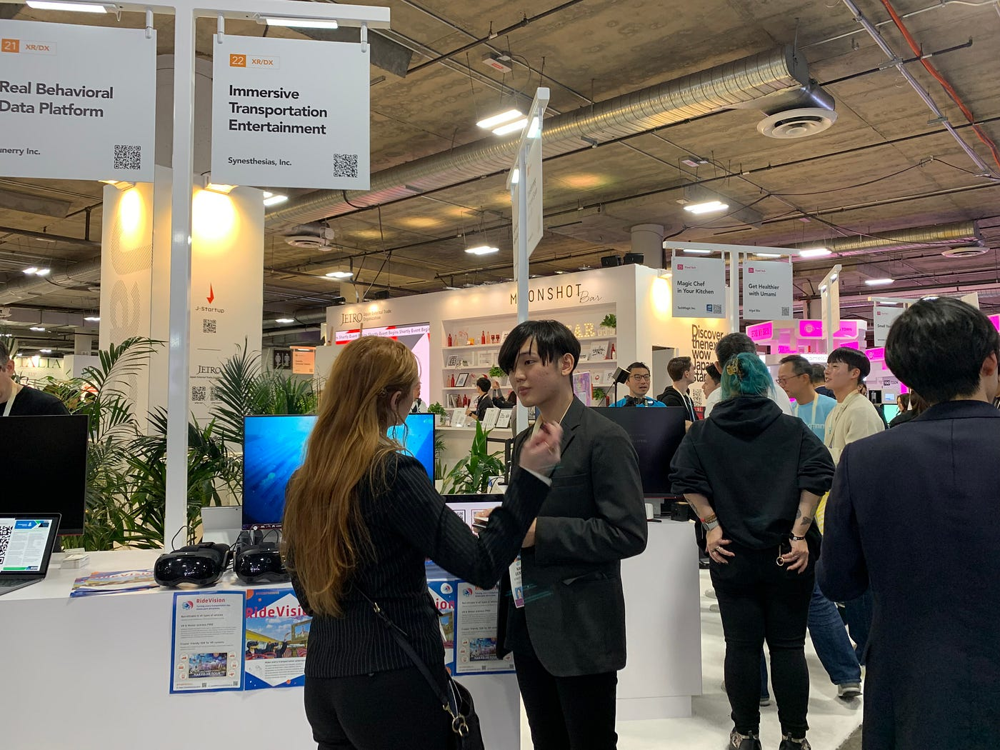
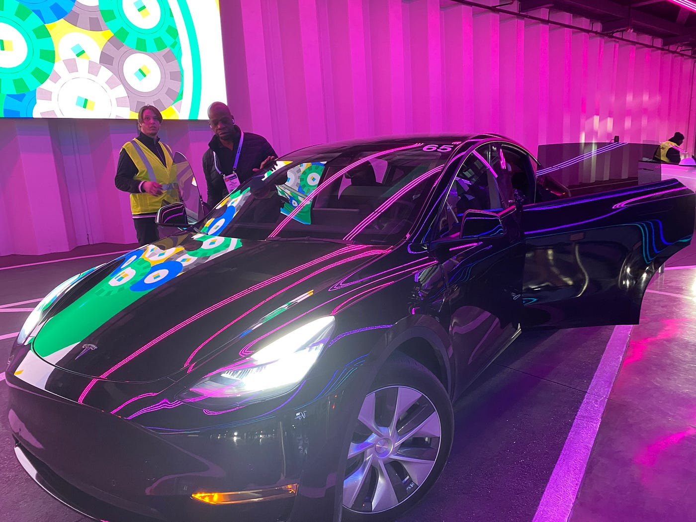
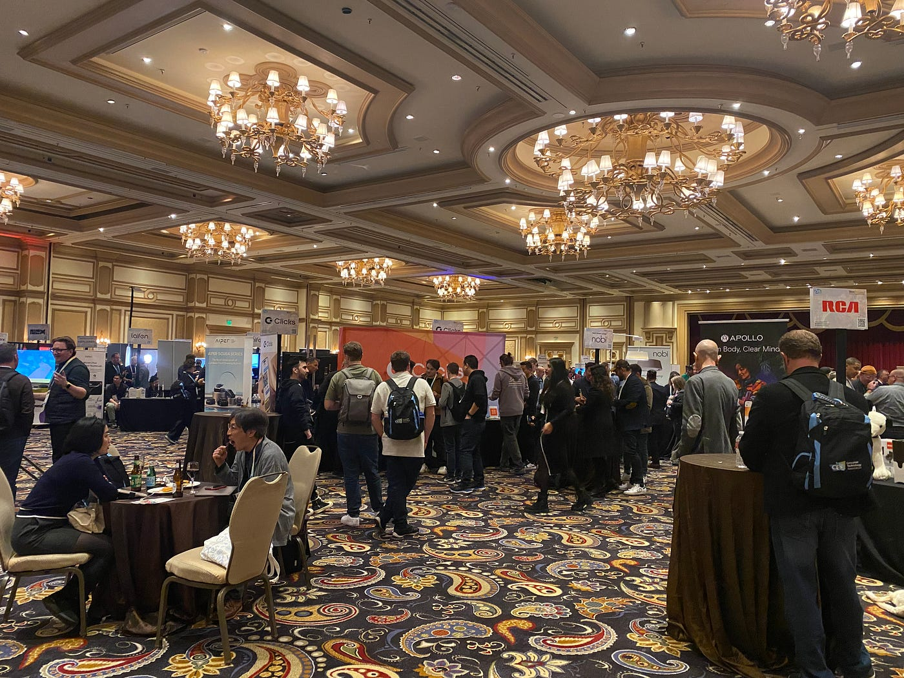
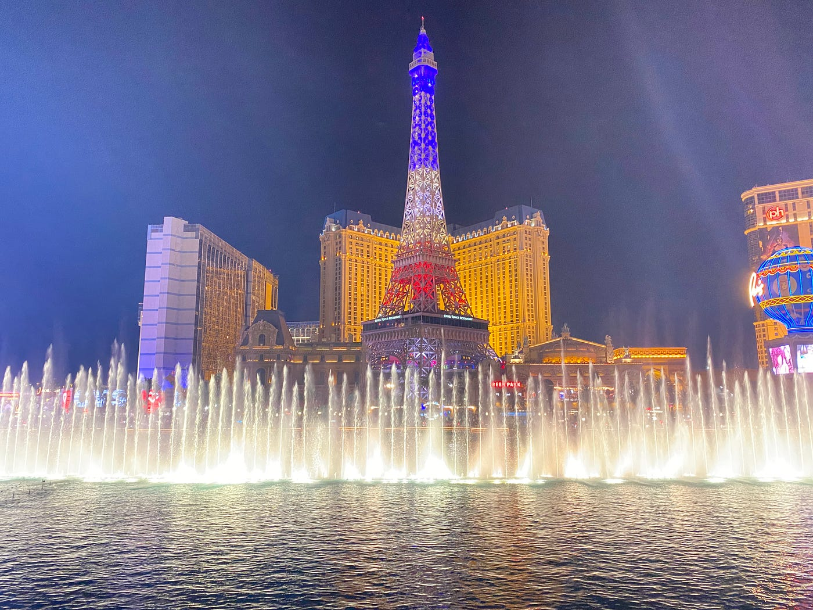
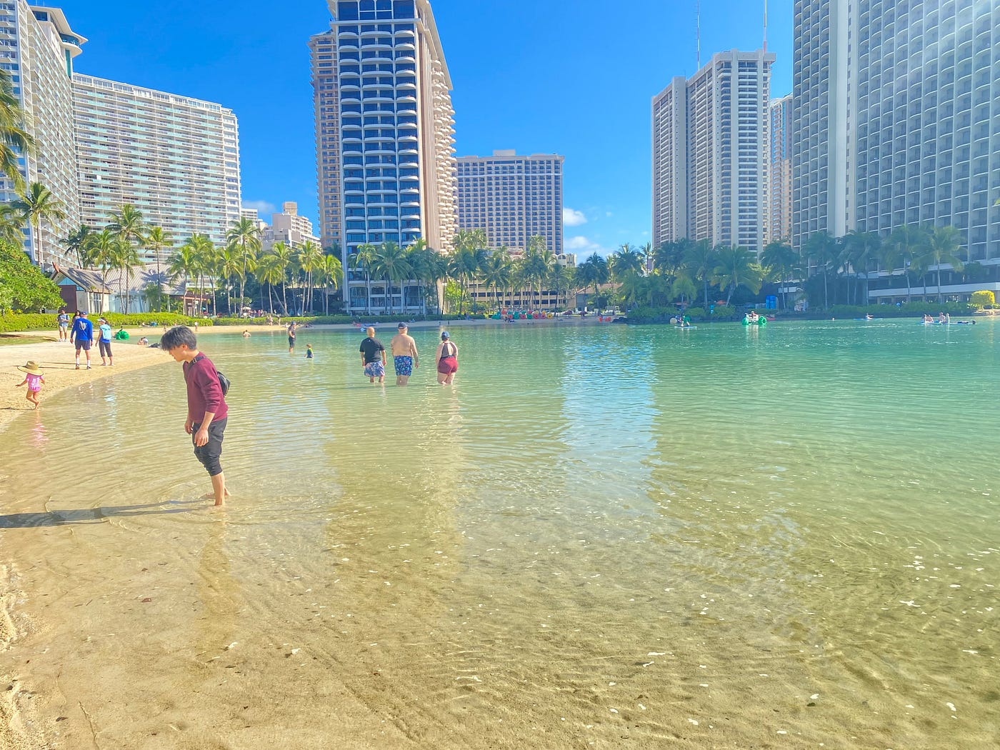
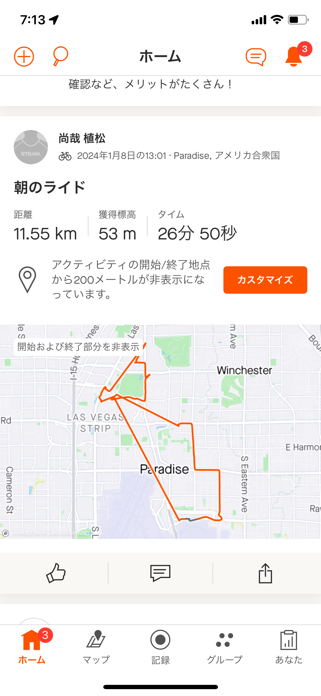
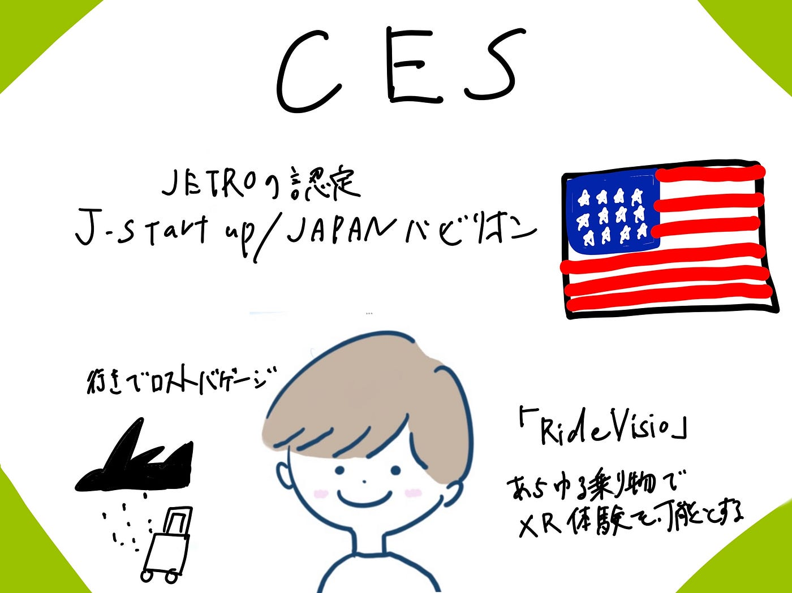

### 【国際会議参加報告】CESに参加しました！

こんにちは、４年植松です。ここで書けないことも多いのでざっくりですが1月9日〜1月12日にかけてラスベガスで開催された国際会議に参加した報告です！

> CESとは

CES（シーイーエス）は、毎年1月全米民生技術協会（が主催し、ネバダ州ラスベガスで開催される電子機器の見本市です。業界向けの見本市で、一般への公開はされておらず、展示会には多くの新製品が出品されます。

> 参加の経緯

私はジェトロ(JETRO)の認定を受けJ-Startup/JAPANパビリオンに出展したインターン先企業の株式会社シナスタジアのブーススタッフとして参加しました。出展エリアのEureka Parkは審査クライテリアが厳しく、毎年規模を拡充している注目度の高いスタートアップ限定出展ゾーンです。そこであらゆる乗り物でのXR体験を可能とするモビリティXRシステム『RideVision』を展示し、来場者へのデモ体験の提供や商談等を行いました。

> 参加してみて

参加前までは外国人向けにプロダクトを紹介するものだと思っていましたが、想像以上にたくさんの日本人のお客さまがブースに立ち寄ってくれました。ただお話する日本人は今まであったことがないような役職の偉い方々で説明が日本語でも緊張しました。

また自分自身がプロダクトに使われている技術的についてよく理解していないことに加え、100%英語が聞き取れるわけではなかったので1日、2日目は非常に大変でした。しかし、役員の方々のセールストークをまねしながらお客さま対応を繰り返すうちに4日目には自然と製品について語れるようになってました！

> ラスベガスで感じたこと

ラスベガスで何より感じたのが、とにかく建物が広区、大きいという点です。

例えば、メイン会場の1つであるコンベンションセンターだけでもCentral Hall、North Hall、West Hall、South Hallと分かれおり、Uberがないと移動できないぐらい離れていました。

こうした移動問題に切り込んだのが、Vegas LOOPだそうです。Vegas LOOPは、テスラCEOのイーロン・マスクが投資したことから実現したCentral HallとWest Hall、South Hall間をそれぞれ地下道で繋ぎ、テスラ車で送迎してくれるCES公式の交通サービスです。正直もっとアトラクションのようなものを想像していましたがただ車で地下を通るだけでした、、、自動運転でもなく。。

> 憧れのベラージオ

CES2日目にベラージオデモプロダクト説明を行いました。食事やお酒を飲みながらという日本では絶対に見れないだろう雰囲気で圧倒されました。

ラスベガスに行ったらみておきたかった有名なベラージオの噴水もみれました！

> 帰国

ハワイ経由で日本へ

> 全体の感想

正直インターンを始めた際にはアメリカに行くなどと思ってもいなかったのでご縁に心から感謝しています。学生のうちに海外でセールスを行うことができた経験やcesを通して得た人脈、cesを通して変わった価値観など全てが宝物です。将来は新卒で入る会社の社員としてもう一度行きたいです！

Strava
[https://strava.app.link/Yap2FaMNTGb](https://strava.app.link/Yap2FaMNTGb)

