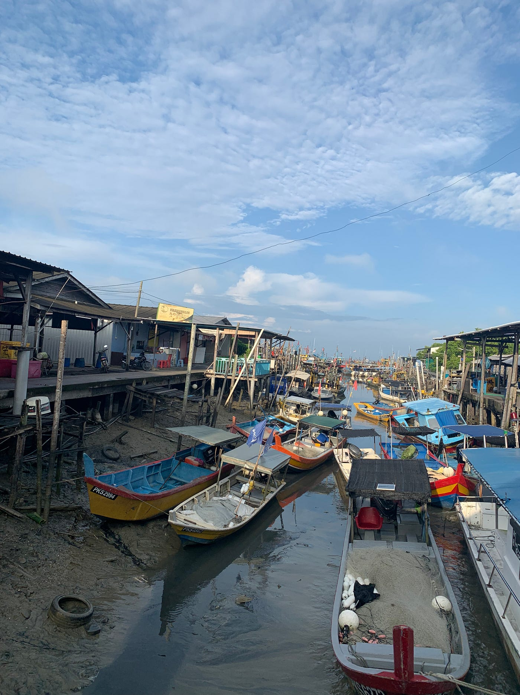
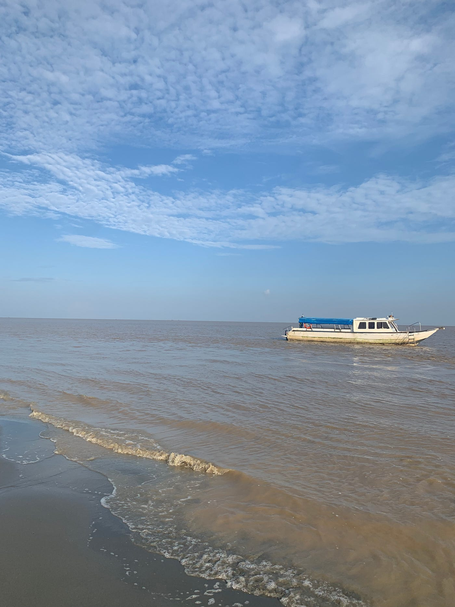

### マレーシア留学ストーリーテリング作品

こんにちは。2年の古内千聖です。

私は2023年10月13日から2024年2月27日までのおよそ4ヶ月間、マレーシアのUNIVERSITI KUALA LUMPURに留学していました。ここでは、友人とのホカンスで2日間を過ごした「Bukit Bintang」と、留学先大学の企画の元行われた3泊4日のAGU Tripで訪れた「Bagan Datoh」周辺地域について記録したものを紹介します。

今回ストーリーテリングで使用した記録ツールは、Strava、Mapillary、GoogleEarthの３つになります。

尚、私の確認不足により、Strava、Mapillaryにて記録した地域を一致させることができなかったため、StravaではBukit Bintangの記録を、MapillaryではBegan Datohの記録を、そしてGoogle Earthではその両方の記録を紹介します。

1. Strava

今回、Stravaを使用し、Bukit Bingtangを1日散策した際の軌跡をマップに落としたものを以下紹介します。

[strava.app.link](https://strava.app.link/pJVSQhhSsIb)

2. Mapillary

Mapillaryでは、AGU Tripで訪れたBagan Datohの街並みと、Sky Mirrowと呼ばれる現地の人々に人気の観光スポットを360度撮影したものを紹介します。

[Mapillary
Street-level imagery, powered by collaboration and computer vision.www.mapillary.com](https://www.mapillary.com/app/?pKey=913403390410982)

[Mapillary
Street-level imagery, powered by collaboration and computer vision.www.mapillary.com](https://www.mapillary.com/app/?pKey=900380911497410)

[Mapillary
Street-level imagery, powered by collaboration and computer vision.www.mapillary.com](https://www.mapillary.com/app/?pKey=402044948846335)

3. Google Earth

Google Earthでは、ホカンスとAGU Tripにて訪れた場所を紹介します。

[Google Earth
Aw snap! Google Earth isn't supported on your browser. You may need to update your browser or use a different browser…earth.google.com](https://earth.google.com/earth/d/1hkzM1uus1GYboF1Sjg8qR5_OL5Y-bTBC?usp=sharing)

最後に、キメのスクリーンショットを紹介します。

これは、Bagan DatohのSky Mirrowを訪れた際に撮影した写真です。

今回、自分が訪れた場所をさまざまなツールを使用して可視化することで、普段とは全く異なる視点で、地図を意識した旅行の記録を行うことができ、新鮮でした。どのツールも今まで使用したことのないものであったため、使い方を模索し、失敗しながらも使い方を学ぶことができ、自分にとってプラスな経験となりました。
