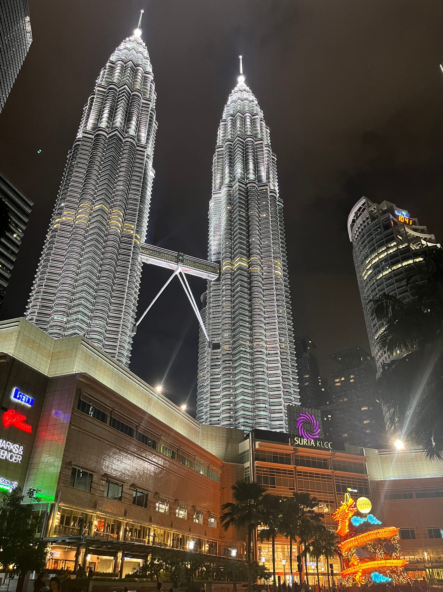

留学中のストーリーテリング

こんにちは。2年の伊藤瑛登（いとうえいと）です。

私は、10月から2月までの約5か月間、マレーシアのクアラルンプール大学に留学にしていました。ここでは、留学生活中のコンドミニアムからKLCCまでの移動を記録したものを紹介します。

KLCCはマレーシアクアラルンプールの中心部に位置し、ペトロナス・ツインタワーを中心にした複合施設です。観光名所やショッピングモールがあり、ホテルも周辺に多数あります。はじめに、ストリーテリング地図作品はこちらになります。

https://earth.google.com/earth/d/1pbfQIGOJNUz0oOyrZw4N0vp6w_UWfGnM

この地図上でマークが打たれているのがペトロナスツインタワーです。KLCCという地域のランドマーク的な存在で見た人を圧倒するようなデザインが施されています。公園やショッピングモール、コンドミニアムがあるため日本人の駐在員の方が多く住んでいることから、度々日本食レストランなどを見かけました。

https://www.mapillary.com/app/?pKey=414796667705248

私は友人たちと帰国直前であったということもあり日本にいる家族、友人のためにマレーシアのお土産を買おうと思い、KLCCのペトロナスツインタワーに行きました。ペトロナスツインタワーは商業施設、ホテルがついているために、多くの観光客が集まるためマレーシアのお土産はほとんどここで揃います。マレーシアに行く際には是非立ち寄るべきスポットの一つです。

今回の留学課題では、ペトロナスツインタワーを題材として作成しました。うまく記録出来なかった部分もあり、まだまだ改善の余地があると感じました。これからより良い作品を作るためにも、ゼミでの活動から多くのことを学び、吸収していきたいと感じました。
