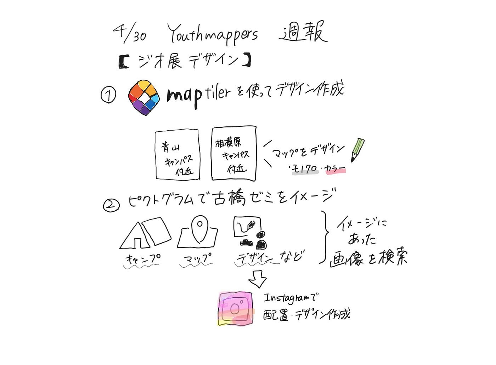

## ジオ展　Youth 週報　4/30

こんにちは。3年の林優香里です。

今週は[ジオ展](https://www.geoten.org/)に向けてガチャガチャの景品制作をしました。景品製作はデザイン担当と印刷担当に分かれて作業を行いました。

今回のジオ展に向けて[Maptiler](https://www.maptiler.com/) を使ってデザインを作成しました。初めてのデザイン作業また、地図を用いたということもあり試行錯誤を続けて作品を完成させました。

デザインのイメージは「アオガクらしさ」そして古橋ゼミ特有のものにするために、青山キャンパスと相模原キャンパスを融合させたデザインを作成しました。色の調整やマップをデザインに落とし込む作業になかなか手こずりましたが、なんとか完成させることができてよかったです。

また、二つ目のデザインとしてピクトグラムを用いて「古橋ゼミらしさ」がモチーフのデザインを作成しました。このデザインはゼミのイメージにあったものをInstagramの画像作成機能を用いて画像を完成させました。

初めてのゼミでの本格的な作業ということもあり、うまくできなかったことが多かったと感じましたが今回の活動を次回に活かせるように頑張っていきたいです！

[GitHubに今回作成したデザインを投稿](https://github.com/furuhashilab/geogacha2024/issues/2)しました。↓

[Youth完成版 · Issue #2 · furuhashilab/geogacha2024
Contribute to furuhashilab/geogacha2024 development by creating an account on GitHub.github.com](https://github.com/furuhashilab/geogacha2024/issues/2)

