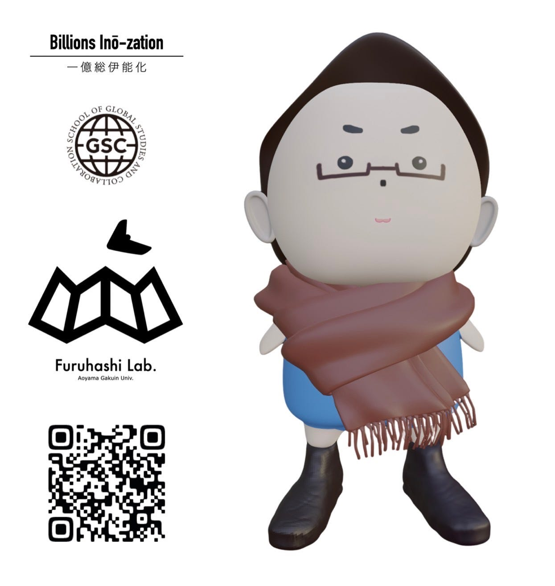
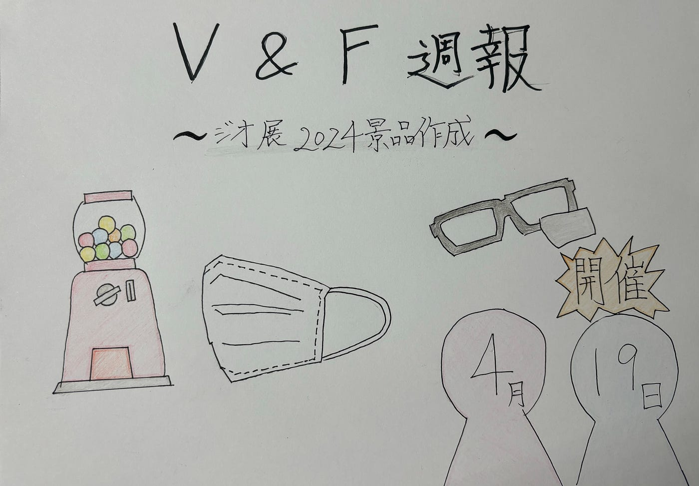

## 週報4/30 (V&F)

今年度3年生になりました古内です。

### 報告

4月19日に行われた[ジオ展2024](https://www.geoten.org/)へ向けて、カプセルトイの景品作りに取り組んだ際のV&Fの活動報告をいたします。

マスク、メガネ拭き、トートバッグは、[こちらのデザイン](https://github.com/furuhashilab/geogacha2024/issues/3)を使用して作成しました。

今回の役割分担は以下の通りです。

深水さん、高井さん: デザイン・景品作成

古内: 週報・グラレコ

今回は家庭の事情により、私はデザイン・景品作成に参加することができませんでした。次回イベントには参加し、新たな挑戦をしていきたいと思っています。

### グラレコ

