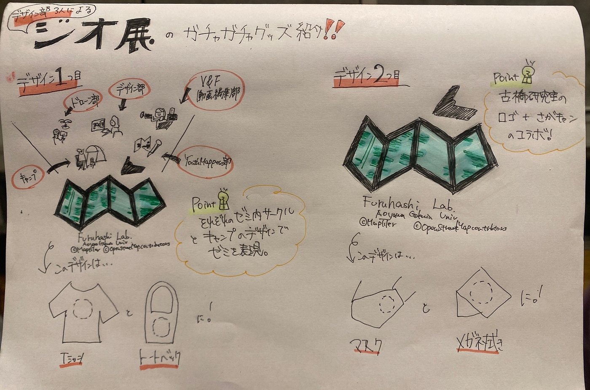

### デザイン部週報 04/30 ジオ展

こんにちは、デザイン部の3年生の滝沢未広です。

今回は、ジオ展のガチャガチャデザインをグラレコで紹介します。4月19日に開催されたジオ展では、古橋研究室のオリジナルグッズをガチャガチャで出品しました。デザイン部では、2種類のデザインを考案しました。

1つ目は、それぞれのゼミ内サークル(ドローン部、デザイン部、V＆F動画編集部、Youthmappers部)とキャンプのデザインでかつ古橋研究室のロゴを使いこのゼミを表現しました。このデザインは、Tシャツとトートバックに使いました。

2つ目は、古橋研究室のロゴと相模原キャンパスの地図を中に入れたデザインです。このデザインは、マスクと眼鏡拭きに使用しました。
