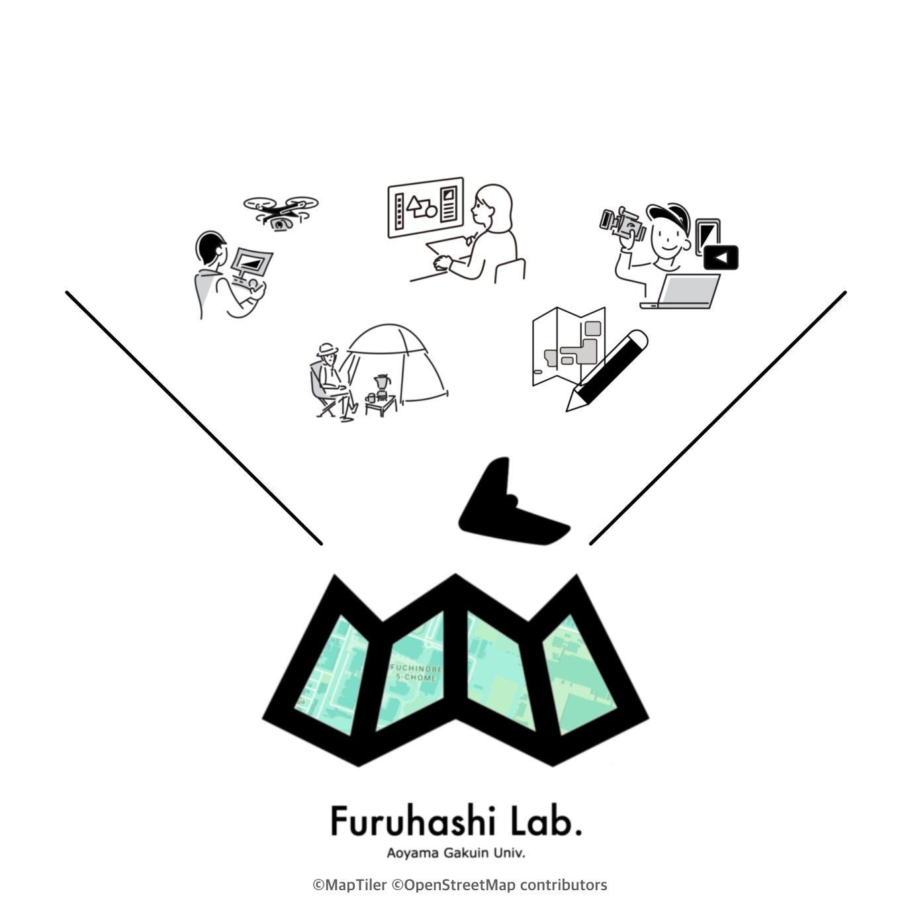
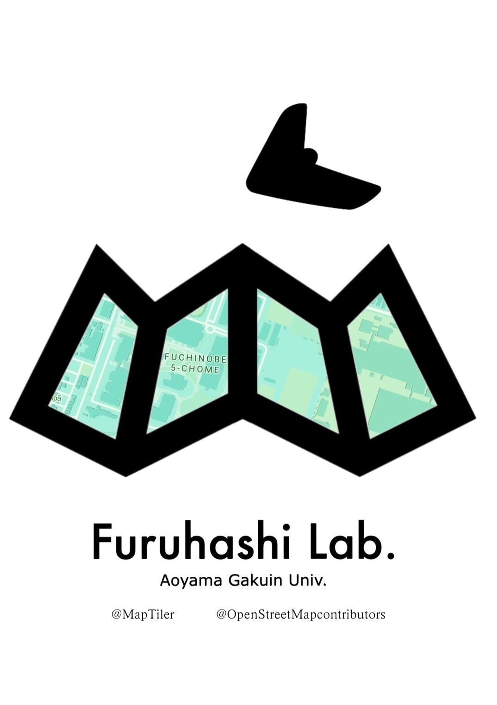
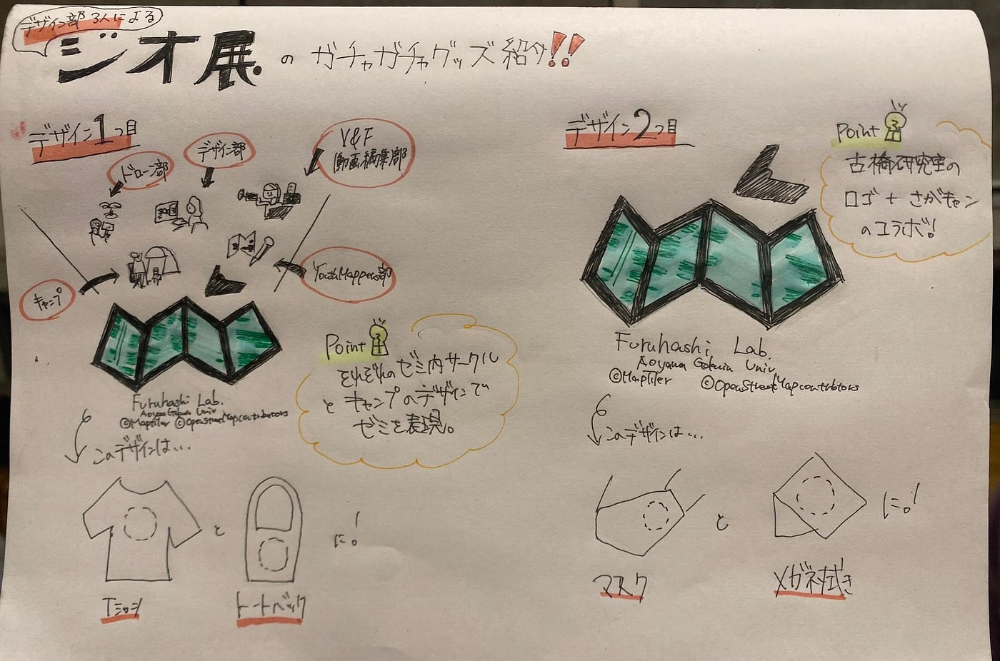

### デザイン部週報4/30

こんにちは！

三年になりました福田です。

4月19日に開催されたジオ展に参加することはできなかったけど、末木さんと滝沢さん三人でデザイン部としてデザインを考えて、ガチャガチャグッズの制作に参加することができました。

これが私たちの考えたデザインです。古橋研究室ではマップだけではなく、デザイン、V＆F（動画編集）、ドローン、YouthMappers AGUの四つのゼミ内サークルもあるので、それを知って欲しいという気持ちで、このようなデザインを考えました。また、キャンプをするというのも他のゼミと大きく異なるところだったので、デザインに含めることにしました。このデザインはTシャツとバッグにプリントしました。

マスクとメガネ拭きは小さめなので古橋研究室のロゴに相模原キャンパスの地図を入れたデザインをプリントしました。

今回はデザインだけだったので、次回は参加して、自分たちが考えたガチャガチャが完売するのをみてみたいと思っています。

