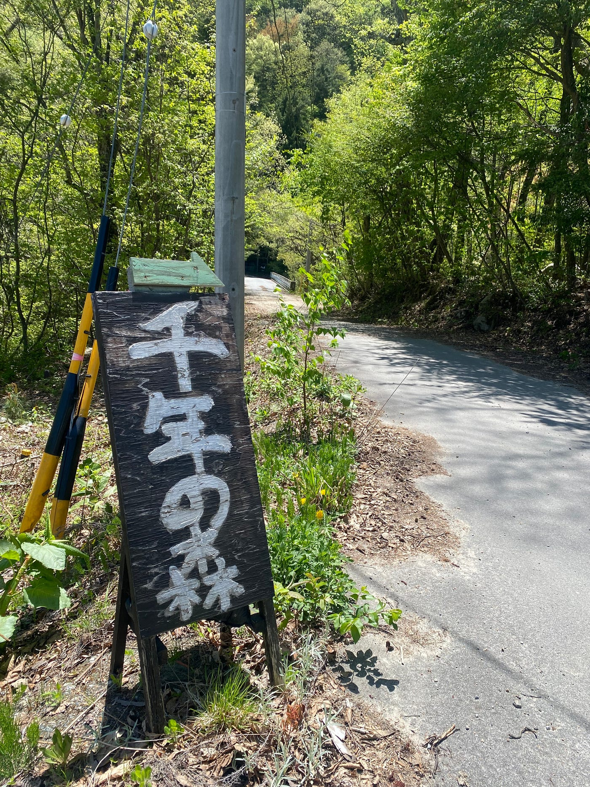
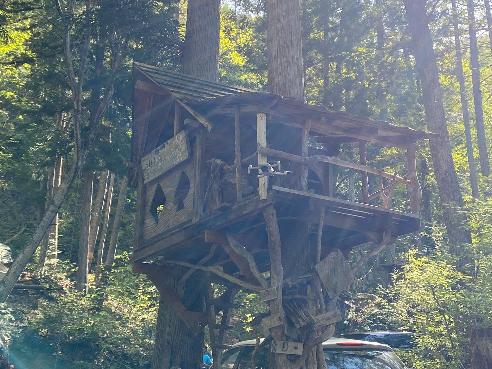
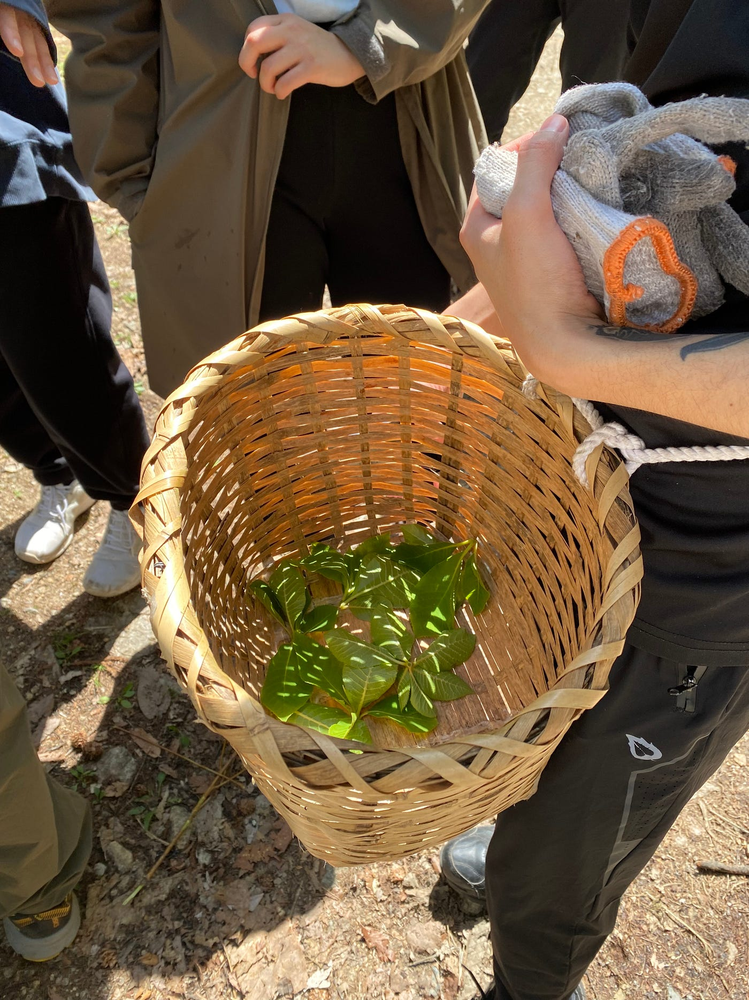

### はじめての本格的なアウトドアに挑戦してみました（Youth週報）

### ～千年の森に行ってきました！～

おはようございます。無事に4年になりました、上原です。

古橋研究室では、5/3~5にかけて「[千年の森](https://www.openstreetmap.org/#map=16/36.5074/137.8016)」へ行き、キャンプ合宿を行いました。

主なスケジュールは以下の通りです。

- 3日 生活準備、山神様ツアー

- 4日 山菜取り、鹿の解体、ワカサギ釣り、ワークショップ（くるみ鈴、そばうち、山菜とり）

- 5日 全山清掃

Youthmappersの週報なので、3日に行った山神様ツアーの移動軌跡を共有します。Stravaで記録しました。
ほとんどの道が整備されておらず、さらに起伏も激しかったため大変でしたが、今後山神様へお参りする際に地図としてあらゆる人に活用してもらえたら嬉しいです。

[山神様 - 史栞 上's 1.3 mi walk
史栞 上 completed 1.3 mi on May 3, 2024.www.strava.com](https://www.strava.com/activities/11320675702?utm_source=ios_share&utm_medium=social&share_sig=7E1AD3E91715046819&_branch_match_id=1213316772068000053&_branch_referrer=H4sIAAAAAAAAA8soKSkottLXLy4pSixL1EssKNDLyczL1jfMTgt2z3EpyPdKAgCd0tnuIwAAAA%3D%3D)

#### 写真

