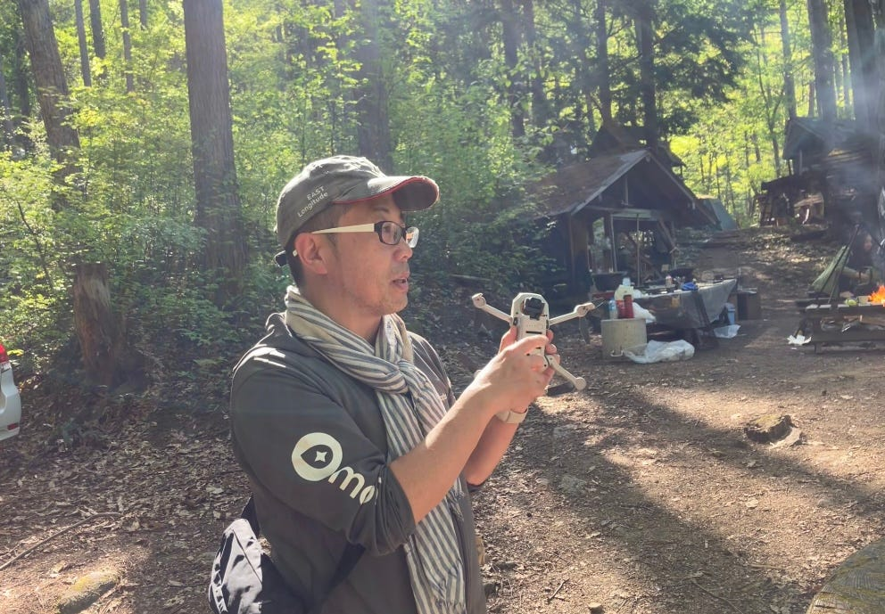

### 千年の森自然学校でアウトドア体験（V＆F週報）

お疲れ様です。深水です。

GW中に、[千年の森](http://morikura.com/contact.html)でツリーハウス合宿を体験してきました。

VFの活動としては、7月のゼミ紹介動画作成に向けて素材となる動画を撮影しました！

今回はその一部を紹介します。

[https://youtu.be/Y2suhfl2HaY](https://youtu.be/Y2suhfl2HaY)

子供達とドローンを飛ばす古橋教授 （深水撮影）

[https://youtu.be/vItyCp6qONc](https://youtu.be/vItyCp6qONc)

ドローン離陸 （高井撮影）

[https://youtu.be/c9Cti0dVX3o](https://youtu.be/c9Cti0dVX3o)

ドローン飛行 （古内撮影）

去年は動画素材が少なくて苦労しましたが、今年は素材が豊富にありそうです！
