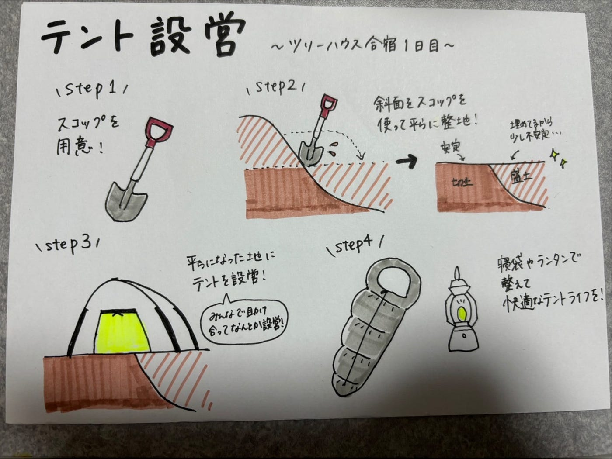
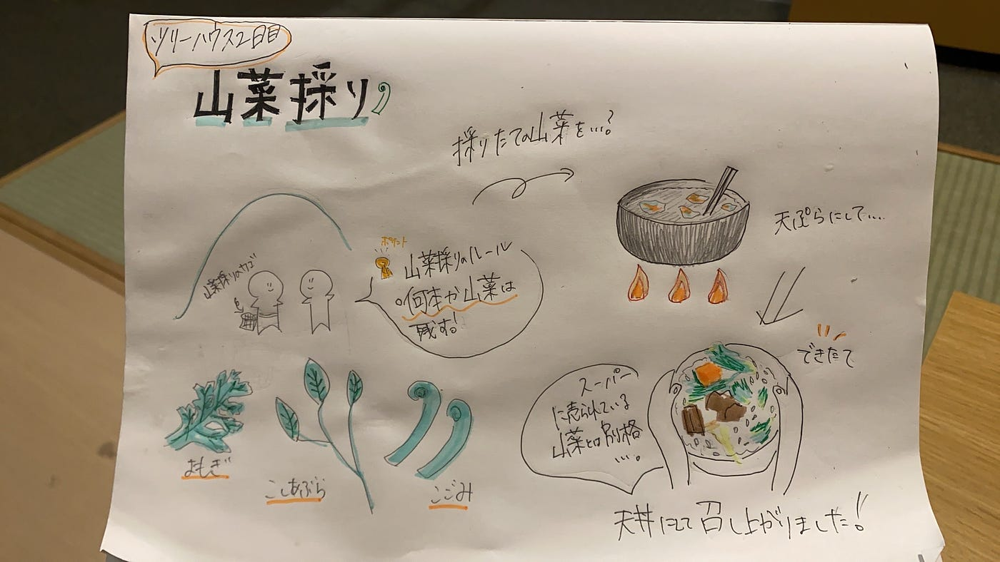
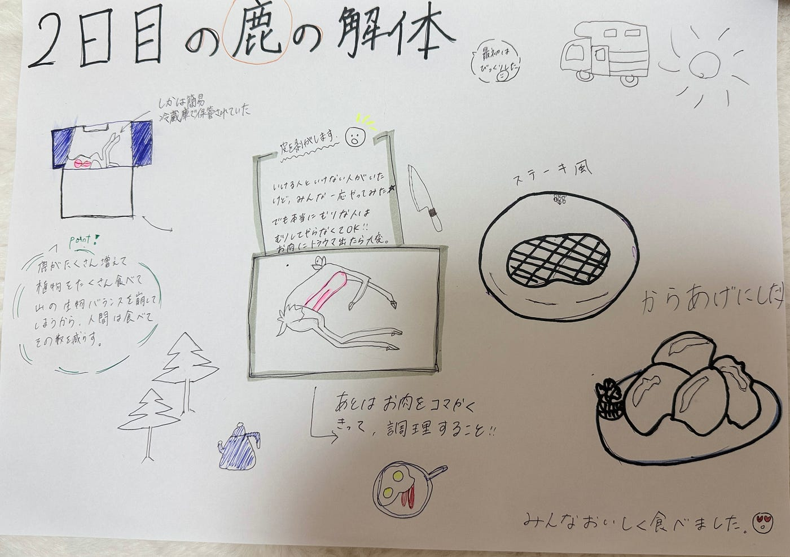
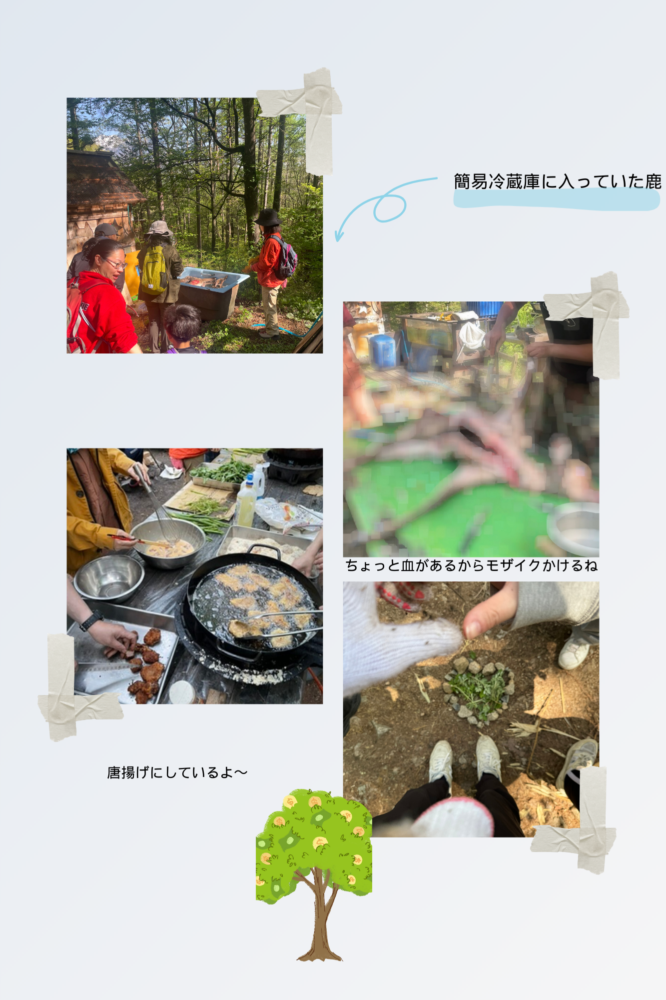
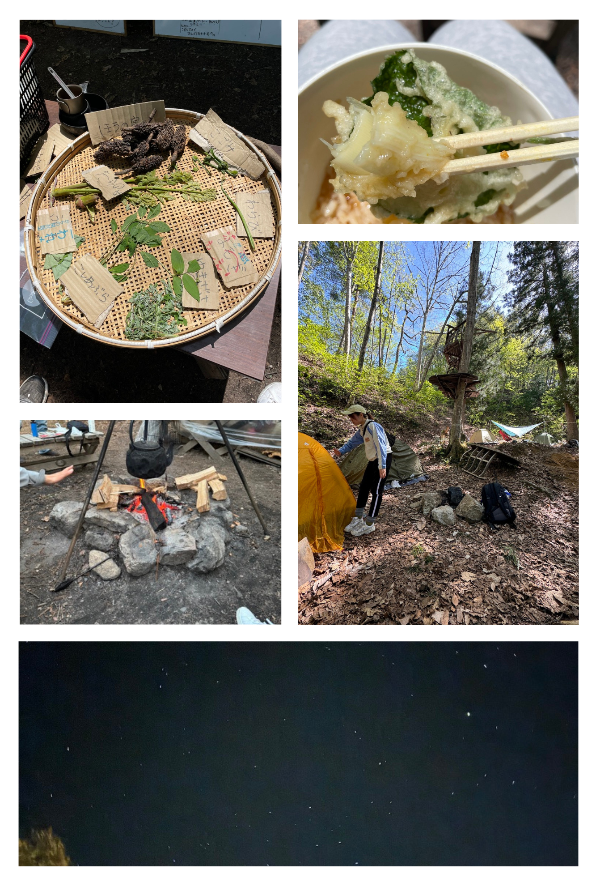

### ゴールデンウィークはみんなで千年の森に行きました！（デザイン部週報5/7）

こんにちは！三年の福田です。

今回のゴールデンウィークは5/3~5の三日間、古橋研究室で長野県にある「[千年の森自然学校](https://morikura.com/)」にいき、本格的なキャンプを初めて体験しました。

デザイン部は三日間の間で、印象に残った場面を絵にしようということで、テントを張る手順、二日目に行った鹿の解体と山菜採りを描いてみました。

写真もシェアさせてください。

最後に．．．

初めてこんな本格的なキャンプに参加し、いろいろわからないことがあったり、慣れないことがあったけど、経験者の方に教えてもらい、さまざまば体験をすることができました。今回の経験を次回のキャンプ、家族でも、ゼミでもに活かすことができるようになると思います。また、いろいろな人に出会えて、大変なこともあったけど、楽しい三日間を過ごすことができました。
