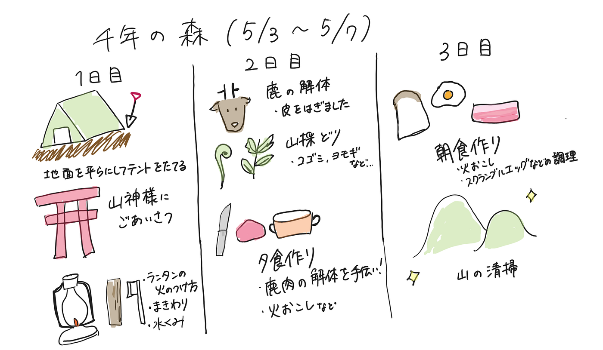
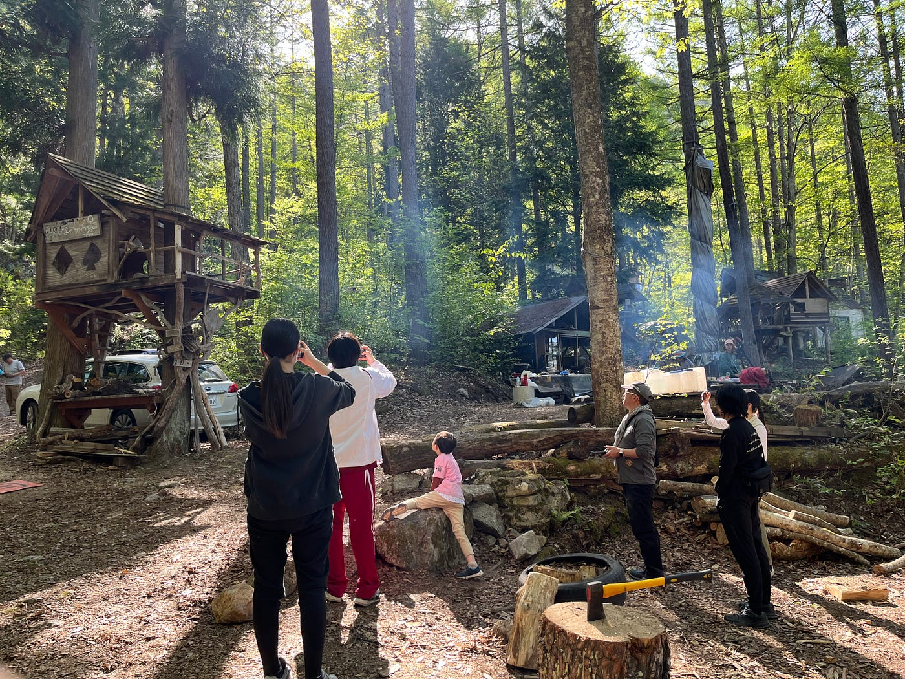

### ライフラインなしのほぼ自給自足サバイバル合宿 in 千年の森 5/3‐5/5（ドローン部週報5/7）

こんにちは！3年の林優香里です。合宿中に体調不良になってしまった人たちは無事に回復できましたでしょうか。みなさんの合宿中の疲労も完全に回復していることを願います。

さて、今回のドローン部週報は5/3‐5/7に、[千年の森](https://morikura.com/)で行ったキャンプ合宿についての感想を共有します。

今回の主なスケジュールをグラレコしてまとめました。

活動中にドローン体験が開催されて、古橋先生と古橋研究室生徒が中心となって、千年の森で一緒に過ごした小中学生に向け、ドローン操縦の指導を行いました。

【今回の合宿の感想】

■今回の合宿を通じて、自分にとって非日常な体験をすることができました。この経験から災害などの緊急時に、自分の生き残るための知識のなさを痛感しました。緊急時の自分の行動を想像したときに、人のために何か行動しようと思っても、自分のことだけで精一杯になってしまっているのが想像できました。千年の森のように、生き抜くために役立つ情報を楽しく学べる機会があることはとてもいいことだと思いました。今回の経験から学んだことを記録し、忘れないようにしたいと感じました。（3年 林）

■キャンプ自給自足を通して、多くの人が筋肉痛になったと思いますが、それは現代人の運動量の少なさを表しているように思います。現代では、一生のうち自給自足の生活などほとんど送る機会がないので、自覚する機会は少ないので、この気づきを得られたことは貴重な経験になりました。また、道具や食材を使いこなす知識や技術も同様であるはずです。非日常に身を置くことで日常がいかに便利であるか実感しました。（3年 佐藤）
