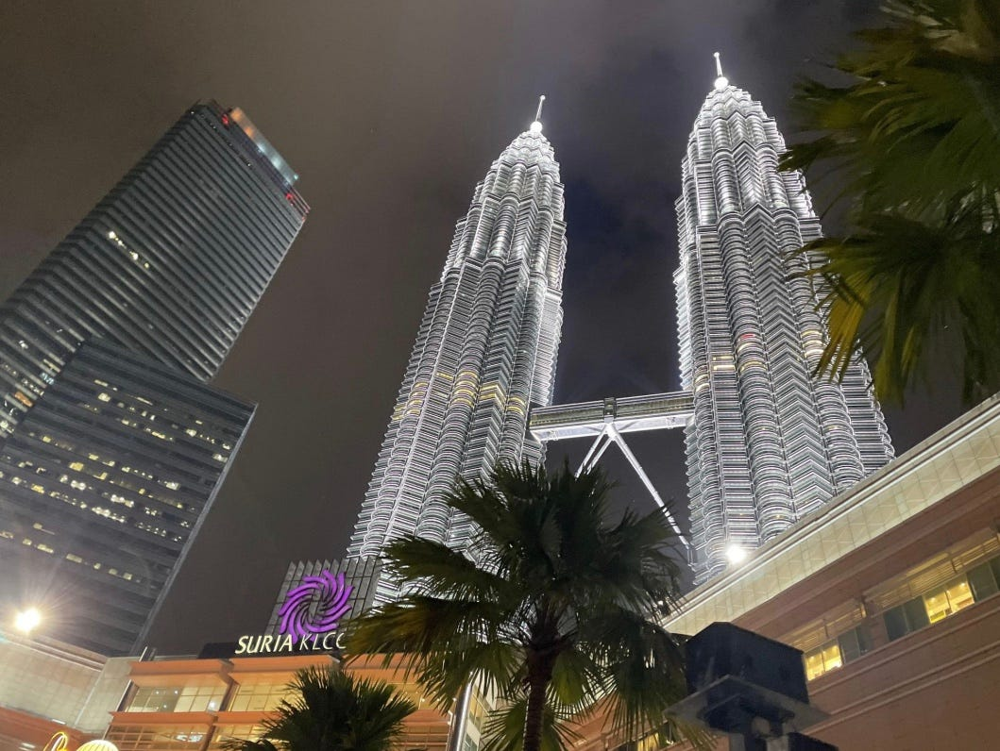

### 個人的に後輩におススメしたいマレーシア

こんにちは！古橋研究室３年の佐藤愛妃です。

私は昨年１０月から２月末のマレーシアのクアラルンプールに留学していました。留学先はUniversiti Kuala Lumpurで、ビジネスコースに所属していました。ここでは留学中に訪れたクアラルンプールの繁華街ブキビンタンと郊外にある無農薬農園の２つ中心にをストーリーテリングにまとめました。移動はバスとGrabを使いました。

はじめに取り上げる場所は、クアラルンプールの繁華街ブキビンタン地区にある観光スポットです。スクランブルスクエアと中心街から徒歩5分ほど離れたナイトマーケットは昼夜問わず観光客で賑わっていました。

もうひとつの場所は「Back 2 Nature Organic」農場で、マレーシアでは珍しい無農薬栽培の方法を研究するための実験農場です。ここは、大学の研究者やマレーシアで食品系の事業展開を考えるビジネスマンが訪れる場所で、日系フードベンチャーを経営された方々も訪問されているようです。この研究農場が建てられた理由は、豪雨による洪水や、土壌は栄養分が少なく、マレーシアで食料自給率の低さが問題視されているからです。ここの農園で育てられた食材を直接購入することも可能です。

また、最後フードコートは、留学中滞在したコンドミニアム近くの学生街です。また、写真はありませんが、私たちが滞在したコンドミニアムは、ビル下層部がショッピングモールになっていて、飲食店や日用品売り場、UNIQULOが入っていました。上層部は居住スペースになっていて、宗教も国籍も様々な方々が住んでいました。私の部屋のはす向かいにはシク教の方が住んでいて、イスラム教とは異なる毎朝礼拝の時間に音楽が聞こえてきました。

今回のストーリーテリングのキメスクリーンショットはペトロナスツインタワーの夜景にしました。

マレーシアのパンフレットにも多く使用される名所であり、マレーシア発展の象徴でもあります。片側のビルは、日本の業者が施工し完成させています。初めて見た時は、その見た目と迫力に圧倒されました。

今回は、Stravaの記録が保存できていなかったので移動記録がありません。

以下がMapilaryのPermanent Linkになります。

[https://scontent-nrt1-1.xx.fbcdn.net/m1/v/t6/An_gaHhbQbHwzqGY9WTBX6nNvix0f9Kgw6DDT4vWYWrCnfEvoSvhjoZMfQf-8JOaWWOpXFqMS5lJJ6cPi6bLZM8HE3kK0JU2tU5WH5N7U5N2hmmXmUfJ-12RkWY06WZkOr7OC46iJWjAeEhTFneAWVM?stp=s2048x1536&ccb=10-5&oh=00_AYCz0v79Xuh3cFsnLgvYUVgdJKVL45hI7Wnv7D6po9RGHw&oe=666CBA75&_nc_sid=201bca](https://scontent-nrt1-1.xx.fbcdn.net/m1/v/t6/An_gaHhbQbHwzqGY9WTBX6nNvix0f9Kgw6DDT4vWYWrCnfEvoSvhjoZMfQf-8JOaWWOpXFqMS5lJJ6cPi6bLZM8HE3kK0JU2tU5WH5N7U5N2hmmXmUfJ-12RkWY06WZkOr7OC46iJWjAeEhTFneAWVM?stp=s2048x1536&ccb=10-5&oh=00_AYCz0v79Xuh3cFsnLgvYUVgdJKVL45hI7Wnv7D6po9RGHw&oe=666CBA75&_nc_sid=201bca)

[https://www.bing.com/ck/a?!&&p=1d945921ca2545a2JmltdHM9MTcxNTczMTIwMCZpZ3VpZD0xYzgyMmI4ZS1lODcxLTZkNzctMWRlZS0zZmE2ZTllNjZjYTEmaW5zaWQ9NTIwOA&ptn=3&ver=2&hsh=3&fclid=1c822b8e-e871-6d77-1dee-3fa6e9e66ca1&psq=mapillary&u=a1aHR0cHM6Ly93d3cubWFwaWxsYXJ5LmNvbS8&ntb=1](https://www.bing.com/ck/a?!&&p=1d945921ca2545a2JmltdHM9MTcxNTczMTIwMCZpZ3VpZD0xYzgyMmI4ZS1lODcxLTZkNzctMWRlZS0zZmE2ZTllNjZjYTEmaW5zaWQ9NTIwOA&ptn=3&ver=2&hsh=3&fclid=1c822b8e-e871-6d77-1dee-3fa6e9e66ca1&psq=mapillary&u=a1aHR0cHM6Ly93d3cubWFwaWxsYXJ5LmNvbS8&ntb=1)

ストーリーテリングの課題を通して、文章のみの日記とは異なる視点で、記録をとることができました。写真にコメントを残せることが特に便利だと思いました。写真と日記を同時に記録していることはあっても、異なる情報をひとつのデータベースにまとめることはあまりなかったです。私は部活でワンダーフォーゲルをしているのですが、この情報の繋げ方はYAMAPさんの行動履歴に似ていたので、地道に使いこなせる様に練習したいです。また、Stravaの記録を保存できておらず報告が不完全になってしまったことが悔しいです。今回は、情報データが不足していたり、写真に多くの人が映り込んだりしたので、今後は撮影場所やアングルを工夫してみたいです！
