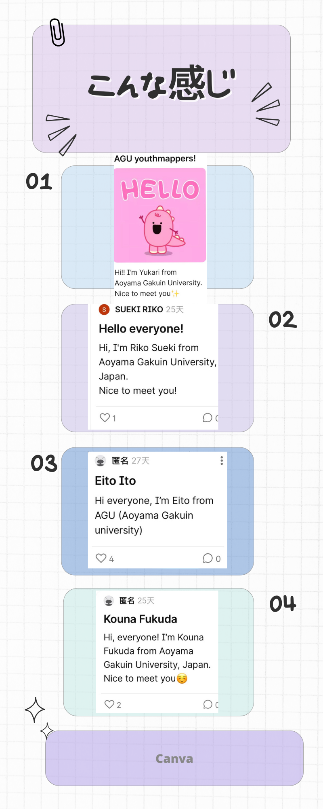
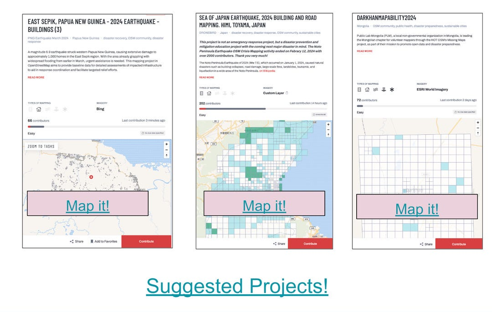
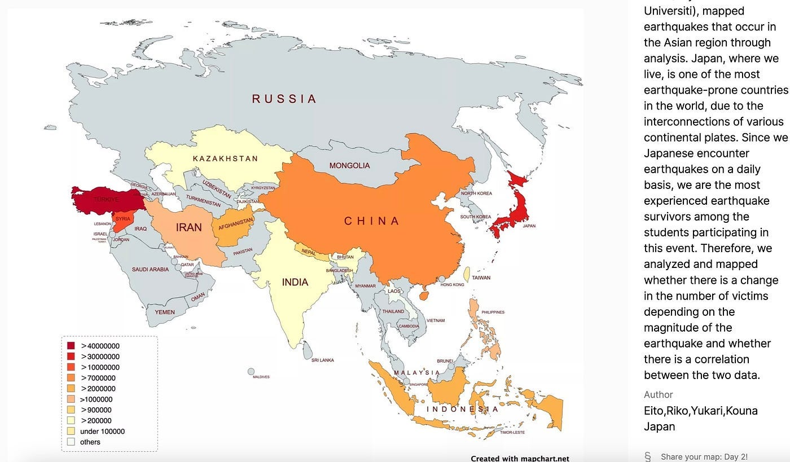
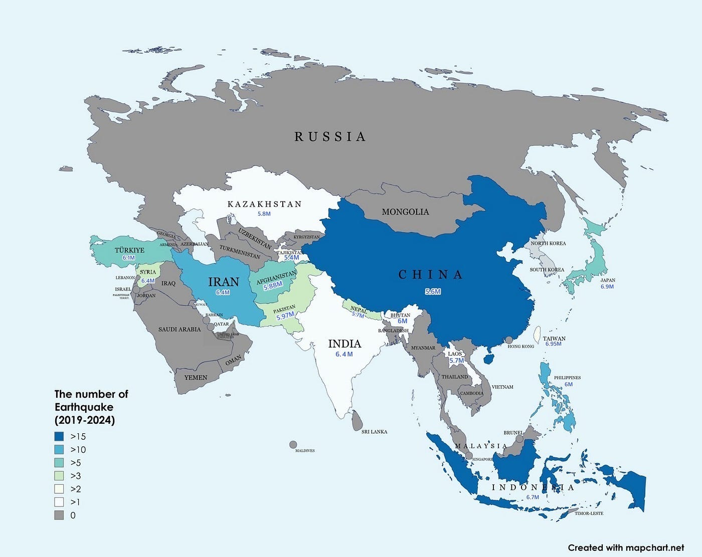
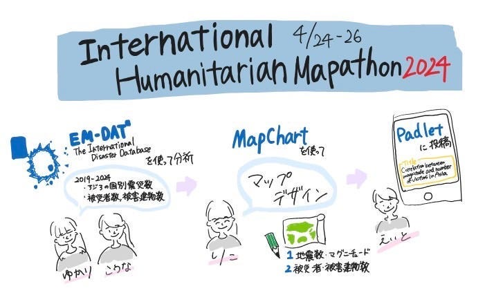

### International Humanitarian Mapathon 2024に参加しました。

こんにちは！福田です。

４/24~26の三日間、オンラインで「[International Humanitarian Mapathon](https://mapathon.la/en/)]に参加することができました。

**１日目**

自己紹介を中心に、みんながどこから参加しているのかを知ることができました。（人数が多くてびっくりしました。）

私のグループは四人．．．

また、１日目からタスクのマッピング（[Hot Tasking Manager](https://www.hotosm.org/))が始まり、私たちのグループは三日間の間でそれぞれ取り組みました。１日目からスタートした人と２日目からの人もいます。

**二日目**

[EM-DAT](https://www.emdat.be/)の資料を使って、2019〜2024にアジアで起きた地震のデータとそれらの被害数（被害者数、被害建物）を元にそれそれマップデザインを制作しました。

分担は、

ゆかり→アジアの地震データ

こうな→アジアの被害数まとめとマップデザイン

りこ→地震データをマップデザイン

えいと→データ投稿作業

このマップデザインは被害数をまとめたデータです。地震の回数とマグニチュードとその被害の変化があるかどうか、および二つの相関関係を分析しました。結果として、防災を頑張り、できていると思われる日本では、地震回数に対して意外と被害者数と建物が多かったということでした。

また、日本がアジアでマグニチュード５以上の地震が多い国だと想定していたが、アジア全体で見ると中国とインドネシア、その次にイランが多かったことも判明しました。

**グラレコ**

