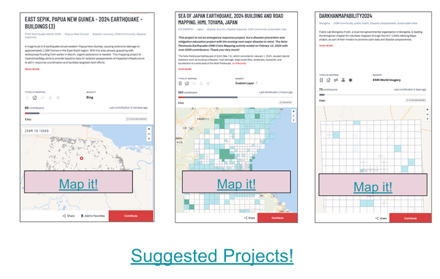
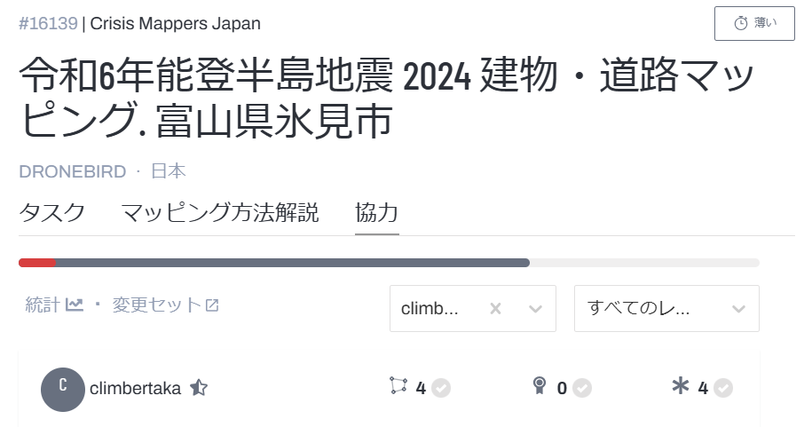
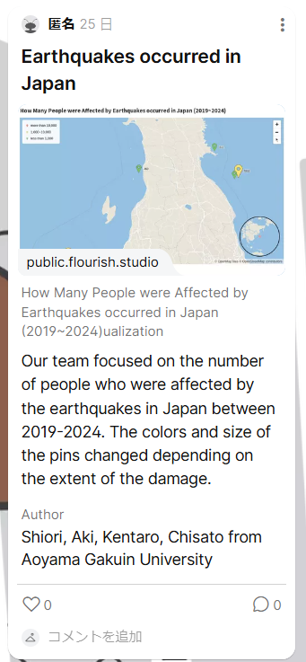
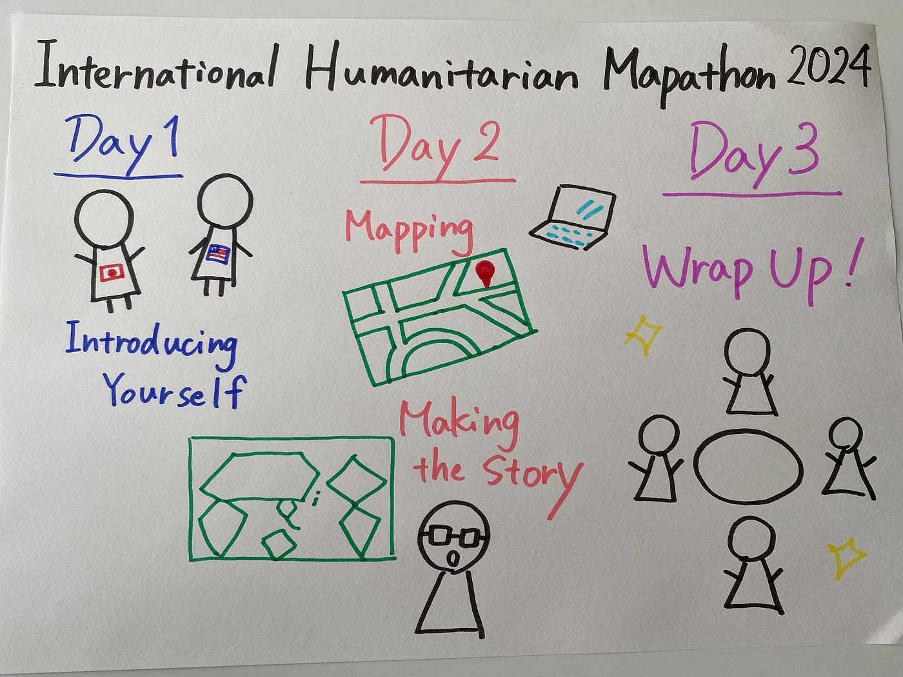

### 昨年より進化したInternational Humanitarian Mapathon 2024

こんにちは！4年の上原です。昨年のInternational Humanitarian Mapathon 2023に引き続き、今年もこの時期がやってまいりました。

### IHM2024

4月24～26日に行われた[International Humanitarian Mapathon 2024](https://mapathon.la/en/)に参加しました。去年はマッピング中心でしたが、今年は内容がアップデートされていました！以下の通りです。

Day1：Humanitarian Mapping (Introducing Yourself & Mapping)

Day2：UN Crisis Map Challenge ( Making the Storytelling)

Day3：International Meetup

[2024 International Humanitarian Mapathon
2024 International Humanitarian Mapathonmapathon.la](https://mapathon.la/en/)

古橋ゼミでは、3つのグループに分かれて参加しました。

【メンバー】上原、佐藤、高井、古内

#### Day1

1日目は、[Padlet](https://padlet.com/UCLA_Library/international-humanitarian-mapathon-2024-v9xzbflkecfhwugp)で参加者全体へ向けて自己紹介を行いました。各国様々のマッパーたちとこのように集中して協働できる機会はとても貴重なこと感じ、交流できることを嬉しく思いました。

マッピングについては、どのメンバーも時間をとれそうになかったので2日目以降にキャッチアップすることにしました。

#### Day2

2日目は、タスクのマッピング（[HOT](https://www.hotosm.org/) [Tasking Manager](https://www.hotosm.org/)）と災害や災害支援に関するテーマで過去のデータベースを参考にストーリーにまとめる課題に取り組みました。

マッピングについては、以下の地域が割り当てられマッピング数を競う形で行われました。

- [EAST SEPIK, PAPUA NEW GUINEA -2024 EARTHQUAKE -BUILDINGS (3)](https://tasks.hotosm.org/projects/16641)

- [SEA OF JAPAN EARTHQUAKE, 2024 BUILDING ANS ROAD MAPPING, HIMI, TOYAMA, JAPAN](https://tasks.hotosm.org/projects/16139)

- [DARKHANMAPABILITY2024](https://tasks.hotosm.org/projects/8460/tasks)

ストーリーテリング作成の課題に関しては、私たちは、"How Many People were Affected by Earthquakes occurred in Japan (2019~2024)” (訳：2019~2024に日本で起きた地震の人的被害の大きさ）について、まとめました。以下の[リンク](https://public.flourish.studio/visualisation/17718967/)からご覧ください（[Flourish](https://flourish.studio/features/)を使用）。

#### Day3

最終日は、2日目の課題の評価とクロージングを行ったようです。と、いうのも授業の関係でメンバーの誰もZoomに参加することができず、Padletやメールでしか様子を把握できませんでした。せっかくの機会を活かせず悔やまれます。

### メンバーの感想

#### 上原

昨年に引き続き参加しましたが、内容が世界中のマッパーたちと交流できるようにアップデートされていたことが印象的でした。ストーリーテリング作成は、以前授業で使用したことのあったFlourishを使ったため比較的簡単に作成できました。マッピングについて、まだ下2つのタスクが完了していないようなので、YouthMappersの活動としても取り組みたいです。

#### 古内

今回、このMapathonに参加したことで、地図作成がどれほど重要であるかを再認識することができました。災害救援や医療支援の効率化には正確な地図が不可欠であり、自分の手でその一端を担えたことに大きな達成感を感じました。
実際の活動では、オープンソースの地図作成ツールを使用し、衛星画像をもとに建物や道路のデータを追加していきました。初めての使うツールが多く、苦戦する場面もありましたが、チュートリアルやサポートが充実していたためスムーズに作業を進めることができました。
今後は、この経験を活かしてさらにGIS技術を磨き、自身のゼミ論作成の際に活かしていきたいです。

#### **高井**

今回のマッパソンに参加して、マッピング活動の重要性を改めて理解することができました。正直、最初はマッピングをする意味をあんまり理解せずにとりあえずマッピングだけしていたという状況ですが、マッピングをしていくうちに「ここに建物が密集しているな」や「この建物は川から近いから水害が発生するかもしれない」ということが徐々にわかってきました。私は今まで本格的なマッピング経験がなく、ほぼ初めての状況で参加させてもらいましたが、今回の経験を今後にも活かしていくためにもマッピング活動を継続していきたいと思います。

#### 佐藤

人道支援において地図作成がいかに重要であるか学ぶことができました。特に災害時や紛争地域では、最新かつ正確な地図が迅速な支援活動につながると学びました。複数のプロジェクトの説明や意義を聞くなかで、実際に災害が起きた際は、被災地のインフラ状況や避難所の位置を示すことで支援物資や救助隊などの効果的な配置につながると知りました。Tasking Managerにプロジェクトをあげる団体みると、医療関係が多いため、医療施設や安全なルートの性格な把握が緊急時に求められる情報としての優先度が高いのだと気づきました。このプロジェクトと通して、現地のニーズを理解し、適切な対応をするための基盤をサポートできるとわかり、地図作成の意義を感じました。

### グラレコ

